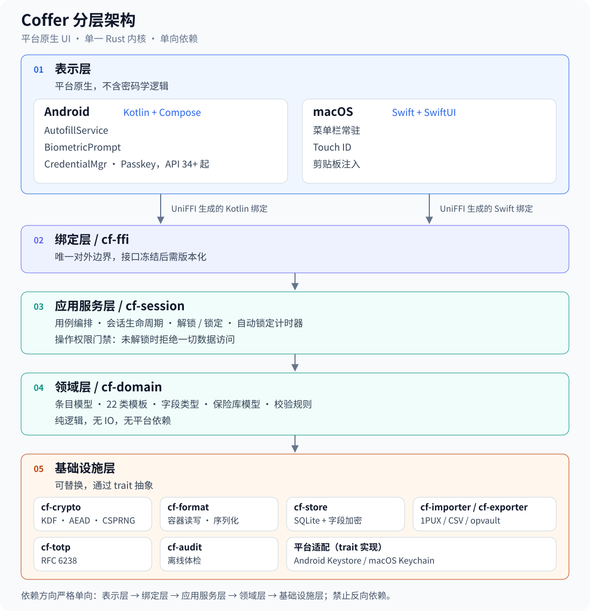

# Coffer

> 一个功能对齐 1Password 8、但**完整移除了网络能力**的本地密码管理器。

<!-- 徽标位（预留）：构建状态 / 测试覆盖率 / license 徽标，CI 就绪后在此添加 -->

Coffer 不是"默认不联网"，而是**根本没有联网能力**——App 内不存在任何网络通信代码路径，这一条可以被技术审计验证（NFR-SEC-07）。面向 **macOS（首版交付）** 与 **Android（第二交付目标）**，纯单机运行，数据永不离开设备。

- 命名：仓库目录 `coffer` · 项目代号 **Coffer** · Rust crate 前缀 `cf-`
- 仓库：<https://github.com/cygnusyang/coffer>
- 许可证：MIT（贡献需先签 [CLA](CLA.md)）

---

## 为什么做这个：一个被厂商自己删掉的产品

Coffer 要解决的问题不是"再做一个密码管理器"，而是填补一个**明确存在的功能真空**。事实链条如下：

1. 1Password 在 7.x 及更早版本中提供 **standalone vault（独立保险库）**——完全本地存储、可由用户自行备份。
2. **1Password 8 于 2021 年发布时移除了 standalone vault**，转为纯云架构（Electron 客户端 + 订阅制）。官方明确表示该功能**不会回归**。
3. 到 2025 年，第三方评测（WIRED）仍将"无法本地托管任何保险库"列为 1Password 的主要缺陷之一。
4. 官方社区中长期存在用户因此流失的讨论，迁移终点集中在 KeePassXC、Bitwarden、Strongbox 等。

**结论**：市场存在一批"要 1Password 的体验，但不要 1Password 的云"的用户，而 1Password 官方已明确放弃服务这批人。Coffer 填的就是这个空位。

### 目标用户

| 画像 | 核心诉求 |
| --- | --- |
| 合规受限者（军工 / 金融 / 涉密研发） | 数据物理不可外流，可接受无跨端同步 |
| 隐私偏好者 | 不信任任何云密码服务，完全掌控数据与备份 |
| 1Password 7 留守者 | 平滑迁出，保留原有使用习惯 |
| 离线环境用户 | 离线可用是第一需求 |

---

## 核心特性

> 标注为「目标」的是设计已锁定、尚未实现的能力。**当前实际实现见下方"当前状态与路线图"。**

| 特性 | 说明 | 状态 |
| --- | --- | --- |
| **零网络可验证**（NFR-SEC-07） | 不是"不联网"，是**没有联网能力**。Android 不申请 `INTERNET` 权限；macOS 不授予 network entitlement；CI 自动检查依赖树中无网络 crate | 架构级承诺，发布后可验证 |
| **强加密** | Argon2id（RFC 9106）+ XChaCha20-Poly1305 信封加密，主密码只封装数据密钥，换密不重加密全库 | 核心原语已实现 |
| **22 类条目** | Login、Credit Card、Identity、Passport、SSH Key 等 22 类模板 + 自定义字段 | 领域模型设计完成，待实现 |
| **TOTP** | 内置验证码生成（RFC 6238），当前支持 SHA-1 | ✅ 已实现，全链路测试绿 |
| **从 1Password 迁移** | 1PUX / CSV 导入，字段映射逐项可核对、未知字段不静默丢弃；opvault 为计划项 | 导入器未实现（M2） |
| **Passkey** | 完整能力进 v1.0（条件性，以 M0 平台验证为前提） | 平台验证未完成 |
| **离线安全检查** | 弱密码 / 重复密码 / 弱 URL / 陈旧密码检测 | 🟡 仅 zxcvbn 强度评估可用，检测项未实现 |
| **原生而非 Electron** | Android = Kotlin + Compose；macOS = Swift + SwiftUI。1Password 8 转 Electron 正是本项目要避开的 | 两端 UI 未开始 |
| **开源 MIT** | 承诺不如可验证——这是本项目开源的理由 | ✅ |

**三个关键承诺**：

| 承诺 | 含义 |
| --- | --- |
| 零网络可证明 | 不是"不联网"，是**没有联网能力**。任何人可用工具自行验证 |
| 迁移不失真 | 从 1Password 导入的数据，字段映射逐项可核对，未知字段不静默丢弃 |
| 原生而非 Electron | 1Password 8 转 Electron 是社区主要抱怨点，本项目坚持 SwiftUI / Compose 原生 |

### 零网络如何验证（发布后适用）

```bash
# Android：反编译确认无 INTERNET 权限
aapt dump permissions Coffer.apk

# macOS：确认无 network entitlement
codesign -d --entitlements - /Applications/Coffer.app

# 核心库：确认依赖树中无网络 crate
cd core && cargo tree --prefix none \
  | grep -E '^(reqwest|hyper|ureq|isahc|surf|curl|tokio-rustls|native-tls)' \
  && echo "FAIL" || echo "OK"
```

### 诚实标注的能力缺口（设计决定的必然结果）

- **无法检测"密码已泄露"**（需查询在线泄露库，与零网络根本冲突）
- **主密码遗失 = 数据永久丢失**（无服务端、无后门、无恢复机制）
- **无跨端同步**（架构层面的排除项；跨端只能人工导出加密文件 + 搬运）
- **无自动更新** → 安全补丁需用户手动获取

---

## 架构一览



**依赖方向严格单向**：表示层 → 绑定层 → 应用服务层 → 领域层 → 基础设施层，禁止反向依赖。加密、存储、业务逻辑全部在 Rust 核心，**两端 UI 不含任何密码学代码**（见 [docs/02-概要设计.md](docs/02-概要设计.md)）。

Rust 工作区（`core/`）11 个 crate：

| crate | 职责 |
| --- | --- |
| `cf-crypto` | 加密原语封装：Argon2id KDF、XChaCha20-Poly1305 AEAD、CSPRNG、内存清零 |
| `cf-format` | 库容器结构层：头部读写、格式版本识别、格式迁移 |
| `cf-domain` | 领域模型：条目 / 字段 / 保险库、22 类模板、校验规则 |
| `cf-store` | 存储引擎：SQLite schema、加密字段读写、事务、附件、历史版本 |
| `cf-importer` | 1PUX / CSV / opvault 解析、字段映射、预检报告 |
| `cf-exporter` | 加密备份、1PUX 兼容导出、CSV 导出 |
| `cf-totp` | TOTP 生成（RFC 6238）、otpauth URI 解析 |
| `cf-audit` | 离线安全检查：弱 / 重复 / 陈旧密码检测 |
| `cf-session` | 会话与用例编排：解锁 / 锁定、权限门禁、TOTP 会话验证 |
| `cf-ffi` | 唯一对外边界：UniFFI 类型与错误映射，暴露给 Kotlin / Swift |
| `cf-testkit` | 测试夹具、合成样本生成、跨端一致性比对辅助 |

**设计文档**（贡献前必读）：[01-需求分析](docs/01-需求分析.md)（做什么、不做什么）→ [02-概要设计](docs/02-概要设计.md)（架构分层）→ [03-详细设计](docs/03-详细设计.md)（格式规范、DDL、接口签名）→ [04-系统设计](docs/04-系统设计.md)（威胁模型、路线图）→ [05-Argon2id 参数标定](docs/05-Argon2id参数标定.md)。

**进度追踪**：[06-开发计划](docs/06-开发计划.md)——每条需求（FR-1 ~ FR-14）做到哪一步的唯一事实源，需求状态变化须同步更新该文档。

---

## 当前状态与路线图

坦白说清楚，避免误判进度：

| 里程碑 | 目标 | 状态 |
| --- | --- | --- |
| **M0 技术预研** | 打通关键不确定性：UniFFI 双向打通、Argon2id 最低端设备标定、真实 1PUX 样本校准、opvault 交叉验证、Passkey 平台验证 | 🟡 **部分完成**（编译链路与 KDF 摸底已推进；三项待真实样本 / 真机） |
| **M1 核心库** | Rust 核心完整可用：cf-crypto / cf-format / cf-domain / cf-store / cf-totp / cf-audit | 🔵 **进行中**（TOTP 全链路 + 加密原语 62 测试绿，其余模块待实现，逐条状态见 [06-开发计划](docs/06-开发计划.md)） |
| **M2 导入器** | 1PUX 完整导入 + CSV 导入、预检报告、映射表校准 | ⬜ 未开始 |
| **M3 macOS MVP** | 可日常使用的 macOS 端（**首版交付目标**） | ⬜ 未开始 |
| **M4 macOS 完整** | 附件、opvault 导入、1PUX 导出、Passkey | ⬜ 未开始 |
| **M5 Android 端** | 第二交付目标（v1.2 需求变更后 macOS 优先） | ⬜ 未开始 |

**当前进展（2026-09-25）**：

- ✅ `cargo build` 通过，`cargo test` **62 个用例全部通过**，`cargo clippy --all-targets` 零警告
- ✅ `cf-crypto`：Argon2id KDF + XChaCha20-Poly1305 AEAD + 内存清零，实现并测试通过
- ✅ TOTP 全链路：`cf-totp`（RFC 6238 SHA-1）→ `cf-store`（加密持久化）→ `cf-session`（会话门禁 + 验证），已串联打通
- 🟡 `cf-audit`：密码强度评估（zxcvbn）与基础密码生成两个函数可用；Watchtower 检测未实现
- 🟡 Argon2id 参数：开发机摸底完成（见 `05-Argon2id参数标定.md`），**最低端设备待做**
- ⬜ 6 个 crate 为纯占位（cf-format / cf-domain / cf-importer / cf-exporter / cf-ffi / cf-testkit，无任何可调用接口）；cf-store / cf-session 仅 TOTP 相关路径可用
- ⬜ **导入器、完整存储引擎、两端 UI 均未实现**

> 每条需求的实现状态见 [docs/06-开发计划.md](docs/06-开发计划.md)。

> **现在拿不到能用的软件，没有任何可安装产物。请不要用它存真实密码。**
> 诚实说明：TOTP 已实现，但导入器还没有；"功能对齐 1Password"是目标而非现状。

---

## 快速开始

要求 Rust **>= 1.85**（stable channel，由 `getrandom` 0.4.3 的 MSRV 决定；工具链由 `core/rust-toolchain.toml` 固定）。

```bash
cd core

cargo build            # 编译整个 workspace
cargo test             # 62 个测试
cargo clippy --all-targets   # 零警告
```

> 若通过 rustup 以 `--no-modify-path` 安装，新终端需先 `source "$HOME/.cargo/env"`。

### 测试中的经典案例

`nfc_归一化使等价密码产生相同密钥` —— 覆盖「Android 设的密码 macOS 打不开」这个经典坑：主密码会先做 Unicode NFC 归一化再送入 KDF。

---

## 参与开发

欢迎贡献。这是一个处理**用户最敏感数据**的项目，门槛比一般项目严，但这些门槛正是它值得信任的原因。

### 第一步：同意 CLA

贡献前必须阅读并同意 **[CLA.md](CLA.md)**。它是**许可授予型**（你保留版权，授予项目再许可权与专利许可），让项目保留变更许可证的能力。首次提交 PR 时按机器人指示签署即可。

### 开发环境与规范

- `cargo fmt` 提交前必须执行；`cargo clippy` 不得有 warning
- **禁止 `unsafe`**、**禁止 `unwrap()` / `expect()`**（生产代码，已在 lib.rs 声明为 deny；测试代码例外）
- **不得引入任何网络依赖**（`reqwest` / `hyper` / `ureq` 等，CI 自动检查）
- 加密代码不得自造密码学原语；密钥类型必须实现 `Zeroize` + `ZeroizeOnDrop`
- **不得提交任何真实数据样本**——需要测试数据时用 `python3 tools/make_test_sample.py` 生成合成样本
- 涉及加密格式的变更必须同步更新设计文档（详见 [CONTRIBUTING.md](CONTRIBUTING.md)）

### 项目级 AI 开发团队

`.claude/agents/` 内置了七个分工明确的角色（用 Claude Code 开发本项目时可复用）：

| 角色 | 职责 |
| --- | --- |
| `coffer-architect` | 系统架构：crate 边界、依赖方向、设计文档对齐 |
| `coffer-coder-1` | 密码学层：`cf-crypto`、`cf-totp` |
| `coffer-coder-2` | 存储与会话层：`cf-store`、`cf-session`、`cf-domain` |
| `coffer-coder-3` | 格式与边界层：`cf-format`、`cf-importer`、`cf-exporter`、`cf-ffi`、`cf-audit` |
| `coffer-researcher` | 技术调研：选型、RFC 规范、平台能力可行性 |
| `coffer-reviewer` | 代码审查（只审查不修改，提交前必过） |
| `coffer-tester` | 测试工程：覆盖验证、性能基准、回归 |

### 从哪里出力

- **M1 核心库**：cf-domain（22 类条目模型）、cf-store（完整存储引擎）、cf-audit（安全检查）——当前主战场
- **M0 收尾**：Passkey 平台能力验证、最低端设备 Argon2id 标定（需真机）
- **M2 导入器**：1PUX / CSV 解析、字段映射表

> 提供 1PUX 结构样本时请用 `python3 tools/inspect_1pux.py <你的导出文件>.1pux`——它只输出结构骨架，**不输出任何字段值**。`.1pux` 是明文导出，内含全部密码，**不要把这个文件发给任何人**。

### 安全漏洞

请勿开公开 issue，按 [SECURITY.md](SECURITY.md) 的流程私下报告。

---

## 测试与质量门

吸引认真开发者的，不是口号，是工程纪律：

| 检查项 | 结果 |
| --- | --- |
| `cargo test` | ✅ **62 个用例全部通过**（含 RFC 6238 标准测试向量） |
| `cargo clippy --all-targets` | ✅ **零警告** |
| `cargo build` | ✅ 通过，无警告 |
| 生产代码 `unsafe` / `unwrap()` / `expect()` | 🚫 编译期禁止（deny） |
| 网络依赖 | 🚫 CI 自动检查依赖树，发现即失败 |
| 测试数据 | 只允许合成样本，真实数据禁止入库 |

---

## 许可证

[MIT](LICENSE)。Copyright (c) 2026 Coffer contributors。

本项目与 AgileBits Inc.（1Password 的开发方）**无任何关联**，也未获其授权或背书。「1Password」是其商标，本项目仅在对数据格式做互操作性描述时提及。
