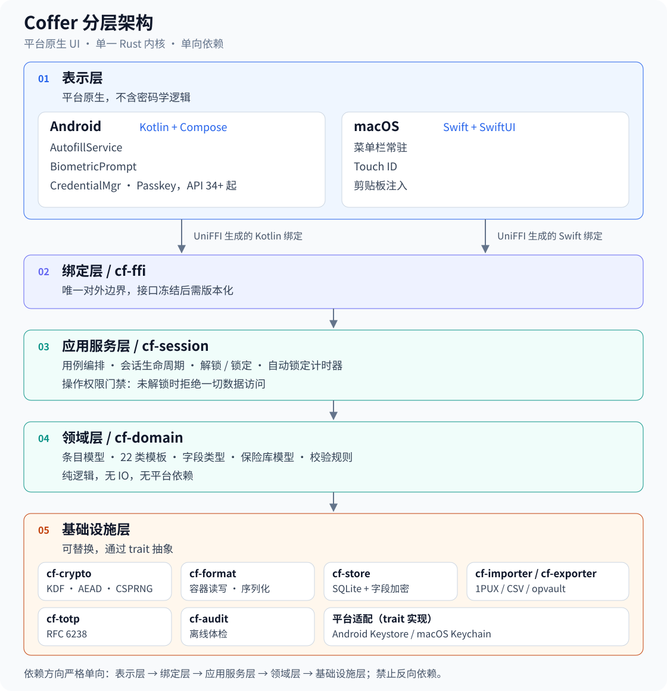

# Coffer

> 一个**完整移除网络能力**的本地密码管理器。App 内不存在任何网络通信代码路径，这一条可被技术审计验证（NFR-SEC-07）。面向 macOS 与 Android，纯单机运行，数据永不离开设备。

- 命名：仓库目录 `coffer` · 项目代号 **Coffer** · Rust crate 前缀 `cf-`
- 仓库：<https://github.com/cygnusyang/coffer>
- 许可证：MIT

---

## 名字：Coffer 是什么

**Coffer /ˈkɒfər/**，名词，本义是**带锁的贵重物品箱——保险箱、钱匣**；复数 `coffers` 引申为「金库、资金」（如 *the company's coffers*）。

词源链（主流词典一致记载）：古法语 `cofre` → 拉丁语 `cophinus`「篮子」→ 希腊语 `kophinos`「筐、篮」。含义从「装东西的容器」逐步收窄为「装**贵重**东西的、上锁的容器」。

**为什么选它做项目名**：

| 层面 | 理由 |
| --- | --- |
| 语义 | 密码管理器的本质就是一个「上锁保管贵重物的容器」——不比喻、不引申，字面直给 |
| 与产品定位契合 | Coffer 是不联网的**本地箱子** |
| 形式 | 一个词、两音节、六个字母，好念好记，做仓库名与 crate 前缀都干净 |


---

## 核心特性

| 特性 | 说明 | 状态 |
| --- | --- | --- |
| **零网络可验证**（NFR-SEC-07） | 不是"不联网"，是**没有联网能力**。Android 不申请 `INTERNET` 权限；macOS 不授予 network entitlement；依赖树中无网络 crate（检查命令见下文，**仓库尚无 CI，当前需手动执行**） | 架构级承诺，发布后可验证 |
| **强加密** | Argon2id（RFC 9106）+ XChaCha20-Poly1305 信封加密，主密码只封装数据密钥，换密不重加密全库 | 核心原语已实现 |
| **22 类条目** | Login、Credit Card、Identity、Passport、SSH Key 等 22 类模板 + 自定义字段（"22 类"的口径与来源见 `docs/03-详细设计.md` §4.1） | ✅ 已实现（`cf-domain`） |
| **TOTP** | 内置验证码生成（RFC 6238），当前支持 SHA-1 | ✅ 已实现，全链路测试绿 |
| **从 1PUX / CSV 迁移** | 1PUX / CSV 导入，字段映射逐项可核对、未知字段不静默丢弃 | 🟡 CSV 导入已交付（`cf-importer`）；1PUX 待真实样本类别校准 |
| **Passkey** | 完整能力进 v1.0.0 | 平台验证未完成 |
| **离线安全检查** | 弱密码 / 重复密码 / 弱 URL / 陈旧密码检测 | 🟡 仅 zxcvbn 强度评估可用，检测项未实现 |
| **原生而非 Electron** | Android = Kotlin + Compose；macOS = Swift + SwiftUI | 🟡 macOS 端 v0.1 已交付；Android 端未开始（M5） |
| **开源 MIT** | 代码可审计、可验证 | ✅ |

### 零网络如何验证（macOS 与依赖树现在即可核查；Android 待 APK 产出）

```bash
# Android：反编译确认无 INTERNET 权限
aapt dump permissions Coffer.apk

# macOS：确认无 network entitlement（本地构建产物；装到 /Applications 后把路径换成 /Applications/Coffer.app）
codesign -d --entitlements - macos/build/Coffer.app

# 核心库：确认依赖树中无网络 crate
cd core && cargo tree --prefix none \
  | grep -E '^(reqwest|hyper|ureq|isahc|surf|curl|tokio-rustls|native-tls)' \
  && echo "FAIL" || echo "OK"
```

### 能力缺口（架构决定的必然结果）

- **无法检测"密码已泄露"**（需查询在线泄露库，与零网络根本冲突）
- **主密码遗失 = 数据永久丢失**（无服务端、无后门、无恢复机制）
- **无跨端同步**（架构层面的排除项；跨端只能人工导出加密文件 + 搬运）
- **无自动更新** → 安全补丁需用户手动获取

---

## 架构一览



**依赖方向严格单向**：表示层 → 绑定层 → 应用服务层 → 领域层 → 基础设施层，禁止反向依赖。加密、存储、业务逻辑全部在 Rust 核心，**两端 UI 不含任何密码学代码**。

Rust 工作区（`core/`）11 个 crate：

| crate | 职责 |
| --- | --- |
| `cf-crypto` | 加密原语封装：Argon2id KDF、XChaCha20-Poly1305 AEAD、CSPRNG、内存清零 |
| `cf-format` | 库容器结构层：头部读写、格式版本识别、格式迁移 |
| `cf-domain` | 领域模型：条目 / 字段 / 保险库、22 类模板、校验规则 |
| `cf-store` | 存储引擎：SQLite schema、加密字段读写、事务、附件、历史版本 |
| `cf-importer` | 1PUX / CSV / opvault 解析、字段映射、预检报告 |
| `cf-exporter` | 加密备份、1PUX 兼容导出、CSV 导出 |
| `cf-totp` | TOTP 生成（RFC 6238）、otpauth URI 解析 |
| `cf-audit` | 离线安全检查：弱 / 重复 / 陈旧密码检测 |
| `cf-session` | 会话与用例编排：解锁 / 锁定、权限门禁、TOTP 会话验证 |
| `cf-ffi` | 唯一对外边界：UniFFI 类型与错误映射，暴露给 Kotlin / Swift |
| `cf-testkit` | 测试夹具、合成样本生成、跨端一致性比对辅助 |

设计文档：`docs/01-需求分析.md` → `docs/02-概要设计.md` → `docs/03-详细设计.md` → `docs/04-系统设计.md` → `docs/05-Argon2id 参数标定.md`。进度追踪见 `docs/06-开发计划.md`；版本计划见 `docs/09-版本开发计划.md`。

---

## 当前状态与路线图

| 里程碑 | 目标 | 状态 |
| --- | --- | --- |
| **M0 技术预研** | UniFFI 双向打通、Argon2id 最低端设备标定、真实 1PUX 样本校准、opvault 交叉验证、Passkey 平台验证 | 🟡 **部分完成** |
| **M1 核心库** | Rust 核心完整可用：cf-crypto / cf-format / cf-domain / cf-store / cf-totp / cf-audit | ✅ **完成** |
| **M2 导入器** | 1PUX 完整导入 + CSV 导入、预检报告、映射表校准 | 🟡 **部分完成**（CSV 已交付；1PUX 待样本校准） |
| **M3 macOS MVP** | 可日常使用的 macOS 端（**首版交付目标**） | ✅ **完成**（v0.1 纵切已交付） |
| **M4 macOS 完整** | 附件、opvault 导入、1PUX 导出、Passkey | ⬜ 未开始 |
| **M5 Android 端** | 第二交付目标 | ⬜ 未开始 |

**当前进展（2026-09-28）**：

- ✅ `cargo build` 通过，`cargo clippy --all-targets -- -D warnings` 零警告；测试 **679 个用例**，门禁命令下 **671 条执行通过**（另 8 条标 `#[ignore]`：1 条 1 GiB KDF 重载荷用例 release 人工独占、fuzz/统计类用例按 CI 口径 `--include-ignored` 执行）
- ℹ️ 门禁命令为 `cargo test --workspace --no-fail-fast`（**须在 `core/` 下执行**）。历史上曾有两条用例需要 `--skip`（1 GiB KDF 资源耗尽、`千条搜索基线` 单次墙钟断言 flaky），**BUG-4 已于 2026-09-27 修复，`--skip` 不再需要**；根因与修复见 `docs/KNOWN-ISSUES.md` **BUG-4**
- ✅ `cf-crypto`：Argon2id KDF + XChaCha20-Poly1305 AEAD + 内存清零；**9 把派生子密钥**（v0.2 增 audit_key、root_mac_key）
- ✅ TOTP 全链路：`cf-totp`（RFC 6238 SHA-1）→ `cf-store`（加密持久化）→ `cf-session`（会话门禁 + 验证），已串联打通
- ✅ `cf-audit`：密码强度评估（zxcvbn）、**密码短语**（EFF 大词表）、Watchtower 弱密码/弱 URL/重复检测编排、陈旧密码 + 泄露启发式 + 无 2FA 提示纯函数
- 🟡 Argon2id 参数：开发机摸底完成（见 `05-Argon2id参数标定.md`），**最低端设备待做**
- ✅ `cf-format` / `cf-domain` / `cf-importer` / `cf-store` / `cf-session` / `cf-ffi` 均已实现并有测试覆盖；**v0.2 内核新增**：加密备份/恢复/校验、CSV 导出、改主密码、暴力退避、剪贴板五档配置、备份提醒、本地审计日志、root_mac 完整性校验（防行级删除/篡改）
- ✅ `cf-exporter` 已交付（FR-8.1/8.6 加密备份 + FR-8.3 CSV 导出 + 备份打点）；**1PUX 导入内核已交付**（含 `files/` 附件、预检报告）；附件存储内核已交付
- ⬜ **尚未实现**：1PUX 导入的真实样本验收（685 条样本待重导）、体检报告编排（FR-6.7）、FR-7.8 风险提示、附件 UI 接线（v0.3 附件 UI / v0.4）、菜单栏/快捷键、Passkey、Android 端
- ✅ **v0.2.0 Swift UI 接线已完成（2026-09-28）**：统一设置页（剪贴板五档 / 自动锁定 / 备份提醒档位）、改主密码、加密备份导出、CSV 明文导出（双门禁）、从备份恢复、备份提醒横幅、审计日志查看页、解锁退避倒计时；真机验收为唯一剩余项

> **已有可用的构建产物**：macOS v0.1 纵切已交付，`./tools/build_macos_app.sh` 可构建出 `macos/build/Coffer.app`（构建命令与签名核查方法见 `macos/README.md`）。
> 数据出口已随 v0.2.0 内核交付（加密备份/CSV 导出/改主密码），「不要存真实密码」的早期限制**解除**；**v0.2.0 的 Swift UI 侧接线已完成（2026-09-28）**——导出/恢复/改密/剪贴板五档等均可在 App 内操作，真机验收（docs/10 人工用例清单）待执行。
> 诚实说明：Passkey、菜单栏、附件 UI、多库 UI 尚未实现；1PUX 导入已过合成样本验收，真实样本验收待补。

---

## 快速开始

要求 Rust **>= 1.85**（stable channel，由 `getrandom` 0.4.3 的 MSRV 决定；工具链由 `core/rust-toolchain.toml` 固定）。

```bash
cd core

cargo build            # 编译整个 workspace
cargo clippy --all-targets -- -D warnings   # 零警告（缺 -- -D warnings 时有警告也退出 0，不可验证）

# 测试：必须带 --no-fail-fast，否则首败即停（假绿）。BUG-4 修复后不再需要任何 --skip
cargo test --workspace --no-fail-fast
```

> 若通过 rustup 以 `--no-modify-path` 安装，新终端需先 `source "$HOME/.cargo/env"`。

### 测试中的经典案例

`nfc_归一化使等价密码产生相同密钥` —— 覆盖「Android 设的密码 macOS 打不开」这个经典坑：主密码会先做 Unicode NFC 归一化再送入 KDF。

---

## 测试与质量门

| 检查项 | 结果 |
| --- | --- |
| 测试门禁命令 | ✅ `cargo test --workspace --no-fail-fast`（**须在 `core/` 下执行**）。2026-09-27 实测 **422 passed**（另有 3 ignored：1 条 1 GiB KDF 用例标 `#[ignore]`、release 人工独占，2 条既有 doctest）。`--no-fail-fast` 必需：否则首败即停，后续 crate 与全部 doctest 一次都不跑 → 假绿。**BUG-4 已修复，不再需要任何 `--skip`**（此前需跳过的两条：1 GiB KDF 资源耗尽、`千条搜索基线` 单次墙钟断言 flaky），根因见 `docs/KNOWN-ISSUES.md` **BUG-4** |
| 门禁的两条前提 | ⚠️ ① `cargo` 可能不在 PATH 上（非交互 shell / 新终端 / 脚本）→ 退出码 **127**、命令**根本没跑**：先 `export PATH="$HOME/.cargo/bin:$PATH"`；② 接了管道时 `$?` 取的是管道最后一个命令的状态，`… 2>&1 \| tail -3` 恒为 0 → zsh 用 `${pipestatus[1]}`（1-indexed、小写），或先 `set -o pipefail`。两者叠加即**静默假绿** |
| 门禁覆盖边界 | ⚠️ 门禁只覆盖 **Rust 侧**（`cargo test` / `cargo clippy`）与构建签名（`build_macos_app.sh` 只作 `swiftc -O` **编译**，编译 ≠ 测试；`codesign --verify --strict` 验的是签名与包结构）。**Swift / UI 侧行为没有自动门禁**（仓库无 CI），其 ✅ 证据在门禁之外 |
| `cargo clippy --all-targets -- -D warnings` | ✅ **零警告** |
| `cargo build` | ✅ 通过，无警告 |
| 生产代码 `unsafe` / `unwrap()` / `expect()` | 🚫 编译期禁止（deny） |
| 网络依赖 | ⬜ **尚无 CI** —— 依赖树检查命令见上文「零网络如何验证」，当前需手动执行 |
| 测试数据 | 只允许合成样本，真实数据禁止入库 |

---

## 许可证

[MIT](LICENSE)。Copyright (c) 2026 Coffer contributors。
