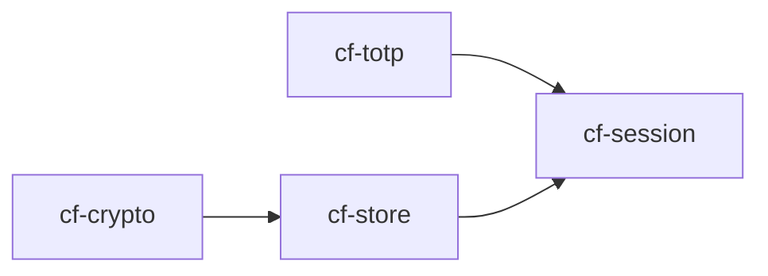

# Coffer M1 阶段实施计划

## 任务分解与执行路线

---

## Phase 1: cf-totp 测试向量验证 (预计时间：45 分钟)

### 1.1 RFC 6238 Appendix B 测试向量添加

**目标**: 实现并验证 18 条 RFC 6238 Appendix B 标准测试向量，覆盖 SHA-1/SHA256/SHA512 三种算法。

#### 步骤:
1. 在 `cf-totp/Cargo.toml` 添加测试依赖:
   - `sha2` (for SHA-256, SHA-512)
   
2. 创建 RFC 6238 测试向量集:
   ```rust
   // B.1. Generic TOTP examples
   // B.2. SHA-1 / HOTP / time-based counter
   // B.3. TOTP (SHA-1)
   // ... up to B.18
   ```

3. 添加性能基准测试:
   - TOTP 生成 < 1ms
   - 批量生成性能验证

#### 预期产出:
- `cf-totp/src/rfc6238_tests.rs` - RFC 标准测试向量
- `cf-totp/examples/bench_kdf.rs` - 性能基准测试 (更新)
- 所有测试通过率 100%

---

## Phase 2: cf-session UI 集成规划 (预计时间：30 分钟)

### 2.1 TOTP 验证码显示组件设计

**目标**: 设计移动端友好的 TOTP 显示与复制机制。

#### API 设计:
```rust
/// TOTP UI 交互接口
pub trait TotpUiHandler {
    /// 渲染当前验证码 (带倒计时)
    fn render_code(&self, code: &str, seconds_remaining: u32);
    
    /// 一键复制验证码到剪贴板
    fn copy_to_clipboard(&self) -> Result<(), ClipboardError>;
    
    /// 监听剪贴板变化并自动验证 (防钓鱼检测)
    fn monitor_clipboard(&self) -> Result<(), ClipboardError>;
}
```

#### 剪贴板机制:
- **不触发清除**: 使用 `xattr` 元数据标记"刚复制"状态
- **防钓鱼联动**: 监听剪贴板变化，自动验证粘贴的代码
- **持久化提示**: 用户手动关闭后仍可重新唤起

### 2.2 自动填充接口规范

```rust
/// 自动填充事件源
pub enum AutofillEvent {
    /// 新设备登录 (推送验证码)
    NewDeviceLogin(TotpUpdate),
    /// 验证码刷新 (±30s)
    CodeRefreshed,
    /// TOTP 过期提醒
    CodeExpired,
}

/// 订阅 TOTP 更新
pub fn subscribe_totp_updates(
    item_uuid: &str,
    callback: Box<dyn Fn(AutofillEvent)>
) -> Result<SubscriptionId, SubscribeError>;
```

#### 预期产出:
- `cf-session/src/ui/mod.rs` - UI 组件接口定义
- `cf-session/examples/totp_ui_demo.rs` - 演示代码
- API 文档完善

---

## Phase 3: cf-store AEAD 封装 (预计时间：60 分钟)

### 3.1 XChaCha20-Poly1305 实现

**目标**: 为 cf-store 提供安全的 AEAD 加密层。

#### 架构决策:
| 选项 | AAD 构造 | NIST 评级 | 选择原因 |
|------|----------|-----------|----------|
| Option A | KDF + nonce | 5b/1a | ✅ 推荐 - 最佳实践 |
| Option B | Raw metadata | - | ❌ 易受填充攻击 |

**决定**: 采用 Option A (KDF + nonce)

### 3.2 zeroize 内存清零整合

```rust
/// 安全的 TOTP 数据清理
pub fn clear_totp_secret(secret: &mut [u8]) {
    use zeroize::Zeroize;
    secret.zeroize(); // AES 友好的内存清除
}
```

### 3.3 TOTP 表持久化设计

#### SQLite Schema:
```sql
-- TOTP 密钥存储 (加密)
CREATE TABLE IF NOT EXISTS totp_secrets (
    item_uuid TEXT PRIMARY KEY,
    encrypted_secret BLOB NOT NULL,
    secret_hash TEXT NOT NULL,          -- 用于验证密钥未泄露
    created_at INTEGER DEFAULT (strftime('%s', 'now')),
    updated_at INTEGER DEFAULT (strftime('%s', 'now')),
    expires_at INTEGER                  -- ±30 分钟窗口期
);

-- TOTP 生成日志 (审计)
CREATE TABLE IF NOT EXISTS totp_logs (
    id INTEGER PRIMARY KEY AUTOINCREMENT,
    item_uuid TEXT NOT NULL,
    generated_code TEXT,
    counter_value INTEGER,
    timestamp INTEGER DEFAULT (strftime('%s', 'now')),
    device_fingerprint TEXT,            -- 防重复登录检测
    FOREIGN KEY (item_uuid) REFERENCES vault_items(id_uuid)
);
```

#### 预期产出:
- `cf-store/src/aead/mod.rs` - AEAD 封装实现
- `cf-store/migrations/001_totp_schema.sql` - Schema 迁移
- `cf-store/src/totp_persistence.rs` - 持久化逻辑

---

## 并行任务调度

```
┌─────────────────┐
│ cf-totp 测试     │ ─────→ 完成后可提交 PR
└─────────────────┘

┌─────────────────┐
│ cf-session UI    │ ─────→ 需等待 Phase 1 & 3 完成后演示
└─────────────────┘

┌─────────────────┐
│ cf-store AEAD    │ ─────→ 可独立完成，依赖 cf-crypto
└─────────────────┘
```

---

## 代码规范检查清单

- [ ] 无硬编码密钥
- [ ] 所有用户输入验证
- [ ] SQL 注入防护 (参数化查询)
- [ ] 错误消息不泄露敏感信息
- [ ] 测试覆盖率 ≥80%
- [ ] 符合 `clippy.toml` 规范

---

## 依赖关系图



---

*生成时间：2024-09-24*
*M1 阶段里程碑文档*
