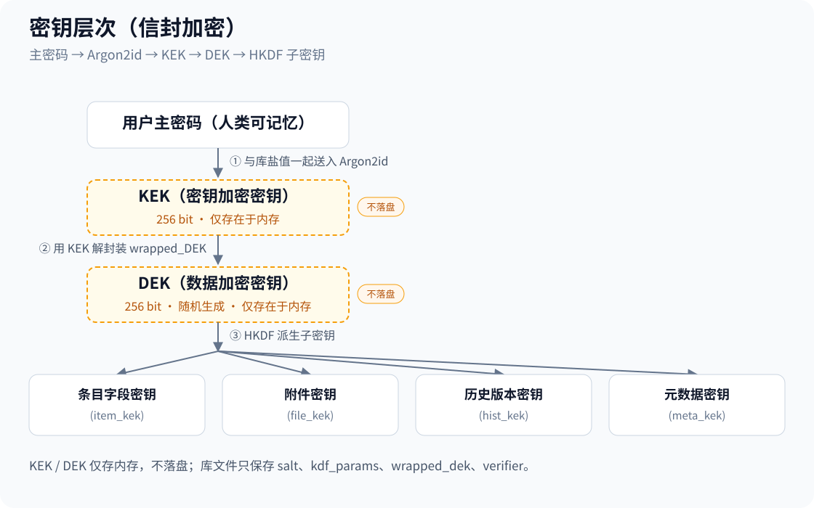

# Coffer 概要设计

| 项 | 内容 |
| --- | --- |
| 文档编号 | LV-HLD-002 |
| 版本 | v1.5 |
| 状态 | 待评审 |
| 创建日期 | 2026-09-23 |
| 上游文档 | `01-需求分析.md` |
| 下游文档 | `03-详细设计.md`、`04-系统设计.md` |

## 修订记录

| 版本 | 日期 | 变更说明 |
| --- | --- | --- |
| v1.0.0 | 2026-09-23 | 首版。基于需求分析 v1.0.0 的决策结论编写 |
| v1.1 | 2026-09-24 | 并入决策会结论（ADR-10 ~ ADR-16）：Passkey 完整能力进 v1.0.0、整体开源（**许可证 MIT**）、第三方安全审计、**采用许可授予型 CLA 保留再许可权**、macOS 14、附件上限 100 MB、macOS 采用剪贴板填充、系统备份按数据类型分别处理。同步关闭原待确认事项 Q-01 ~ Q-05 / Q-07 / Q-08 / Q-09、H-01 / H-03、D-06 / D-09。新增 `tools/inspect_1pux.py`、`tools/make_test_sample.py` 与 `CLA.md` |
| v1.2 | 2026-09-24 | 交付优先级调整为 macOS 优先（C-04 v1.2），Passkey 条件性交付、D-11 升阻塞级；opvault 保持 Should（CSV 为保底迁移路径）；macOS 全局快捷键升重要级 |
| v1.3 | 2026-09-28 | **新增 §10 注册激活与授权（FR-15）概要设计**：模块划分与依赖方向（闭源 cf-license 经 LicenseGate 端口注入，开源核心零依赖闭源）、只读门禁接入点比选、试用期时钟与激活凭证存储比选（Keychain）、构建隔离方案比选（Q-19）、待拍板项汇总（Q-17/18/19）；原 §10/§11 顺延为 §11/§12，§12 增 H-08 ~ H-10。FR-15 详细设计见 `03` §14，测试计划见 `12-注册激活测试计划.md` |
| v1.4 | 2026-09-28 | **Q-17a / Q-17b / Q-18 / Q-19 拍板**：§10.4 试用期起点 = 首次启动定稿；§10.5 构建隔离定稿方案 A（比选表保留存档）；§10.6 改为拍板项汇总——Q-17b 一码多机（限 N 台）采用**格式零改动 + 签发侧 N 枚签发**（默认 N=3 可调，比选见 `03` §14.2.1）；Q-18 纳入 v1.0.0 审计窄范围。§12 H-08 ~ H-10 关闭 |
| v1.5 | 2026-10-07 | **零网络措辞全仓改写（D-4 裁定，docs/02-研发计划与决策/03-不可逆决策追认表.md 附表）**：§2 P0「零网络可证明」按新口径改写、§3 模块表 cf-audit「不联网（硬约束）」/ §10.2 模块表 cf-license「无网络」→「无外部网络」——**边界 = 禁止外部网络（不去云端、数据不出本机）为硬承诺；本机内 UDS / 本机回环允许且不违背承诺**。修订记录历史行不改写 |
| v1.6 | 2026-10-10 | **新增 §6.5 用户名/密码 写面与读面全景（SVG 架构图）**：写面三入口（App 编辑 / CLI set-password --user / 1PUX 导入）汇单一加密落库管线，读面三出口（App 详情页 / MCP get_secret_metadata username 直出 v2.8.1 / run_with_secret 子进程注入）按 R2 纪律分层——密码值只经 stdin/掩码/子进程 env 注入三通道，MCP 无写面；浏览器捕获线废弃（v2.4.0）登记在图。修订记录历史行不改写 |
| v1.7 | 2026-10-10 | **全文档 ASCII 图转 SVG（12 张）**：§4.2 库文件布局、§4.3 会话锁定状态机、§4.4 导入流水线（8 阶段管线）、§4.5 自动填充两流程（Android 7 步 / macOS 5 步）、§4.6 Passkey 两流程（Android 7 步 / macOS 6 步）、§6.1 解锁链 / §6.2 查询链 / §6.3 导入时序（预检与执行分离）、§10.2 双分发渠道对比（含依赖方向图例）——§2.2 目录树与 §4.3 KDF 封装链保留 ASCII（文本树与公式不属流程图）。每张渲染核验（qlmanage 渲染 + 视觉模型逐张核验，12/12 CLEAN）。修订记录历史行不改写 |

---

## 1. 设计目标与原则

### 1.1 首要设计目标

按优先级排序，冲突时高优先级胜出：

| 优先级 | 目标 | 具体含义 |
| --- | --- | --- |
| P0 | **零网络可证明** | 不是"不联网"，是**没有连接外部网络的能力**——不去云端、数据不出本机（本机内 UDS / 本机回环允许，docs/02-研发计划与决策/03-不可逆决策追认表.md D-4）。任何引入外部网络依赖的设计方案直接否决，无论性能多好 |
| P0 | **数据不丢** | 加密体系正确性优先于一切性能优化。宁可慢，不可错 |
| P1 | **两端行为绝对一致** | 同一个库文件在 Android 与 macOS 上必须产生完全相同的解析结果 |
| P1 | **迁移不失真** | 从 1PUX / CSV 导入的数据，字段映射必须可逐项核对，不静默丢弃 |
| P2 | **解锁体验可接受** | KDF 强度与解锁耗时的平衡，目标 0.5–1.0 秒 |
| P3 | **代码可审计** | 核心逻辑集中、边界清晰、第三方依赖可控 |

### 1.2 设计原则

| 原则 | 落地要求 |
| --- | --- |
| **单一内核** | 加密、存储、业务逻辑全部在 Rust 核心，两端 UI 不含任何密码学代码 |
| **不自造密码学** | 只使用 RustCrypto 等成熟 crate 的高层 API，禁止手工拼装 AEAD 构造 |
| **显式优于隐式** | 所有加密失败、格式错误必须显式返回错误，禁止 `unwrap()` 兜底 |
| **格式先行** | 容器格式先写成规范文档，再写实现。格式变更必须升版本号 |
| **可验证** | 安全承诺必须能被第三方用工具验证，不能只靠声明 |

### 1.3 对需求文档的一处修正

**修正 1**：需求文档 FR-1.8 表述为"换密后全库重新加密"。本设计采用 **envelope encryption（信封加密）**，改主密码只需重新封装数据密钥，**不需要重加密全库**。这是一个显著的性能与可靠性优势（换密从"全库重写"降为"改 64 字节"），也是行业标准做法。

因此 FR-1.8 修正为：

> **FR-1.8（修正）** 支持更换主密码。默认路径：重新封装数据密钥，全库密文不变。另提供"完全重加密"选项，用于用户怀疑数据密钥已泄露的场景。两条路径均需先验证旧密码。

---

## 2. 架构总览

### 2.1 分层架构


**依赖方向严格单向**：表示层 → 绑定层 → 应用服务层 → 领域层 → 基础设施层。反向依赖一律禁止。

### 2.2 工程结构

```
coffer/
├── core/                          # Rust workspace
│   ├── Cargo.toml                 # workspace 定义
│   ├── cf-crypto/                 # 加密原语封装
│   │   └── src/{kdf.rs, aead.rs, rng.rs, mem.rs}
│   ├── cf-format/                 # 容器格式读写
│   │   └── src/{header.rs, container.rs, migrate.rs}
│   ├── cf-domain/                 # 领域模型
│   │   └── src/{item.rs, category.rs, field.rs, vault.rs, error.rs}
│   ├── cf-store/                  # 存储引擎
│   │   └── src/{schema.rs, repo.rs, tx.rs, attachment.rs, history.rs}
│   ├── cf-importer/               # 导入器
│   │   └── src/{one_pux.rs, csv.rs, opvault.rs, mapping.rs, precheck.rs}
│   ├── cf-exporter/               # 导出器
│   │   └── src/{backup.rs, one_pux.rs, csv.rs}
│   ├── cf-totp/                   # TOTP
│   │   └── src/{otp.rs, uri.rs, qr.rs}
│   ├── cf-audit/                  # 离线安全检查
│   │   └── src/{rules.rs, report.rs, dictionary.rs}
│   ├── cf-session/                # 会话与用例编排
│   │   └── src/{session.rs, lock.rs, usecase/*.rs}
│   ├── cf-ffi/                    # UniFFI 边界
│   │   └── src/{api.udl 或 proc-macro, types.rs, error.rs}
│   └── cf-testkit/                # 测试夹具与样本生成
├── android/                       # Android 工程
│   ├── app/                       # 主应用
│   ├── autofill/                  # AutofillService 模块
│   └── core-bindings/             # UniFFI 生成的 Kotlin 绑定
├── macos/                         # macOS 工程（Xcode）
│   ├── Coffer/                # SwiftUI 应用
│   ├── CoreBindings/              # UniFFI 生成的 Swift 绑定
│   └── Coffer.xcodeproj
├── docs/                          # 本套文档
└── tools/                         # 构建脚本、样本生成工具
```

### 2.3 模块职责矩阵

| 模块 | 职责 | 不做什么 | 平台相关 |
| --- | --- | --- | --- |
| `cf-crypto` | Argon2id KDF、XChaCha20-Poly1305 AEAD、CSPRNG、内存清零 | 不知道"条目"是什么 | 否 |
| `cf-format` | 容器头部读写、版本识别、格式迁移 | 不管理条目内容 | 否 |
| `cf-domain` | 条目/字段/保险库模型、22 类模板、校验 | 不碰 IO 与加密 | 否 |
| `cf-store` | SQLite schema、加密字段读写、事务、附件、历史版本 | 不做字段级业务校验 | 否 |
| `cf-importer` | 1PUX / CSV / opvault 解析、字段映射、预检报告 | 不直接写库（产出中间模型） | 否 |
| `cf-exporter` | 加密备份、1PUX 兼容导出、CSV 导出 | 不做 UI 提示 | 否 |
| `cf-totp` | TOTP 生成、otpauth URI 解析、QR 解码 | 不存储密钥（由 store 管） | 否 |
| `cf-audit` | 弱/重复/陈旧密码检测、弱 URL 检测、报告聚合 | 无外部网络（**硬约束**，本机内 UDS / 回环不在禁止范围，docs/02-研发计划与决策/03-不可逆决策追认表.md D-4） | 否 |
| `cf-session` | 解锁/锁定、用例编排、权限门禁、空闲计时 | 不直接操作 UI | 否 |
| `cf-ffi` | 类型映射、错误映射、接口暴露 | 不含业务逻辑 | 否 |
| Android 层 | UI、AutofillService、BiometricPrompt、Keystore | **不实现任何加密算法** | 是 |
| macOS 层 | UI、菜单栏、Touch ID、Keychain、剪贴板 | **不实现任何加密算法** | 是 |

---

## 3. 技术选型

| 领域 | 选型 | 理由 | 否决的替代方案 |
| --- | --- | --- | --- |
| 核心语言 | Rust（edition 2021+） | 内存安全 + 无 GC + 跨平台一致；密码学生态成熟 | C/C++（内存安全风险）；Go（GC 与内存清零困难） |
| FFI 绑定 | UniFFI | 自动生成 Kotlin/Swift 绑定，类型映射可靠，减少手写胶水代码 | 手写 JNI（维护成本高）；cgo（不适用） |
| KDF | `argon2` crate（RustCrypto） | Argon2id 抗 GPU/ASIC，RFC 9106 标准 | PBKDF2（抗 GPU 弱）；scrypt（内存参数不如 Argon2 灵活） |
| AEAD | `chacha20poly1305` crate，XChaCha20-Poly1305 模式 | 192-bit nonce，可安全随机生成，无 nonce 复用风险；纯软件实现性能好，不依赖 AES 硬件指令 | AES-256-GCM（96-bit nonce 随机生成风险高，需计数器管理）；AES-SIV（生态支持弱） |
| 随机源 | `getrandom`（底层 OsRng） | 直接使用操作系统 CSPRNG | 用户态 RNG（不可信） |
| 内存清零 | `zeroize` | 编译期防优化掉清零操作 | 手写清零（会被编译器优化删除） |
| 存储 | SQLite（`rusqlite`，bundled 编译） | 事务可靠、单文件、跨平台一致、支持增量写入 | 纯 JSON 文件（大库性能差、易损坏）；自研 B+ 树（不必要） |
| 内部序列化 | CBOR（`ciborium`） | 紧凑、二进制安全、schema 演进友好 | JSON（体积大、二进制字段需 base64）；protobuf（需 schema 编译） |
| 导入解析 | `serde_json` | 1PUX 是 JSON | — |
| ZIP 读取 | `zip` crate | 1PUX 是 ZIP 归档 | 自研 ZIP（不必要） |
| TOTP | 自研实现于 `cf-totp`，底层用 `hmac` + `sha1`/`sha2` | RFC 6238 逻辑简单，便于完全掌控；需标准测试向量验证 | 现成 TOTP crate（可评估，但需审计依赖） |
| Base32 | `data-encoding` | otpauth URI 解析需要 | — |
| QR 解码 | Android：`zxing` / ML Kit；macOS：Vision 框架 | 用平台原生能力，核心库不含图像处理 | 核心库内做 QR 解码（引入大量依赖） |
| Android UI | Jetpack Compose | 官方现代方案，声明式 | XML View（维护成本高） |
| Android 生物识别 | `androidx.biometric` | 官方封装，兼容性好 | 直接调 FingerprintManager（已废弃） |
| Android 密钥存储 | Android Keystore（`setUserAuthenticationRequired`） | 硬件级密钥保护，TEE/StrongBox 支持 | 纯软件密钥（无硬件保护） |
| macOS UI | SwiftUI | 原生、与系统集成好、Apple Silicon 优化 | Electron（引入完整浏览器运行时，与"原生"定位冲突）；AppKit（开发效率低） |
| macOS 生物识别 | LocalAuthentication | 官方 Touch ID 接口 | — |
| macOS 密钥存储 | Keychain + `kSecAccessControlBiometryCurrentSet` | 密钥受生物识别保护，且生物特征变更后自动失效 | 普通 Keychain 项（无生物识别门禁） |
| macOS 分发 | 硬编码签名 + 公证（Notarization） | 用户可直接运行，无需绕过 Gatekeeper | 仅签名不公证（用户需手工放行） |

### 3.1 为什么坚持原生而非 Electron

本项目的差异化定位之一就是"原生"。因此：

- **Android**：Kotlin + Compose，不使用 WebView 承载核心 UI
- **macOS**：Swift + SwiftUI，**明确禁用 Electron / Tauri / 任何 Web 技术栈承载 UI**

> 这不是技术洁癖。Electron 会引入一个完整的浏览器运行时，其网络栈是"零网络"承诺的**实质性威胁**——即使代码不调用，运行时自身的存在就扩大了攻击面与审计难度。这与 P0 目标直接冲突。

---

## 4. 核心机制设计

### 4.1 密钥层次（信封加密）



**设计要点**：

1. **DEK 随机生成，不派生自主密码**。这是信封加密的核心：改主密码只重封装 DEK，不重加密数据。
2. **子密钥通过 HKDF 从 DEK 派生**，做到"一钥一用"——附件密钥泄露不影响条目字段，便于轮换与审计。
3. **KEK 不落盘**。库文件中只存 `salt`、`kdf_params`、`wrapped_dek`、`verifier`。
4. **verifier 用于快速判断密码是否错误**，但必须设计成不泄露可用信息（见 §8.3）。
5. **所有密钥类型实现 `Zeroize` + `ZeroizeOnDrop`**。

**为什么没有 Secret Key**：Secret Key 类机制要求服务端参与保管与分发，本项目无服务端。替代策略是**提高 Argon2id 内存参数**，用计算成本补偿缺失的额外熵。具体参数将于阶段 3 实测标定（需求 NFR-SEC-02）。

### 4.2 存储模型

采用 **SQLite 结构明文 + 敏感字段密文** 的混合模型。

<svg xmlns="http://www.w3.org/2000/svg" viewBox="0 0 980 720" font-family="PingFang SC, Hiragino Sans GB, Microsoft YaHei, sans-serif">
  <defs>
    <marker id="b1-arr" viewBox="0 0 10 10" refX="9" refY="5" markerWidth="7" markerHeight="7" orient="auto-start-reverse">
      <path d="M 0 0 L 10 5 L 0 10 z" fill="#555"/>
    </marker>
  </defs>

  <text x="490" y="34" text-anchor="middle" font-size="20" font-weight="bold" fill="#222">vault.lvvault 库文件布局（SQLite 数据库文件）</text>

  <!-- ===== [文件头部区] ===== -->
  <rect x="90" y="80" width="800" height="90" rx="10" fill="#EAF2FB" stroke="#3B82C4" stroke-width="1.5"/>
  <text x="104" y="100" font-size="14" font-weight="bold" fill="#3B82C4">文件头部区</text>
  <rect x="139" y="106" width="112" height="36" rx="6" fill="#FFFFFF" stroke="#9FB6DD" stroke-width="1"/>
  <text x="195" y="128" text-anchor="middle" font-size="12" fill="#222">magic</text>
  <text x="254" y="128" text-anchor="middle" font-size="12" fill="#999">|</text>
  <rect x="257" y="106" width="112" height="36" rx="6" fill="#FFFFFF" stroke="#9FB6DD" stroke-width="1"/>
  <text x="313" y="128" text-anchor="middle" font-size="12" fill="#222">format_version</text>
  <text x="372" y="128" text-anchor="middle" font-size="12" fill="#999">|</text>
  <rect x="375" y="106" width="112" height="36" rx="6" fill="#FFFFFF" stroke="#9FB6DD" stroke-width="1"/>
  <text x="431" y="128" text-anchor="middle" font-size="12" fill="#222">kdf_params</text>
  <text x="490" y="128" text-anchor="middle" font-size="12" fill="#999">|</text>
  <rect x="493" y="106" width="112" height="36" rx="6" fill="#FFFFFF" stroke="#9FB6DD" stroke-width="1"/>
  <text x="549" y="128" text-anchor="middle" font-size="12" fill="#222">salt</text>
  <text x="608" y="128" text-anchor="middle" font-size="12" fill="#999">|</text>
  <rect x="611" y="106" width="112" height="36" rx="6" fill="#FFFFFF" stroke="#9FB6DD" stroke-width="1"/>
  <text x="667" y="128" text-anchor="middle" font-size="12" fill="#222">wrapped_dek</text>
  <text x="726" y="128" text-anchor="middle" font-size="12" fill="#999">|</text>
  <rect x="729" y="106" width="112" height="36" rx="6" fill="#FFFFFF" stroke="#9FB6DD" stroke-width="1"/>
  <text x="785" y="128" text-anchor="middle" font-size="12" fill="#222">verifier</text>

  <!-- ===== [SQLite 表区] ===== -->
  <rect x="90" y="200" width="800" height="436" rx="10" fill="#F7F4FC" stroke="#7A5CC4" stroke-width="1.5"/>
  <text x="104" y="220" font-size="14" font-weight="bold" fill="#7A5CC4">SQLite 表区</text>

  <!-- 树主干 + 行连接 -->
  <line x1="112" y1="261" x2="112" y2="611" stroke="#B9A6E8" stroke-width="1.5"/>
  <line x1="112" y1="261" x2="136" y2="261" stroke="#B9A6E8" stroke-width="1.5"/>
  <line x1="112" y1="311" x2="136" y2="311" stroke="#B9A6E8" stroke-width="1.5"/>
  <line x1="112" y1="361" x2="136" y2="361" stroke="#B9A6E8" stroke-width="1.5"/>
  <line x1="112" y1="411" x2="136" y2="411" stroke="#B9A6E8" stroke-width="1.5"/>
  <line x1="112" y1="461" x2="136" y2="461" stroke="#B9A6E8" stroke-width="1.5"/>
  <line x1="112" y1="511" x2="136" y2="511" stroke="#B9A6E8" stroke-width="1.5"/>
  <line x1="112" y1="561" x2="136" y2="561" stroke="#B9A6E8" stroke-width="1.5"/>
  <line x1="112" y1="611" x2="136" y2="611" stroke="#B9A6E8" stroke-width="1.5"/>

  <!-- meta -->
  <rect x="136" y="242" width="190" height="38" rx="6" fill="#FFFFFF" stroke="#B9A6E8" stroke-width="1"/>
  <text x="231" y="266" text-anchor="middle" font-size="13" font-weight="bold" fill="#222">meta</text>
  <text x="344" y="264" font-size="12" fill="#555">库级元数据（明文：库 ID、创建时间、格式版本）</text>

  <!-- items -->
  <rect x="136" y="292" width="190" height="38" rx="6" fill="#FFFFFF" stroke="#B9A6E8" stroke-width="1"/>
  <text x="231" y="316" text-anchor="middle" font-size="13" font-weight="bold" fill="#222">items</text>
  <text x="344" y="305" font-size="12" fill="#555">条目索引（uuid、category、created_at、updated_at、</text>
  <text x="344" y="323" font-size="12" fill="#555">state(active/archived)、is_favorite、enc_title、sort_key）</text>

  <!-- fields -->
  <rect x="136" y="342" width="190" height="38" rx="6" fill="#FFFFFF" stroke="#B9A6E8" stroke-width="1"/>
  <text x="231" y="366" text-anchor="middle" font-size="13" font-weight="bold" fill="#222">fields</text>
  <text x="344" y="355" font-size="12" fill="#555">字段明细（item_uuid、field_id、enc_name、enc_value、</text>
  <text x="344" y="373" font-size="12" fill="#555">field_type、designation、section_id）</text>

  <!-- tags -->
  <rect x="136" y="392" width="190" height="38" rx="6" fill="#FFFFFF" stroke="#B9A6E8" stroke-width="1"/>
  <text x="231" y="416" text-anchor="middle" font-size="13" font-weight="bold" fill="#222">tags</text>
  <text x="344" y="414" font-size="12" fill="#555">标签（uuid、item_uuid、enc_name）</text>

  <!-- urls -->
  <rect x="136" y="442" width="190" height="38" rx="6" fill="#FFFFFF" stroke="#B9A6E8" stroke-width="1"/>
  <text x="231" y="466" text-anchor="middle" font-size="13" font-weight="bold" fill="#222">urls</text>
  <text x="344" y="464" font-size="12" fill="#555">多 URL（item_uuid、enc_label、enc_url）</text>

  <!-- attachments -->
  <rect x="136" y="492" width="190" height="38" rx="6" fill="#FFFFFF" stroke="#B9A6E8" stroke-width="1"/>
  <text x="231" y="516" text-anchor="middle" font-size="13" font-weight="bold" fill="#222">attachments</text>
  <text x="344" y="505" font-size="12" fill="#555">附件元数据 + 加密内容（item_uuid、enc_filename、</text>
  <text x="344" y="523" font-size="12" fill="#555">enc_content 或外置文件引用、size、sha256）</text>

  <!-- history -->
  <rect x="136" y="542" width="190" height="38" rx="6" fill="#FFFFFF" stroke="#B9A6E8" stroke-width="1"/>
  <text x="231" y="566" text-anchor="middle" font-size="13" font-weight="bold" fill="#222">history</text>
  <text x="344" y="564" font-size="12" fill="#555">历史版本（item_uuid、version、created_at、enc_snapshot）</text>

  <!-- audit_local -->
  <rect x="136" y="592" width="190" height="38" rx="6" fill="#FFFFFF" stroke="#B9A6E8" stroke-width="1"/>
  <text x="231" y="616" text-anchor="middle" font-size="13" font-weight="bold" fill="#222">audit_local</text>
  <text x="344" y="614" font-size="12" fill="#555">本地安全日志（时间、事件类型；<tspan font-weight="bold" fill="#A03030">不含敏感值</tspan>）</text>

  <text x="490" y="670" text-anchor="middle" font-size="11" fill="#999">docs/02-概要设计 §4.2 · vault.lvvault 库文件布局（SQLite 数据库文件）</text>
</svg>

**加密粒度**：`enc_*` 前缀列存放 AEAD 密文（`nonce || ciphertext || tag`），AAD 绑定"记录 UUID + 列名"，防止密文被跨行跨列搬运。

**允许泄露的元数据（必须在威胁模型中声明）**：条目数量、每个条目的字段数量、字段类型分布、创建/更新时间、标签数量、附件大小、分类。（**标题、用户名、密码、URL、备注全部加密**）这个取舍是为了换取增量写入、事务可靠性与可用性。若要连元数据也隐藏，只能回到"整库一次性加解密"方案，代价是大库每次修改都要重写全文件且必须全库载入内存。

**"排序"的处理**：列表需要按标题排序，但标题已加密。方案是额外存一个 `sort_key`——标题的**加盐 HMAC 摘要**，仅用于排序与等值匹配，不泄露明文（可选）。**默认关闭**（因为 HMAC 摘要对短标题存在字典攻击风险），关闭时排序在解密后于内存中完成。

### 4.3 会话与锁定模型

<svg xmlns="http://www.w3.org/2000/svg" viewBox="0 0 980 450" font-family="PingFang SC, Hiragino Sans GB, Microsoft YaHei, sans-serif">
  <defs>
    <marker id="b2-arr" viewBox="0 0 10 10" refX="9" refY="5" markerWidth="7" markerHeight="7" orient="auto-start-reverse">
      <path d="M 0 0 L 10 5 L 0 10 z" fill="#555"/>
    </marker>
  </defs>

  <text x="490" y="34" text-anchor="middle" font-size="20" font-weight="bold" fill="#222">会话与锁定状态机</text>
  <text x="960" y="96" text-anchor="end" font-size="11" fill="#666">状态标注</text>

  <!-- Locked -->
  <rect x="90" y="120" width="260" height="130" rx="10" fill="#F5F5F5" stroke="#999" stroke-width="1.5"/>
  <text x="220" y="172" text-anchor="middle" font-size="16" font-weight="bold" fill="#222">Locked</text>
  <text x="220" y="202" text-anchor="middle" font-size="13" fill="#555">密钥=空</text>

  <!-- Unlocked -->
  <rect x="560" y="120" width="260" height="130" rx="10" fill="#EAF7EE" stroke="#3B9E5F" stroke-width="1.5"/>
  <text x="690" y="172" text-anchor="middle" font-size="16" font-weight="bold" fill="#222">Unlocked</text>
  <text x="690" y="202" text-anchor="middle" font-size="13" fill="#555">DEK 在内存</text>

  <!-- 解锁转移：Locked → Unlocked -->
  <line x1="350" y1="160" x2="560" y2="160" stroke="#555" stroke-width="1.5" marker-end="url(#b2-arr)"/>
  <text x="455" y="152" text-anchor="middle" font-size="12" fill="#444">输入主密码/生物识别</text>

  <!-- 锁定转移：Unlocked → Locked -->
  <line x1="560" y1="220" x2="350" y2="220" stroke="#555" stroke-width="1.5" marker-end="url(#b2-arr)"/>
  <text x="455" y="240" text-anchor="middle" font-size="12" fill="#444">锁定 / 空闲超时 / 系统锁屏 / 手动锁定</text>

  <!-- 允许的操作（挂 Unlocked 右下，连线接 Unlocked） -->
  <line x1="785" y1="250" x2="785" y2="290" stroke="#555" stroke-width="1.5" marker-end="url(#b2-arr)"/>
  <rect x="655" y="290" width="260" height="76" rx="8" fill="#F2F2F2" stroke="#999" stroke-width="1.5"/>
  <text x="785" y="322" text-anchor="middle" font-size="12"><tspan font-weight="bold" fill="#222">允许的操作：</tspan><tspan fill="#444">查询、增删改、</tspan></text>
  <text x="785" y="346" text-anchor="middle" font-size="12" fill="#444">导入导出、填充</text>

  <text x="490" y="400" text-anchor="middle" font-size="11" fill="#999">docs/02-概要设计 §4.3 · 会话与锁定状态机（Locked ⇄ Unlocked）</text>
</svg>

**门禁规则**：`cf-session` 是唯一持有 DEK 的模块。所有数据访问用例必须先通过 `require_unlocked()` 检查，未解锁时返回 `Error::VaultLocked`。**此检查在 Rust 侧强制执行，不能依赖 UI 层的状态管理**（UI 状态可被绕过，Rust 侧不行）。

**自动锁定触发条件**：

| 平台 | 触发条件 |
| --- | --- |
| Android | 空闲超时；应用进入后台（可配置立即锁定）；屏幕关闭；设备锁屏 |
| macOS | 空闲超时；系统锁屏；屏幕保护启动；用户切换（快速用户切换）；系统休眠 |

**生物识别解锁的密钥封装链**：

```
主密码路径：  主密码 → Argon2id → KEK → 解封装 DEK
生物识别路径：Touch ID/Fingerprint → 释放平台密钥库中的平台密钥
                                    → 解封装 生物识别_DEK
```

两条路径**都能解出同一个 DEK**。生物识别路径要写入平台密钥库（Android Keystore / macOS Keychain）一份 `wrapped_dek_biometric`，其平台密钥受生物识别保护（`setUserAuthenticationRequired(true)` / `kSecAccessControlBiometryCurrentSet`）。

**关键安全性质**：用户修改生物特征（录入新指纹 / 新增 Face ID）后，平台密钥失效，`wrapped_dek_biometric` 无法解开，用户必须回退到主密码。这是**期望行为**，防止他人添加自己的指纹后解锁。

### 4.4 导入流水线

导入是分层流水线，每层职责单一，便于定位问题：

<svg xmlns="http://www.w3.org/2000/svg" width="760" height="960" viewBox="0 0 760 960" role="img" aria-labelledby="title desc">
<title id="title">导入流水线</title>
<desc id="desc">导入是 8 阶段分层流水线：读取 → 解包 → 解析 → 映射 → 预检 → 用户确认 → 写入 → 结果核对；预检与执行分离，写入在事务中完成。</desc>
<defs><marker id="arrow" viewBox="0 0 10 10" refX="9" refY="5" markerWidth="7" markerHeight="7" orient="auto-start-reverse"><path d="M 0 0 L 10 5 L 0 10 z" fill="#64748b"/></marker></defs>
<rect width="760" height="960" rx="20" fill="#f8fafc"/>
<g font-family="-apple-system, BlinkMacSystemFont, 'Segoe UI', 'PingFang SC', 'Microsoft YaHei', 'Noto Sans CJK SC', sans-serif">
<text x="40" y="50" font-size="28" fill="#0f172a" font-weight="700">导入流水线 · 8 阶段</text>
<text x="40" y="80" font-size="16" fill="#64748b">每层职责单一，便于定位问题 · 预检（①–⑤）只读无副作用，执行（⑦）在事务中完成</text>

<!-- ===== ① 读取 ===== -->
<rect x="60" y="108" width="520" height="58" rx="10" fill="#eff6ff" stroke="#2563eb" stroke-width="1.6"/>
<text x="88" y="134" font-size="16" fill="#0f172a" font-weight="700">① 读取</text>
<text x="88" y="156" font-size="13" fill="#334155">识别文件类型（魔数 + 扩展名 + 内容探测）</text>
<rect x="634" y="125" width="96" height="24" rx="6" fill="#eff6ff" stroke="#2563eb" stroke-width="1.2"/>
<text x="682" y="141" font-size="12" fill="#1e40af" text-anchor="middle">cf-importer</text>
<path d="M 320 166 V 186" fill="none" stroke="#64748b" stroke-width="2" marker-end="url(#arrow)"/>

<!-- ===== ② 解包 ===== -->
<rect x="60" y="186" width="520" height="92" rx="10" fill="#eff6ff" stroke="#2563eb" stroke-width="1.6"/>
<text x="88" y="212" font-size="16" fill="#0f172a" font-weight="700">② 解包</text>
<text x="88" y="232" font-size="13" fill="#334155">1PUX：解 ZIP → export.attributes + export.data + files/</text>
<text x="88" y="252" font-size="13" fill="#334155">CSV：编码探测（BOM / UTF-8 / GBK）→ 表头解析</text>
<text x="88" y="272" font-size="13" fill="#334155">opvault：定位 default 配置文件 → 解密</text>
<rect x="634" y="220" width="96" height="24" rx="6" fill="#eff6ff" stroke="#2563eb" stroke-width="1.2"/>
<text x="682" y="236" font-size="12" fill="#1e40af" text-anchor="middle">cf-importer</text>
<path d="M 320 278 V 298" fill="none" stroke="#64748b" stroke-width="2" marker-end="url(#arrow)"/>

<!-- ===== ③ 解析 ===== -->
<rect x="60" y="298" width="520" height="58" rx="10" fill="#eff6ff" stroke="#2563eb" stroke-width="1.6"/>
<text x="88" y="324" font-size="16" fill="#0f172a" font-weight="700">③ 解析</text>
<text x="88" y="346" font-size="13" fill="#334155">产出中间表示 ImportModel（与存储层解耦）</text>
<rect x="634" y="315" width="96" height="24" rx="6" fill="#eff6ff" stroke="#2563eb" stroke-width="1.2"/>
<text x="682" y="331" font-size="12" fill="#1e40af" text-anchor="middle">cf-importer</text>
<path d="M 320 356 V 376" fill="none" stroke="#64748b" stroke-width="2" marker-end="url(#arrow)"/>

<!-- ===== ④ 映射 ===== -->
<rect x="60" y="376" width="520" height="78" rx="10" fill="#eff6ff" stroke="#2563eb" stroke-width="1.6"/>
<text x="88" y="402" font-size="16" fill="#0f172a" font-weight="700">④ 映射</text>
<text x="88" y="424" font-size="13" fill="#334155">1PUX 字段 → Coffer 字段（按映射表）</text>
<text x="88" y="444" font-size="13" fill="#334155">未映射字段 → 收集进「未映射清单」，不丢弃</text>
<rect x="634" y="401" width="96" height="24" rx="6" fill="#eff6ff" stroke="#2563eb" stroke-width="1.2"/>
<text x="682" y="417" font-size="12" fill="#1e40af" text-anchor="middle">cf-importer</text>
<path d="M 320 454 V 474" fill="none" stroke="#64748b" stroke-width="2" marker-end="url(#arrow)"/>

<!-- ===== ⑤ 预检 ===== -->
<rect x="60" y="474" width="520" height="78" rx="10" fill="#eff6ff" stroke="#2563eb" stroke-width="1.6"/>
<text x="88" y="500" font-size="16" fill="#0f172a" font-weight="700">⑤ 预检</text>
<text x="88" y="522" font-size="13" fill="#334155">产出 PrecheckReport：条目数 / 类型分布 / 附件数 / 未映射字段</text>
<text x="88" y="542" font-size="13" fill="#334155">/ 冲突项 / 预计耗时</text>
<rect x="634" y="499" width="96" height="24" rx="6" fill="#eff6ff" stroke="#2563eb" stroke-width="1.2"/>
<text x="682" y="515" font-size="12" fill="#1e40af" text-anchor="middle">cf-importer</text>
<path d="M 320 552 V 572" fill="none" stroke="#64748b" stroke-width="2" marker-end="url(#arrow)"/>

<!-- ===== ⑥ 用户确认 ===== -->
<rect x="60" y="572" width="520" height="78" rx="10" fill="#ffffff" stroke="#94a3b8" stroke-width="1.4"/>
<text x="88" y="598" font-size="16" fill="#0f172a" font-weight="700">⑥ 用户确认</text>
<text x="88" y="620" font-size="13" fill="#475569">UI 展示预检报告</text>
<text x="88" y="640" font-size="13" fill="#475569">用户选择冲突策略</text>
<rect x="656" y="597" width="74" height="24" rx="6" fill="#ffffff" stroke="#94a3b8" stroke-width="1.2"/>
<text x="693" y="613" font-size="12" fill="#475569" text-anchor="middle">App UI</text>
<path d="M 320 650 V 670" fill="none" stroke="#64748b" stroke-width="2" marker-end="url(#arrow)"/>

<!-- ===== ⑦ 写入 ===== -->
<rect x="60" y="670" width="520" height="78" rx="10" fill="#fffbeb" stroke="#d97706" stroke-width="1.6"/>
<text x="88" y="696" font-size="16" fill="#0f172a" font-weight="700">⑦ 写入</text>
<text x="88" y="718" font-size="13" fill="#92400e">在事务中写入临时区 → 全部成功才提交</text>
<text x="88" y="738" font-size="13" fill="#92400e">失败则回滚，已有数据不受影响（NFR-REL-04）</text>
<rect x="590" y="695" width="140" height="24" rx="6" fill="#fffbeb" stroke="#d97706" stroke-width="1.2"/>
<text x="660" y="711" font-size="11.5" fill="#92400e" text-anchor="middle">cf-session + cf-store</text>
<path d="M 320 748 V 768" fill="none" stroke="#64748b" stroke-width="2" marker-end="url(#arrow)"/>

<!-- ===== ⑧ 结果核对 ===== -->
<rect x="60" y="768" width="520" height="78" rx="10" fill="#ffffff" stroke="#94a3b8" stroke-width="1.4"/>
<text x="88" y="794" font-size="16" fill="#0f172a" font-weight="700">⑧ 结果核对</text>
<text x="88" y="816" font-size="13" fill="#475569">随机抽样展示导入结果，供用户核对</text>
<text x="88" y="836" font-size="13" fill="#475569">强制提示删除源导出文件</text>
<rect x="656" y="793" width="74" height="24" rx="6" fill="#ffffff" stroke="#94a3b8" stroke-width="1.2"/>
<text x="693" y="809" font-size="12" fill="#475569" text-anchor="middle">App UI</text>

<!-- 底注 -->
<text x="40" y="888" font-size="14" fill="#64748b">关键设计：③ 的 ImportModel 是纯数据、可单独测试与序列化（便于问题复现）；④ 映射表配置驱动，新增类型只需加规则；⑦ 事务保证「导入失败不搞坏库」（NFR-REL-04）。</text>
<text x="40" y="912" font-size="14" fill="#64748b">预检与执行分离：precheck_import 只读无副作用、可反复调用；execute_import 才写库（§6.3 时序）。</text>
</g>
</svg>

**关键设计**：

- ③ 的中间表示是**纯数据**，不含存储依赖，可单独测试与序列化，便于问题复现。
- ④ 的映射表是**配置驱动**的，新增条目类型只需加映射规则，不改代码逻辑。
- ⑦ 的原子性保证"导入失败不会把库搞坏"，这是用户信任的基础。

### 4.5 自动填充机制

两端机制完全不同，因为平台能力不同：

**Android（能力完整）**

<svg xmlns="http://www.w3.org/2000/svg" viewBox="0 0 640 800" font-family="PingFang SC, Hiragino Sans GB, Microsoft YaHei, sans-serif">
  <defs>
    <marker id="arr" viewBox="0 0 10 10" refX="9" refY="5" markerWidth="7" markerHeight="7" orient="auto-start-reverse">
      <path d="M 0 0 L 10 5 L 0 10 z" fill="#555"/>
    </marker>
  </defs>

  <text x="320" y="40" text-anchor="middle" font-size="20" font-weight="bold" fill="#222">§4.5 Android 自动填充流程（7 步）</text>

  <!-- ===== 步骤 1 ===== -->
  <circle cx="90" cy="123" r="13" fill="#3B82C4"/>
  <text x="90" y="128" text-anchor="middle" font-size="13" font-weight="bold" fill="#fff">①</text>
  <rect x="60" y="90" width="520" height="66" rx="8" fill="#EAF2FB" stroke="#3B82C4" stroke-width="1.5"/>
  <text x="118" y="128" font-size="13" fill="#222">目标 App 出现登录框</text>
  <line x1="320" y1="156" x2="320" y2="186" stroke="#555" stroke-width="1.5" marker-end="url(#arr)"/>

  <!-- ===== 步骤 2 ===== -->
  <circle cx="90" cy="219" r="13" fill="#3B82C4"/>
  <text x="90" y="224" text-anchor="middle" font-size="13" font-weight="bold" fill="#fff">②</text>
  <rect x="60" y="186" width="520" height="66" rx="8" fill="#EAF2FB" stroke="#3B82C4" stroke-width="1.5"/>
  <text x="118" y="212" font-size="13" fill="#222">系统 Autofill Framework 回调</text>
  <text x="118" y="230" font-size="13" fill="#444">Coffer 的 AutofillService</text>
  <line x1="320" y1="252" x2="320" y2="282" stroke="#555" stroke-width="1.5" marker-end="url(#arr)"/>

  <!-- ===== 步骤 3 ===== -->
  <circle cx="90" cy="315" r="13" fill="#3B82C4"/>
  <text x="90" y="320" text-anchor="middle" font-size="13" font-weight="bold" fill="#fff">③</text>
  <rect x="60" y="282" width="520" height="66" rx="8" fill="#EAF2FB" stroke="#3B82C4" stroke-width="1.5"/>
  <text x="118" y="308" font-size="13" fill="#222">解析 AssistStructure → 提取</text>
  <text x="118" y="326" font-size="13" fill="#444">包名 / 域名 / 输入框语义</text>
  <line x1="320" y1="348" x2="320" y2="378" stroke="#555" stroke-width="1.5" marker-end="url(#arr)"/>

  <!-- ===== 步骤 4 ===== -->
  <circle cx="90" cy="411" r="13" fill="#3B82C4"/>
  <text x="90" y="416" text-anchor="middle" font-size="13" font-weight="bold" fill="#fff">④</text>
  <rect x="60" y="378" width="520" height="66" rx="8" fill="#EAF2FB" stroke="#3B82C4" stroke-width="1.5"/>
  <text x="118" y="404" font-size="13" fill="#222">匹配条目（按 URL 域名 + 包名）</text>
  <text x="118" y="422" font-size="13" fill="#444">→ 生成 Dataset 列表</text>
  <line x1="320" y1="444" x2="320" y2="474" stroke="#555" stroke-width="1.5" marker-end="url(#arr)"/>

  <!-- ===== 步骤 5 ===== -->
  <circle cx="90" cy="507" r="13" fill="#3B82C4"/>
  <text x="90" y="512" text-anchor="middle" font-size="13" font-weight="bold" fill="#fff">⑤</text>
  <rect x="60" y="474" width="520" height="66" rx="8" fill="#EAF2FB" stroke="#3B82C4" stroke-width="1.5"/>
  <text x="118" y="512" font-size="13" fill="#222">用户选中某个 Dataset</text>
  <line x1="320" y1="540" x2="320" y2="570" stroke="#555" stroke-width="1.5" marker-end="url(#arr)"/>

  <!-- ===== 步骤 6（身份校验） ===== -->
  <circle cx="90" cy="603" r="13" fill="#C47B3B"/>
  <text x="90" y="608" text-anchor="middle" font-size="13" font-weight="bold" fill="#fff">⑥</text>
  <rect x="60" y="570" width="520" height="66" rx="8" fill="#FBF3E4" stroke="#C47B3B" stroke-width="1.5"/>
  <text x="118" y="596" font-size="13" fill="#222">【身份校验】BiometricPrompt 或主密码</text>
  <text x="118" y="614" font-size="13" fill="#444">（可配置免验场景）</text>
  <line x1="320" y1="636" x2="320" y2="666" stroke="#555" stroke-width="1.5" marker-end="url(#arr)"/>

  <!-- ===== 步骤 7 ===== -->
  <circle cx="90" cy="699" r="13" fill="#3B82C4"/>
  <text x="90" y="704" text-anchor="middle" font-size="13" font-weight="bold" fill="#fff">⑦</text>
  <rect x="60" y="666" width="520" height="66" rx="8" fill="#EAF2FB" stroke="#3B82C4" stroke-width="1.5"/>
  <text x="118" y="692" font-size="13" fill="#222">返回 Dataset 的 Authentication 结果</text>
  <text x="118" y="710" font-size="13" fill="#444">→ 系统完成填充</text>

  <text x="320" y="760" text-anchor="middle" font-size="11" fill="#999">§4.5 · 系统 Autofill 框架保证调用方身份；身份校验通过后由系统完成填充</text>
</svg>

**macOS（能力受限，已定采用剪贴板方案）**

<svg xmlns="http://www.w3.org/2000/svg" viewBox="0 0 640 620" font-family="PingFang SC, Hiragino Sans GB, Microsoft YaHei, sans-serif">
  <defs>
    <marker id="arr" viewBox="0 0 10 10" refX="9" refY="5" markerWidth="7" markerHeight="7" orient="auto-start-reverse">
      <path d="M 0 0 L 10 5 L 0 10 z" fill="#555"/>
    </marker>
  </defs>

  <text x="320" y="40" text-anchor="middle" font-size="20" font-weight="bold" fill="#222">§4.5 macOS 快捷键填充流程（5 步）</text>

  <!-- ===== 步骤 1 ===== -->
  <circle cx="90" cy="123" r="13" fill="#3B9E5F"/>
  <text x="90" y="128" text-anchor="middle" font-size="13" font-weight="bold" fill="#fff">①</text>
  <rect x="60" y="90" width="520" height="66" rx="8" fill="#EAF7EE" stroke="#3B9E5F" stroke-width="1.5"/>
  <text x="118" y="128" font-size="13" fill="#222">用户按全局快捷键</text>
  <line x1="320" y1="156" x2="320" y2="186" stroke="#555" stroke-width="1.5" marker-end="url(#arr)"/>

  <!-- ===== 步骤 2 ===== -->
  <circle cx="90" cy="219" r="13" fill="#3B9E5F"/>
  <text x="90" y="224" text-anchor="middle" font-size="13" font-weight="bold" fill="#fff">②</text>
  <rect x="60" y="186" width="520" height="66" rx="8" fill="#EAF7EE" stroke="#3B9E5F" stroke-width="1.5"/>
  <text x="118" y="212" font-size="13" fill="#222">菜单栏弹出快速搜索面板</text>
  <line x1="320" y1="252" x2="320" y2="282" stroke="#555" stroke-width="1.5" marker-end="url(#arr)"/>

  <!-- ===== 步骤 3（搜索并选中 + Touch ID 确认） ===== -->
  <circle cx="90" cy="315" r="13" fill="#C47B3B"/>
  <text x="90" y="320" text-anchor="middle" font-size="13" font-weight="bold" fill="#fff">③</text>
  <rect x="60" y="282" width="520" height="66" rx="8" fill="#FBF3E4" stroke="#C47B3B" stroke-width="1.5"/>
  <text x="118" y="308" font-size="13" fill="#222">搜索并选中条目 → Touch ID 确认</text>
  <line x1="320" y1="348" x2="320" y2="378" stroke="#555" stroke-width="1.5" marker-end="url(#arr)"/>

  <!-- ===== 步骤 4 ===== -->
  <circle cx="90" cy="411" r="13" fill="#3B9E5F"/>
  <text x="90" y="416" text-anchor="middle" font-size="13" font-weight="bold" fill="#fff">④</text>
  <rect x="60" y="378" width="520" height="66" rx="8" fill="#EAF7EE" stroke="#3B9E5F" stroke-width="1.5"/>
  <text x="118" y="404" font-size="13" fill="#222">密码写入剪贴板 → 提示用户粘贴</text>
  <line x1="320" y1="444" x2="320" y2="474" stroke="#555" stroke-width="1.5" marker-end="url(#arr)"/>

  <!-- ===== 步骤 5 ===== -->
  <circle cx="90" cy="507" r="13" fill="#3B9E5F"/>
  <text x="90" y="512" text-anchor="middle" font-size="13" font-weight="bold" fill="#fff">⑤</text>
  <rect x="60" y="474" width="520" height="66" rx="8" fill="#EAF7EE" stroke="#3B9E5F" stroke-width="1.5"/>
  <text x="118" y="512" font-size="13" fill="#222">N 秒后自动清空剪贴板</text>

  <text x="320" y="580" text-anchor="middle" font-size="11" fill="#999">§4.5 · macOS 剪贴板方案（H-01 已定）：Touch ID 确认后写入剪贴板，N 秒自动清空</text>
</svg>

**域名匹配反钓鱼规则**（两端共用，实现在 `cf-domain`）：

| 规则 | 行为 |
| --- | --- |
| 完全匹配（含子域） | 允许填充 |
| 存储 URL 是父域，当前是子域 | 允许填充 |
| 当前是父域，存储是子域 | **拒绝**（防降级攻击） |
| 域名相似但不同（如 `paypa1.com` vs `paypal.com`） | **拒绝并显式告警** |
| 无 URL 的条目 | 需用户手动选择，不作为自动建议 |

---

### 4.6 Passkey 机制

Passkey 是本项目唯一需要平台深度参与的功能。两端机制不同，但核心设计一致。

**核心设计决策**

| 项 | 设计 | 理由 |
| --- | --- | --- |
| **私钥存放位置** | **库内加密存储**，不落平台密钥库 | 若私钥落在 Secure Enclave / TEE，则**不可导出**，库文件搬到另一端后 Passkey 即失效。这与"库文件是唯一搬运单位"的架构（ADR-01）根本冲突 |
| 硬件保护的替代方案 | **平台生物识别门禁 + 库内加密** | 方案 A 牺牲了硬件级私钥保护，用"使用前必须通过生物识别"补偿。**此项作为残余风险列入威胁模型** |
| 私钥加密强度 | 与条目字段同级（由 DEK 派生的 `passkey_key`） | 不因它是"密钥"而特殊对待，避免引入额外的密钥管理复杂度 |
| 账号密码 | 创建 Passkey 的条目**必须同时保留密码**（FR-10.6） | 网站仍可能要求密码；Passkey 是补充而非替代 |
| 跨端搬运 | 随库文件一起，无独立通道 | 与 ADR-01 一致 |

**Android 侧**（API 34+）

<svg xmlns="http://www.w3.org/2000/svg" viewBox="0 0 980 680" font-family="PingFang SC, Hiragino Sans GB, Microsoft YaHei, sans-serif">
  <defs>
    <marker id="arr" viewBox="0 0 10 10" refX="9" refY="5" markerWidth="7" markerHeight="7" orient="auto-start-reverse">
      <path d="M 0 0 L 10 5 L 0 10 z" fill="#555"/>
    </marker>
  </defs>

  <text x="490" y="34" text-anchor="middle" font-size="20" font-weight="bold" fill="#222">Android Passkey 创建 / 使用流程（API 34+）</text>

  <!-- S1 -->
  <rect x="100" y="74" width="780" height="48" rx="8" fill="#EAF2FB" stroke="#3B82C4" stroke-width="1.5"/>
  <text x="490" y="102" text-anchor="middle" font-size="13" font-weight="bold" fill="#222">网站在浏览器 / App 中请求创建或使用 Passkey</text>

  <line x1="490" y1="122" x2="490" y2="148" stroke="#555" stroke-width="1.5" marker-end="url(#arr)"/>

  <!-- S2 -->
  <rect x="100" y="148" width="780" height="48" rx="8" fill="#EAF2FB" stroke="#3B82C4" stroke-width="1.5"/>
  <text x="490" y="176" text-anchor="middle" font-size="13" font-weight="bold" fill="#222">系统 Credential Manager 向已注册的凭据提供者发起查询</text>

  <line x1="490" y1="196" x2="490" y2="222" stroke="#555" stroke-width="1.5" marker-end="url(#arr)"/>

  <!-- S3 -->
  <rect x="100" y="222" width="780" height="58" rx="8" fill="#EAF2FB" stroke="#3B82C4" stroke-width="1.5"/>
  <text x="490" y="248" text-anchor="middle" font-size="13" font-weight="bold" fill="#222">Coffer 的 CredentialProviderService 被调用</text>
  <text x="490" y="269" text-anchor="middle" font-size="11" fill="#444">查询阶段：onBeginGetCredentialRequest / onBeginCreateCredentialRequest</text>

  <line x1="490" y1="280" x2="490" y2="306" stroke="#555" stroke-width="1.5" marker-end="url(#arr)"/>

  <!-- S4 -->
  <rect x="100" y="306" width="780" height="58" rx="8" fill="#EAF2FB" stroke="#3B82C4" stroke-width="1.5"/>
  <text x="490" y="332" text-anchor="middle" font-size="13" font-weight="bold" fill="#222">Rust 核心按 rpId 匹配库内 Passkey → 生成凭据条目列表</text>
  <text x="490" y="353" text-anchor="middle" font-size="11" fill="#444">每个条目带 PendingIntent，不含私钥</text>

  <line x1="490" y1="364" x2="490" y2="390" stroke="#555" stroke-width="1.5" marker-end="url(#arr)"/>

  <!-- S5 -->
  <rect x="100" y="390" width="780" height="58" rx="8" fill="#EAF2FB" stroke="#3B82C4" stroke-width="1.5"/>
  <text x="490" y="416" text-anchor="middle" font-size="13" font-weight="bold" fill="#222">用户在系统选择器中选择</text>
  <text x="490" y="437" text-anchor="middle" font-size="11" fill="#444">PendingIntent 拉起 Coffer 的 Activity</text>

  <line x1="490" y1="448" x2="490" y2="474" stroke="#555" stroke-width="1.5" marker-end="url(#arr)"/>

  <!-- S6 身份校验 -->
  <rect x="100" y="474" width="780" height="48" rx="8" fill="#FBF0E4" stroke="#C98A4B" stroke-width="1.5"/>
  <text x="490" y="502" text-anchor="middle" font-size="13" font-weight="bold" fill="#222">【身份校验】BiometricPrompt 或主密码</text>

  <line x1="490" y1="522" x2="490" y2="548" stroke="#555" stroke-width="1.5" marker-end="url(#arr)"/>

  <!-- S7 -->
  <rect x="100" y="548" width="780" height="58" rx="8" fill="#EAF2FB" stroke="#3B82C4" stroke-width="1.5"/>
  <text x="490" y="574" text-anchor="middle" font-size="13" font-weight="bold" fill="#222">Rust 核心用私钥完成签名</text>
  <text x="490" y="595" text-anchor="middle" font-size="11" fill="#444">经 EXTRA_GET_CREDENTIAL_RESPONSE 回传系统</text>

  <text x="490" y="634" text-anchor="middle" font-size="11" fill="#999">docs/02-概要设计 §4.6 · Android 侧 Passkey 流程 · API 34+</text>
</svg>

**macOS 侧**（macOS 14+）

<svg xmlns="http://www.w3.org/2000/svg" viewBox="0 0 980 600" font-family="PingFang SC, Hiragino Sans GB, Microsoft YaHei, sans-serif">
  <defs>
    <marker id="arr" viewBox="0 0 10 10" refX="9" refY="5" markerWidth="7" markerHeight="7" orient="auto-start-reverse">
      <path d="M 0 0 L 10 5 L 0 10 z" fill="#555"/>
    </marker>
  </defs>

  <text x="490" y="34" text-anchor="middle" font-size="20" font-weight="bold" fill="#222">macOS Passkey 凭据提供者扩展流程（macOS 14+）</text>

  <!-- S1 -->
  <rect x="100" y="74" width="780" height="48" rx="8" fill="#EAF7EE" stroke="#3B9E5F" stroke-width="1.5"/>
  <text x="490" y="102" text-anchor="middle" font-size="13" font-weight="bold" fill="#222">网站在 Safari 中请求创建或「使用」Passkey</text>

  <line x1="490" y1="122" x2="490" y2="148" stroke="#555" stroke-width="1.5" marker-end="url(#arr)"/>

  <!-- S2 系统侧（虚线说明框） -->
  <rect x="100" y="148" width="780" height="58" rx="8" fill="#F6F6F1" stroke="#8A8A7F" stroke-width="1.5" stroke-dasharray="7 5"/>
  <text x="490" y="174" text-anchor="middle" font-size="13" font-weight="bold" fill="#222">系统调用已启用的凭据提供者扩展</text>
  <text x="490" y="195" text-anchor="middle" font-size="11" fill="#444">Coffer 内的 App Extension，独立签名目标</text>

  <line x1="490" y1="206" x2="490" y2="232" stroke="#555" stroke-width="1.5" marker-end="url(#arr)"/>

  <!-- S3 -->
  <rect x="100" y="232" width="780" height="58" rx="8" fill="#EAF7EE" stroke="#3B9E5F" stroke-width="1.5"/>
  <text x="490" y="258" text-anchor="middle" font-size="13" font-weight="bold" fill="#222">扩展是独立进程</text>
  <text x="490" y="279" text-anchor="middle" font-size="11" fill="#444">无法直接访问主 App 的已解锁会话</text>

  <line x1="490" y1="290" x2="490" y2="316" stroke="#555" stroke-width="1.5" marker-end="url(#arr)"/>

  <!-- S4 -->
  <rect x="100" y="316" width="780" height="58" rx="8" fill="#EAF7EE" stroke="#3B9E5F" stroke-width="1.5"/>
  <text x="490" y="342" text-anchor="middle" font-size="13" font-weight="bold" fill="#222">扩展向主 App 请求一次签名</text>
  <text x="490" y="363" text-anchor="middle" font-size="11" fill="#444">不索取 DEK</text>

  <line x1="490" y1="374" x2="490" y2="400" stroke="#555" stroke-width="1.5" marker-end="url(#arr)"/>

  <!-- S5 身份校验 -->
  <rect x="100" y="400" width="780" height="48" rx="8" fill="#FBF0E4" stroke="#C98A4B" stroke-width="1.5"/>
  <text x="490" y="428" text-anchor="middle" font-size="13" font-weight="bold" fill="#222">【身份校验】Touch ID</text>

  <line x1="490" y1="448" x2="490" y2="474" stroke="#555" stroke-width="1.5" marker-end="url(#arr)"/>

  <!-- S6 -->
  <rect x="100" y="474" width="780" height="58" rx="8" fill="#EAF7EE" stroke="#3B9E5F" stroke-width="1.5"/>
  <text x="490" y="500" text-anchor="middle" font-size="13" font-weight="bold" fill="#222">主 App 完成解密与签名</text>
  <text x="490" y="521" text-anchor="middle" font-size="11" fill="#444">结果回传扩展 → 扩展返回系统</text>

  <text x="490" y="558" text-anchor="middle" font-size="11" fill="#999">docs/02-概要设计 §4.6 · macOS 侧 Passkey 凭据提供者扩展流程 · macOS 14+</text>
</svg>

> ⚠️ **macOS 侧实现复杂度显著高于 Android**，三个原因均需在 M0 验证：
> 1. **进程边界**：凭据提供者扩展是独立进程，而 DEK 只存在于主 App 会话中。两者之间如何传递凭据必须有明确设计。
> 2. **沙盒与共享容器**：扩展需通过 App Group 或 XPC 访问库文件，涉及沙盒权限配置。
> 3. **官方能力限制**：扩展有内存与执行时间约束，不能长时间持有解密数据。
>
> **macOS 侧三项复杂度为首版门禁，M0 时间盒内必须给出结论（C-04 v1.2）。**
>
> **已定设计原则**：**扩展只做轻量代理——向主 App 请求一次签名，DEK 永不进入扩展进程。** 这条原则的作用是把"私钥暴露面"限制在主 App 内，扩展被攻破也拿不到库密钥。

**两端共同约束**

| 约束 | 说明 |
| --- | --- |
| 私钥无展示路径 | UI 仅展示 rpId、用户名、创建时间、签名计数器；私钥字段不存在任何显示入口 |
| 签名计数器单调递增 | 每次断言后 `sign_count += 1` 并持久化。**依赖方用它检测克隆凭据**，漏递增会导致部分严格网站拒绝登录 |
| 删除需二次确认 | 删除意味着该网站无法再用此凭据登录 |
| 降级路径 | Android API < 34 / macOS < 14 时隐藏 Passkey UI 并说明原因；密码与 Autofill 功能不受影响 |

---

## 5. FFI 接口概要

`cf-ffi` 是唯一对外边界。接口设计遵循"**粗粒度、面向用例**"——不为 `get_field()` 这种细粒度操作暴露接口，而是暴露"解锁保险库""搜索条目""执行导入"这类用例。理由：细粒度接口会导致 UI 侧大量往返调用，且难以保证事务与权限检查的一致性。

**接口分组（详表见 `03-详细设计.md` §5）**：

| 分组 | 接口数量（估） | 说明 |
| --- | --- | --- |
| 保险库生命周期 | 8 | 创建、打开、解锁（主密码/生物识别）、锁定、改密、删除、查询状态、列出库 |
| 条目 CRUD | 12 | 增删改查、移动、复制、收藏、归档、恢复、历史版本 |
| 字段与标签 | 6 | — |
| 搜索与筛选 | 5 | — |
| 生成器 | 3 | — |
| TOTP | 4 | 生成验证码、解析 URI、增删 |
| 安全检查 | 3 | 运行体检、取报告、忽略某项 |
| 导入导出 | 8 | 预检、执行导入、导出备份、导出 1PUX/CSV、校验 |
| 附件 | 5 | — |
| 设置与状态 | 6 | — |

**跨边界类型映射**（UniFFI 自动生成）：
- `String` ↔ Kotlin `String` / Swift `String`
- `Vec<T>` ↔ `List<T>` / `[T]`
- `Option<T>` ↔ `T?`
- Rust `enum` ↔ Kotlin `sealed class` / Swift `enum`
- Rust `struct` ↔ Kotlin `data class` / Swift `struct`
- **`u64` 时间戳需注意**：Kotlin 的 `ULong` 与 Swift 的 `UInt64` 映射由 UniFFI 处理，但 Kotlin 侧需确认无符号语义

**错误处理**：所有接口返回 `Result<T, CfError>`，`CfError` 为带错误码的 enum。UI 侧按错误码做本地化提示，**不解析错误消息文本**。

---

## 6. 关键数据流

### 6.1 解锁流程

<svg xmlns="http://www.w3.org/2000/svg" width="760" height="790" viewBox="0 0 760 790" role="img" aria-labelledby="title desc">
<title id="title">解锁流程</title>
<desc id="desc">主密码经 unlock_vault 进入会话，cf-session 读取库头参数，cf-crypto 完成 Argon2id 派生 KEK 与 XChaCha20-Poly1305 解封 DEK，校验 verifier 后 DEK 存入会话并启动空闲计时器，返回 UnlockResult。</desc>
<defs><marker id="arrow" viewBox="0 0 10 10" refX="9" refY="5" markerWidth="7" markerHeight="7" orient="auto-start-reverse"><path d="M 0 0 L 10 5 L 0 10 z" fill="#64748b"/></marker></defs>
<rect width="760" height="790" rx="20" fill="#f8fafc"/>
<g font-family="-apple-system, BlinkMacSystemFont, 'Segoe UI', 'PingFang SC', 'Microsoft YaHei', 'Noto Sans CJK SC', sans-serif">
<text x="40" y="49" font-size="28" fill="#0f172a" font-weight="700">解锁流程 · 主密码路径</text>
<text x="40" y="78" font-size="16" fill="#64748b">主密码 → Argon2id → KEK → 解封 DEK → 会话持有 · 全程 Rust 侧强制（UI 无密码学代码）</text>

<!-- ===== 步骤 1 ===== -->
<text x="150" y="132" font-size="14" fill="#475569" text-anchor="end" font-weight="700">UI</text>
<rect x="160" y="110" width="560" height="56" rx="10" fill="#ffffff" stroke="#94a3b8" stroke-width="1.4"/>
<text x="180" y="144" font-size="15" fill="#0f172a" font-weight="600">用户输入主密码</text>
<path d="M 440 166 V 188" fill="none" stroke="#64748b" stroke-width="2" marker-end="url(#arrow)"/>

<!-- ===== 步骤 2 ===== -->
<text x="150" y="210" font-size="14" fill="#065f46" text-anchor="end" font-weight="700">cf-ffi</text>
<rect x="160" y="188" width="560" height="56" rx="10" fill="#ecfdf5" stroke="#059669" stroke-width="1.4"/>
<text x="180" y="222" font-size="15" fill="#0f172a" font-weight="600">unlock_vault(vault_id, password)</text>
<path d="M 440 244 V 266" fill="none" stroke="#64748b" stroke-width="2" marker-end="url(#arrow)"/>

<!-- ===== 步骤 3 ===== -->
<text x="150" y="288" font-size="14" fill="#92400e" text-anchor="end" font-weight="700">cf-session</text>
<rect x="160" y="266" width="560" height="56" rx="10" fill="#fffbeb" stroke="#d97706" stroke-width="1.4"/>
<text x="180" y="300" font-size="15" fill="#0f172a" font-weight="600">取库文件头 → 读 salt 与 kdf_params</text>
<path d="M 440 322 V 344" fill="none" stroke="#64748b" stroke-width="2" marker-end="url(#arrow)"/>

<!-- ===== 步骤 4（关键转换点） ===== -->
<text x="150" y="366" font-size="14" fill="#1e40af" text-anchor="end" font-weight="700">cf-crypto</text>
<rect x="160" y="344" width="560" height="56" rx="10" fill="#eff6ff" stroke="#2563eb" stroke-width="1.4"/>
<rect x="646" y="334" width="74" height="20" rx="6" fill="#f59e0b"/>
<text x="683" y="348" font-size="11" fill="#ffffff" text-anchor="middle" font-weight="700">关键转换点</text>
<text x="180" y="378" font-size="15" fill="#0f172a" font-weight="600">Argon2id(password, salt, params) → KEK　<span fill="#64748b" font-size="13">[耗时 0.5–1.0s]</span></text>
<path d="M 440 400 V 422" fill="none" stroke="#64748b" stroke-width="2" marker-end="url(#arrow)"/>

<!-- ===== 步骤 5 ===== -->
<text x="150" y="444" font-size="14" fill="#1e40af" text-anchor="end" font-weight="700">cf-crypto</text>
<rect x="160" y="422" width="560" height="56" rx="10" fill="#eff6ff" stroke="#2563eb" stroke-width="1.4"/>
<text x="180" y="456" font-size="15" fill="#0f172a" font-weight="600">XChaCha20-Poly1305 解封装 wrapped_dek → DEK</text>
<path d="M 440 478 V 500" fill="none" stroke="#64748b" stroke-width="2" marker-end="url(#arrow)"/>

<!-- ===== 步骤 6 ===== -->
<text x="150" y="522" font-size="14" fill="#1e40af" text-anchor="end" font-weight="700">cf-crypto</text>
<rect x="160" y="500" width="560" height="56" rx="10" fill="#eff6ff" stroke="#2563eb" stroke-width="1.4"/>
<text x="180" y="534" font-size="15" fill="#0f172a" font-weight="600">校验 verifier</text>
<path d="M 440 556 V 578" fill="none" stroke="#64748b" stroke-width="2" marker-end="url(#arrow)"/>

<!-- ===== 步骤 7 ===== -->
<text x="150" y="600" font-size="14" fill="#92400e" text-anchor="end" font-weight="700">cf-session</text>
<rect x="160" y="578" width="560" height="56" rx="10" fill="#fffbeb" stroke="#d97706" stroke-width="1.4"/>
<text x="180" y="612" font-size="15" fill="#0f172a" font-weight="600">DEK 存入会话；启动空闲计时器</text>
<path d="M 440 634 V 656" fill="none" stroke="#64748b" stroke-width="2" marker-end="url(#arrow)"/>

<!-- ===== 步骤 8（结果） ===== -->
<text x="150" y="678" font-size="14" fill="#0f172a" text-anchor="end" font-weight="700">结果</text>
<rect x="160" y="656" width="560" height="56" rx="10" fill="#f0fdfa" stroke="#0d9488" stroke-width="1.4"/>
<text x="180" y="690" font-size="15" fill="#0f172a" font-weight="600">返回 UnlockResult{vault_meta}</text>

<!-- 底注 -->
<text x="40" y="740" font-size="14" fill="#64748b">安全要点：密码错误与文件损坏返回同一个错误码 Error::UnlockFailed（FR-1.4），不给攻击者区分信号。</text>
</g>
</svg>

**安全要点**：密码错误与文件损坏返回**同一个错误码** `Error::UnlockFailed`（需求 FR-1.4），避免给攻击者提供区分信号。

### 6.2 条目查询流程（含解密）

<svg xmlns="http://www.w3.org/2000/svg" width="760" height="640" viewBox="0 0 760 640" role="img" aria-labelledby="title desc">
<title id="title">条目查询流程（含解密）</title>
<desc id="desc">打开条目列表后，cf-ffi 调 list_items，cf-session 强制 require_unlocked 门禁，cf-store 按索引列查询 enc_title，逐行解密后组装 ItemSummary 返回。</desc>
<defs><marker id="arrow" viewBox="0 0 10 10" refX="9" refY="5" markerWidth="7" markerHeight="7" orient="auto-start-reverse"><path d="M 0 0 L 10 5 L 0 10 z" fill="#64748b"/></marker></defs>
<rect width="760" height="640" rx="20" fill="#f8fafc"/>
<g font-family="-apple-system, BlinkMacSystemFont, 'Segoe UI', 'PingFang SC', 'Microsoft YaHei', 'Noto Sans CJK SC', sans-serif">
<text x="40" y="49" font-size="28" fill="#0f172a" font-weight="700">条目查询流程（含解密）</text>
<text x="40" y="78" font-size="16" fill="#64748b">列表页只需标题、不解密全部字段 · 按需解密是「逐字段加密」方案的核心优势</text>

<!-- ===== 步骤 1 ===== -->
<text x="150" y="132" font-size="14" fill="#475569" text-anchor="end" font-weight="700">UI</text>
<rect x="160" y="110" width="560" height="56" rx="10" fill="#ffffff" stroke="#94a3b8" stroke-width="1.4"/>
<text x="180" y="144" font-size="15" fill="#0f172a" font-weight="600">打开条目列表</text>
<path d="M 440 166 V 188" fill="none" stroke="#64748b" stroke-width="2" marker-end="url(#arrow)"/>

<!-- ===== 步骤 2 ===== -->
<text x="150" y="210" font-size="14" fill="#065f46" text-anchor="end" font-weight="700">cf-ffi</text>
<rect x="160" y="188" width="560" height="56" rx="10" fill="#ecfdf5" stroke="#059669" stroke-width="1.4"/>
<text x="180" y="222" font-size="15" fill="#0f172a" font-weight="600">list_items(vault_id, filter?, sort?, page?)</text>
<path d="M 440 244 V 266" fill="none" stroke="#64748b" stroke-width="2" marker-end="url(#arrow)"/>

<!-- ===== 步骤 3（门禁） ===== -->
<text x="150" y="288" font-size="14" fill="#92400e" text-anchor="end" font-weight="700">cf-session</text>
<rect x="160" y="266" width="560" height="56" rx="10" fill="#fffbeb" stroke="#d97706" stroke-width="1.4"/>
<rect x="646" y="256" width="74" height="20" rx="6" fill="#f59e0b"/>
<text x="683" y="270" font-size="11" fill="#ffffff" text-anchor="middle" font-weight="700">Rust 门禁</text>
<text x="180" y="300" font-size="15" fill="#0f172a" font-weight="600">require_unlocked()</text>
<path d="M 440 322 V 344" fill="none" stroke="#64748b" stroke-width="2" marker-end="url(#arrow)"/>

<!-- ===== 步骤 4 ===== -->
<text x="150" y="366" font-size="14" fill="#1e40af" text-anchor="end" font-weight="700">cf-store</text>
<rect x="160" y="344" width="560" height="56" rx="10" fill="#eff6ff" stroke="#2563eb" stroke-width="1.4"/>
<text x="180" y="371" font-size="14" fill="#0f172a" font-weight="600">SELECT uuid, category, updated_at, enc_title</text>
<text x="180" y="391" font-size="13" fill="#1e40af">FROM items WHERE …（只取索引列，不取字段明细）</text>
<path d="M 440 400 V 422" fill="none" stroke="#64748b" stroke-width="2" marker-end="url(#arrow)"/>

<!-- ===== 步骤 5（关键转换点） ===== -->
<text x="150" y="444" font-size="14" fill="#1e40af" text-anchor="end" font-weight="700">cf-crypto</text>
<rect x="160" y="422" width="560" height="56" rx="10" fill="#eff6ff" stroke="#2563eb" stroke-width="1.4"/>
<rect x="646" y="412" width="74" height="20" rx="6" fill="#f59e0b"/>
<text x="683" y="426" font-size="11" fill="#ffffff" text-anchor="middle" font-weight="700">关键转换点</text>
<text x="180" y="456" font-size="15" fill="#0f172a" font-weight="600">逐行解密 enc_title（用 meta_kek 或 item_kek）</text>
<path d="M 440 478 V 500" fill="none" stroke="#64748b" stroke-width="2" marker-end="url(#arrow)"/>

<!-- ===== 步骤 6（结果） ===== -->
<text x="150" y="522" font-size="14" fill="#0f172a" text-anchor="end" font-weight="700">结果</text>
<rect x="160" y="500" width="560" height="56" rx="10" fill="#f0fdfa" stroke="#0d9488" stroke-width="1.4"/>
<text x="180" y="534" font-size="15" fill="#0f172a" font-weight="600">组装 ItemSummary 列表返回</text>

<!-- 底注 -->
<text x="40" y="588" font-size="14" fill="#64748b">性能考量：1000 条目列表只需 1000 次小规模 AEAD 解密（约数微秒级），无需全库解密——这是「逐字段加密 + 按需解密」的核心优势。</text>
</g>
</svg>

**性能考量**：列表页只需标题，**不要解密全部字段**。这是"逐字段加密 + 按需解密"方案的核心优势——1000 条目的列表只需 1000 次小规模 AEAD 解密（约数微秒级），无需全库解密。

### 6.3 导入流程

见 §4.4。补充时序细节：

<svg xmlns="http://www.w3.org/2000/svg" viewBox="0 0 1440 420" font-family="PingFang SC, Hiragino Sans GB, Microsoft YaHei, sans-serif">
  <defs>
    <marker id="arr" viewBox="0 0 10 10" refX="9" refY="5" markerWidth="7" markerHeight="7" orient="auto-start-reverse">
      <path d="M 0 0 L 10 5 L 0 10 z" fill="#555"/>
    </marker>
  </defs>

  <text x="720" y="40" text-anchor="middle" font-size="20" font-weight="bold" fill="#222">§6.3 导入时序：预检与执行分离</text>

  <!-- ===== 预检阶段 ===== -->
  <text x="40" y="78" font-size="13" font-weight="bold" fill="#3B82C4">预检阶段（只读 · 无副作用）</text>

  <rect x="40" y="96" width="160" height="72" rx="8" fill="#FFFFFF" stroke="#94A3B8" stroke-width="1.5"/>
  <text x="54" y="122" font-size="12" font-weight="bold" fill="#222">UI</text>
  <text x="54" y="139" font-size="10.5" fill="#555">选择文件</text>

  <rect x="236" y="96" width="160" height="72" rx="8" fill="#EAF7EE" stroke="#3B9E5F" stroke-width="1.5"/>
  <text x="250" y="122" font-size="12" font-weight="bold" fill="#222">cf-ffi</text>
  <text x="250" y="139" font-size="10.5" fill="#555">precheck_import(path)</text>

  <rect x="432" y="96" width="160" height="72" rx="8" fill="#EAF2FB" stroke="#3B82C4" stroke-width="1.5"/>
  <text x="446" y="122" font-size="12" font-weight="bold" fill="#222">cf-importer</text>
  <text x="446" y="139" font-size="10.5" fill="#555">执行 ①~⑤</text>

  <rect x="628" y="96" width="160" height="72" rx="8" fill="#F7F4FC" stroke="#7A5CC4" stroke-width="1.5"/>
  <text x="642" y="122" font-size="12" font-weight="bold" fill="#222">PrecheckReport</text>
  <text x="642" y="139" font-size="10.5" fill="#555">不写库 · 无副作用</text>

  <line x1="200" y1="132" x2="236" y2="132" stroke="#555" stroke-width="1.5" marker-end="url(#arr)"/>
  <line x1="396" y1="132" x2="432" y2="132" stroke="#555" stroke-width="1.5" marker-end="url(#arr)"/>
  <line x1="592" y1="132" x2="628" y2="132" stroke="#555" stroke-width="1.5" marker-end="url(#arr)"/>

  <!-- ===== 阶段分隔线 ===== -->
  <line x1="40" y1="204" x2="1396" y2="204" stroke="#94A3B8" stroke-width="1.5" stroke-dasharray="6 5"/>

  <!-- ===== 执行阶段 ===== -->
  <text x="40" y="230" font-size="13" font-weight="bold" fill="#C47B3B">执行阶段（事务内写库）</text>

  <rect x="40" y="248" width="160" height="72" rx="8" fill="#FFFFFF" stroke="#94A3B8" stroke-width="1.5"/>
  <text x="54" y="274" font-size="12" font-weight="bold" fill="#222">UI</text>
  <text x="54" y="291" font-size="10.5" fill="#555">展示报告</text>
  <text x="54" y="303" font-size="10.5" fill="#555">用户确认策略</text>

  <rect x="236" y="248" width="160" height="72" rx="8" fill="#EAF7EE" stroke="#3B9E5F" stroke-width="1.5"/>
  <text x="250" y="274" font-size="12" font-weight="bold" fill="#222">cf-ffi</text>
  <text x="250" y="291" font-size="10.5" fill="#555">execute_import</text>
  <text x="250" y="303" font-size="10.5" fill="#555">(path, policy)</text>

  <rect x="432" y="248" width="160" height="72" rx="8" fill="#FBF3E4" stroke="#C47B3B" stroke-width="1.5"/>
  <text x="446" y="274" font-size="12" font-weight="bold" fill="#222">cf-session</text>
  <text x="446" y="291" font-size="10.5" fill="#555">BEGIN TRANSACTION</text>

  <rect x="628" y="248" width="160" height="72" rx="8" fill="#EAF2FB" stroke="#3B82C4" stroke-width="1.5"/>
  <text x="642" y="274" font-size="12" font-weight="bold" fill="#222">cf-importer</text>
  <text x="642" y="291" font-size="10.5" fill="#555">执行 ③④</text>

  <rect x="824" y="248" width="160" height="72" rx="8" fill="#EAF2FB" stroke="#3B82C4" stroke-width="1.5"/>
  <text x="838" y="274" font-size="12" font-weight="bold" fill="#222">cf-store</text>
  <text x="838" y="291" font-size="10.5" fill="#555">批量写入</text>

  <rect x="1020" y="248" width="160" height="72" rx="8" fill="#FDECEC" stroke="#C43B3B" stroke-width="1.5"/>
  <text x="1034" y="274" font-size="12" font-weight="bold" fill="#A03030">校验</text>
  <text x="1034" y="291" font-size="10.5" fill="#555">条目数一致</text>
  <text x="1034" y="303" font-size="10.5" fill="#555">→ COMMIT</text>
  <text x="1034" y="315" font-size="10.5" fill="#555">（否则 ROLLBACK）</text>

  <rect x="1216" y="248" width="160" height="72" rx="8" fill="#F7F4FC" stroke="#7A5CC4" stroke-width="1.5"/>
  <text x="1230" y="274" font-size="12" font-weight="bold" fill="#222">ImportResult</text>
  <text x="1230" y="291" font-size="10.5" fill="#555">返回给 UI</text>

  <line x1="200" y1="284" x2="236" y2="284" stroke="#555" stroke-width="1.5" marker-end="url(#arr)"/>
  <line x1="396" y1="284" x2="432" y2="284" stroke="#555" stroke-width="1.5" marker-end="url(#arr)"/>
  <line x1="592" y1="284" x2="628" y2="284" stroke="#555" stroke-width="1.5" marker-end="url(#arr)"/>
  <line x1="788" y1="284" x2="824" y2="284" stroke="#555" stroke-width="1.5" marker-end="url(#arr)"/>
  <line x1="984" y1="284" x2="1020" y2="284" stroke="#555" stroke-width="1.5" marker-end="url(#arr)"/>
  <line x1="1180" y1="284" x2="1216" y2="284" stroke="#555" stroke-width="1.5" marker-end="url(#arr)"/>

  <text x="40" y="368" font-size="11" fill="#999">§6.3 导入时序 · 预检与执行分离：预检只读可反复调用；执行在事务中完成，条目数一致才 COMMIT，否则 ROLLBACK（NFR-REL-04）</text>
</svg>

**为什么预检与执行分离**：预检是只读的，可以安全地反复调用；执行是会改数据的。分离后可支持"先看报告再决定"，也便于测试。

### 6.4 自动填充流程

见 §4.5。

### 6.5 用户名/密码 写面与读面全景（v2.8.1）

用户名与密码是条目模型中的两个 designation 标签字段（`Designation::Username` / `Designation::Password`），同一加密落库管线向三组入口开放写、向三组出口开放读，纪律边界各不相同。全景如下：

<svg xmlns="http://www.w3.org/2000/svg" viewBox="0 0 980 560" font-family="PingFang SC, Hiragino Sans GB, Microsoft YaHei, sans-serif">
  <defs>
    <marker id="arr" viewBox="0 0 10 10" refX="9" refY="5" markerWidth="7" markerHeight="7" orient="auto-start-reverse">
      <path d="M 0 0 L 10 5 L 0 10 z" fill="#555"/>
    </marker>
  </defs>

  <text x="490" y="34" text-anchor="middle" font-size="20" font-weight="bold" fill="#222">用户名 / 密码 写面与读面架构（v2.8.1）</text>

  <!-- ===== 写面（输入） ===== -->
  <text x="60" y="112" font-size="14" font-weight="bold" fill="#3B82C4">写面（输入）</text>
  <rect x="50" y="130" width="240" height="64" rx="8" fill="#EAF2FB" stroke="#3B82C4" stroke-width="1.5"/>
  <text x="170" y="155" text-anchor="middle" font-size="12" font-weight="bold" fill="#222">App 新建 / 编辑条目</text>
  <text x="170" y="175" text-anchor="middle" font-size="11" fill="#444">Login 模板必填 username+password</text>

  <rect x="50" y="222" width="240" height="64" rx="8" fill="#EAF2FB" stroke="#3B82C4" stroke-width="1.5"/>
  <text x="170" y="247" text-anchor="middle" font-size="12" font-weight="bold" fill="#222">CLI set-password [--user]</text>
  <text x="170" y="267" text-anchor="middle" font-size="11" fill="#444">值经 stdin（rpassword）隐藏输入</text>

  <rect x="50" y="314" width="240" height="64" rx="8" fill="#EAF2FB" stroke="#3B82C4" stroke-width="1.5"/>
  <text x="170" y="339" text-anchor="middle" font-size="12" font-weight="bold" fill="#222">1PUX 批量导入</text>
  <text x="170" y="359" text-anchor="middle" font-size="11" fill="#444">designation 映射无损往返</text>

  <!-- ===== 核心（加密落库） ===== -->
  <text x="385" y="112" font-size="14" font-weight="bold" fill="#7A5CC4">核心（加密落库）</text>
  <rect x="380" y="130" width="240" height="248" rx="10" fill="#F7F4FC" stroke="#7A5CC4" stroke-width="1.5"/>
  <rect x="395" y="145" width="210" height="60" rx="6" fill="#FFFFFF" stroke="#B9A6E8" stroke-width="1"/>
  <text x="500" y="169" text-anchor="middle" font-size="12" font-weight="bold" fill="#222">cf-domain 条目模型</text>
  <text x="500" y="189" text-anchor="middle" font-size="11" fill="#444">字段化 + designation 语义标签</text>
  <rect x="395" y="219" width="210" height="60" rx="6" fill="#FFFFFF" stroke="#B9A6E8" stroke-width="1"/>
  <text x="500" y="243" text-anchor="middle" font-size="12" font-weight="bold" fill="#222">cf-session 写入 seam</text>
  <text x="500" y="263" text-anchor="middle" font-size="11" fill="#444">ItemDraft 校验 + 事务</text>
  <rect x="395" y="293" width="210" height="60" rx="6" fill="#FFFFFF" stroke="#B9A6E8" stroke-width="1"/>
  <text x="500" y="317" text-anchor="middle" font-size="12" font-weight="bold" fill="#222">cf-store 逐字段加密</text>
  <text x="500" y="337" text-anchor="middle" font-size="11" fill="#444">SQLite 密文落库</text>

  <!-- ===== 读面（输出） ===== -->
  <text x="725" y="112" font-size="14" font-weight="bold" fill="#3B9E5F">读面（输出）</text>
  <rect x="720" y="130" width="230" height="64" rx="8" fill="#EAF7EE" stroke="#3B9E5F" stroke-width="1.5"/>
  <text x="835" y="155" text-anchor="middle" font-size="12" font-weight="bold" fill="#222">App 详情页</text>
  <text x="835" y="175" text-anchor="middle" font-size="11" fill="#444">username 直显 · password 掩码复制</text>

  <rect x="720" y="222" width="230" height="64" rx="8" fill="#EAF7EE" stroke="#3B9E5F" stroke-width="1.5"/>
  <text x="835" y="247" text-anchor="middle" font-size="12" font-weight="bold" fill="#222">MCP get_secret_metadata</text>
  <text x="835" y="267" text-anchor="middle" font-size="11" fill="#444">username 直出 · 密码值永不出现</text>

  <rect x="720" y="314" width="230" height="64" rx="8" fill="#EAF7EE" stroke="#3B9E5F" stroke-width="1.5"/>
  <text x="835" y="339" text-anchor="middle" font-size="12" font-weight="bold" fill="#222">MCP run_with_secret</text>
  <text x="835" y="359" text-anchor="middle" font-size="11" fill="#444">注入子进程 env + _USERNAME 伴随</text>

  <!-- ===== 箭头：写面 → 核心 ===== -->
  <line x1="290" y1="162" x2="380" y2="172" stroke="#555" stroke-width="1.5" marker-end="url(#arr)"/>
  <text x="335" y="157" text-anchor="middle" font-size="10" fill="#666">ItemDraft</text>
  <line x1="290" y1="254" x2="380" y2="249" stroke="#555" stroke-width="1.5" marker-end="url(#arr)"/>
  <line x1="290" y1="346" x2="380" y2="323" stroke="#555" stroke-width="1.5" marker-end="url(#arr)"/>

  <!-- ===== 箭头：核心 → 读面 ===== -->
  <line x1="620" y1="172" x2="720" y2="162" stroke="#555" stroke-width="1.5" marker-end="url(#arr)"/>
  <text x="670" y="157" text-anchor="middle" font-size="10" fill="#666">明文/掩码</text>
  <line x1="620" y1="249" x2="720" y2="254" stroke="#555" stroke-width="1.5" marker-end="url(#arr)"/>
  <text x="670" y="242" text-anchor="middle" font-size="10" fill="#666">SecretMeta</text>
  <line x1="620" y1="323" x2="720" y2="346" stroke="#555" stroke-width="1.5" marker-end="url(#arr)"/>
  <text x="670" y="325" text-anchor="middle" font-size="10" fill="#666">取值注入</text>

  <!-- ===== R2 纪律红线 ===== -->
  <rect x="50" y="418" width="900" height="58" rx="8" fill="#FDECEC" stroke="#C43B3B" stroke-width="1.5"/>
  <text x="500" y="442" text-anchor="middle" font-size="12" font-weight="bold" fill="#A03030">R2 零泄漏红线：密码值只经 stdin / 掩码显示 / 子进程 env 注入三条路，绝不进 argv / 日志 / 协议帧 / 模型上下文</text>
  <text x="500" y="462" text-anchor="middle" font-size="12" fill="#A03030">username 为低敏字段：App / CLI 可读写，MCP 只读直出（v2.8.1）；MCP 无写面；浏览器捕获线已废弃（v2.4.0）</text>

  <text x="490" y="510" text-anchor="middle" font-size="11" fill="#999">docs/02-概要设计 §6.5 · 用户名/密码输入输出全景 · v2.8.1 · 2026-10-10</text>
</svg>

**要点注记**：

- **写面三入口汇同一 seam**：App 编辑（模板驱动，`username` 为 Login 硬约束，密码 designation 触发生成器）、CLI `set-password --user`（一对写，值走 stdin/rpassword，不进 argv/日志）、1PUX 导入（designation 对位映射，无损往返）。写面细节：密码更新写面见 docs/03-功能设计/10-v2.5.0设计-密码更新写面.md，环境容器写面（独立通道）见 docs/03-功能设计/12-环境容器写面设计.md。
- **核心是单一加密管线**：字段化条目模型（每字段带 designation 标签）→ 写入 seam 校验/事务 → 逐字段 AEAD 加密落库，三入口无差别受益。
- **读面按纪律分层**：App 详情页 username 明文直显、password 掩码+复制（⌘U 复制用户名快捷键）；MCP `get_secret_metadata` 出参带 `username`（v2.8.1，Email 兜底，无则 `null`），密码值**永不**出现在元数据信封；`run_with_secret` 把密码注入子进程 env 并伴随注入 `<ENV>_USERNAME`——值不进 MCP 协议帧，也就不进模型上下文。
- **纪律红线（R2）**：低敏（username）与敏感（password）分层暴露是刻意设计——MCP 只读、密码只走「stdin / 掩码 / 子进程 env 注入」三条通道；浏览器扩展捕获线已于 v2.4.0 整体废弃。

---

## 7. 跨端一致性策略

由于两端完全独立（无同步），"一致性"指的不是数据一致，而是**行为一致**：同一个库文件在两端打开结果必须相同。

| 保证项 | 策略 |
| --- | --- |
| 加密结果一致 | 全部在 Rust 侧，同一份代码 |
| 格式解析一致 | 全部在 Rust 侧 |
| 字段映射一致 | 映射表在 Rust 侧，配置数据 |
| 排序规则一致 | 排序逻辑在 Rust 侧；**禁用平台默认排序**（Kotlin `sortedBy` 与 Swift `sorted` 的 Unicode 处理可能不同） |
| 时间戳一致 | 统一用 Unix 秒（UTC），禁用本地时区参与存储 |
| 浮点/数值 | 密码学与格式层不涉及浮点，避免精度问题 |
| 随机性 | 均使用 OS CSPRNG |

**已知的平台差异（需在实现中显式处理）**：

| 差异点 | Android | macOS | 处理 |
| --- | --- | --- | --- |
| 文件路径分隔符 | `/` | `/` | 无差异 |
| 文件名大小写 | 敏感（Linux 内核） | 默认不敏感（APFS） | 库文件命名统一用 UUID，避免依赖大小写 |
| 换行符 | `\n` | `\n` | 无差异 |
| 剪贴板格式 | 纯文本 | 纯文本（注意 NSPasteboard 的类型声明） | 均按纯文本处理 |
| 剪贴板清除 | 需前台服务或协程 | 需保证 App 存活 | macOS 侧用 `NSPasteboard.clearContents()` |

---

## 8. 安全架构概要

### 8.1 威胁模型（STRIDE 摘要，详见 `04-系统设计.md` §5）

| 威胁 | 场景 | 对策 |
| --- | --- | --- |
| **Spoofing 身份伪造** | 恶意 App 冒充 Coffer 的填充界面骗取凭据 | 填充前强制身份校验；Android 侧用系统 Autofill 框架（系统保证调用方身份） |
| **Tampering 篡改** | 修改库文件使条目被替换 | AEAD 的 AAD 绑定记录 UUID 与列名；库文件整体签名（见 §8.2） |
| **Repudiation 抵赖** | 用户否认执行过导出操作 | 本地审计日志（FR-12.6） |
| **Information Disclosure 信息泄露** | 库文件被窃取；剪贴板残留；内存转储；截屏 | 全字段加密；剪贴板定时清除；密钥 zeroize；Android `FLAG_SECURE`；禁止写入系统日志 |
| **Denial of Service 拒绝服务** | 恶意构造的 1PUX 文件导致导入崩溃 / 内存耗尽 | 导入前做结构校验；限制条目数、字段数、附件大小；解析器设深度限制 |
| **Elevation of Privilege 权限提升** | 未解锁状态下读取数据 | Rust 侧强制 `require_unlocked()` 门禁 |

### 8.2 库文件完整性

AEAD 本身保证"密文未被篡改"，但提供不了"整条记录未被删除"的保证。因此：

- **单条记录级**：AAD 绑定 `uuid + column` → 防止密文跨记录搬运
- **库级**：在 `meta` 表存一份**记录计数与根哈希**，解锁时校验。若记录数不匹配则告警（提示可能被回滚或删除）

> 完整的防回滚（anti-rollback）在无服务端的场景下**无法做到绝对**——攻击者可以整体替换库文件为旧版本。这一点必须诚实告知用户，并建议定期做带时间戳的加密备份。

### 8.3 解锁验证器（verifier）设计

`verifier` 用于快速判断主密码是否正确。设计约束：**不得泄露任何有助于爆破的信息**。

方案：`verifier = XChaCha20-Poly1305(key=KEK, nonce=固定已知值, plaintext=固定已知值)` 的密文。

- 解密成功 → 密码正确
- 解密失败（tag 校验失败）→ 密码错误
- 密文内容是常量，不携带信息
- 攻击者即使拿到 verifier，能做的也只有"爆破 KEK"，而 KEK 的爆破成本由 Argon2id 参数决定 → **verifier 不降低安全性**

### 8.4 内存安全要求

| 要求 | 实现 |
| --- | --- |
| 密钥不在磁盘留痕 | 全程内存操作 + `zeroize`；禁用 swap 到磁盘不可控，但通过"锁定即清除"缩短暴露窗口 |
| 解密后的明文尽早释放 | 明文以 `Zeroizing<String>` 等包装；UI 侧取用后不长期持有 |
| 崩溃转储不含密钥 | 核心库设置 panic hook，panic 时不打印含敏感值的调试信息 |
| Android 侧防内存转储 | 不额外处理（需 root 才能 dump），但通过 `FLAG_SECURE` 阻止截屏 |

---

## 9. 性能设计要点

| 场景 | 设计手段 |
| --- | --- |
| 冷启动 | 核心库不预加载任何库文件；UI 首屏只读库列表元信息（明文头部） |
| 解锁 | Argon2id 是耗时主体（0.5–1.0s 目标）。**这是安全投资，不是性能缺陷**，UI 需给出明确的进度反馈 |
| 列表滚动 | 分页查询（默认每页 50 条）+ 只解密标题；列表项内容不可见时不解密 |
| 搜索 | 权衡方案见下 |
| 导入 | 批量写入 + 单事务；附件流式处理，不整体载入内存 |
| 大附件 | 分块加密（每块独立 AEAD），避免一次性 2 GB 内存占用 |

**搜索方案的权衡**（这是本项目最需要实测决策的性能点）：

| 方案 | 优点 | 缺点 | 结论 |
| --- | --- | --- | --- |
| A. 全解密后内存搜索 | 支持任意字段、模糊匹配、零额外存储 | 每次搜索需解密全库标题与相关字段 | **v1.0.0 采用**。目标 1000 条 ≤200ms；若实测不达标则升级到 B |
| B. 加密倒排索引 | 快 | 实现复杂，索引本身泄露词频信息 | v1.1 评估 |
| C. 明文标题摘要索引 | 快 | 泄露标题信息，与安全目标冲突 | **否决** |

---

## 10. 注册激活与授权（FR-15）概要设计

> **需求来源**：`01-需求分析.md` §5-O（FR-15.1 ~ FR-15.8）、C-05、X-12 / X-13、R-09 / R-10、AC-09、NFR-LEGAL-05。决策 Q-12 ~ Q-19 已定（Q-17a/b、Q-18、Q-19 于 2026-09-28 拍板，汇总见本章 §10.6）。详细设计见 `03-详细设计.md` §14，测试计划见 `12-注册激活测试计划.md`。

### 10.1 定位与诚实声明

| 项 | 结论 |
| --- | --- |
| 商业模式 | 单机买断制 + 序列号激活（Q-12）。无订阅、无周期校验、无在线激活（X-12） |
| 与零网络的关系 | **完全兼容**：激活为纯离线本地验签，不引入任何网络代码路径。C-01 / NFR-SEC-07 / AC-07 判据**照常适用于含激活模块的官方产物** |
| **诚实声明** | 激活模块**闭源**（C-05，不入公开仓库）。**从公开源码自行编译的产物不含激活模块，等价于全功能免费版**。商业模式约束的是官方分发渠道的 binaries，**不做反破解技术对抗**（X-13）。此声明在文档、发布说明、许可信息页三处写明（对齐 FR-6.5 的诚实声明传统） |
| 安全边界 | 激活模块不接触任何密钥材料与条目明文（FR-15.8），仅输出门禁判定；激活态异常**只允许拒绝写操作**，不允许锁死 / 删除已有数据 |

### 10.2 模块划分与依赖方向

**核心原则：开源核心不得依赖闭源 crate。**闭源激活模块以「实现开源侧定义的端口 trait」的方式**包装 / 拦截**，而非侵入核心——公开仓库不出现任何条件编译的商业化分叉。

| 模块 | 开源/闭源 | 职责 | 不做什么 |
| --- | --- | --- | --- |
| `LicenseGate` 端口（置于 cf-domain） | 开源 | 定义门禁端口 trait（输入 `LicensedOp` 操作枚举，输出允许 / 拒绝及拒绝码类别）与默认实现 `PermitAllGate` | 无密钥、无 IO、无判定逻辑 |
| cf-session / cf-ffi | 开源 | 在写路径统一入口调用注入的 gate（拦截点见 §10.3）；开源产物装配 `PermitAllGate` | 不知道 cf-license 的存在 |
| **cf-license**（新 crate） | **闭源**（私有仓库） | Ed25519 验签、机器指纹计算、试用期时钟（首启 / 最后运行时间戳、回拨判定）、Keychain 凭证读写、门禁判定；实现 `LicenseGate` | **不依赖 cf-store / cf-crypto**；不接触 DEK 与任何条目明文；无外部网络；不写库内任何表 |
| 官方装配壳（闭源薄 crate） | 闭源 | 官方构建专用：把 cf-license 的 gate 实例注入会话与 FFI 装配；经 UniFFI 暴露 `LicenseService`（激活 / 状态 / 指纹导出） | 不含业务逻辑 |

**分层图**：

<svg xmlns="http://www.w3.org/2000/svg" viewBox="0 0 980 680" font-family="PingFang SC, Hiragino Sans GB, Microsoft YaHei, sans-serif">
  <defs>
    <marker id="arr" viewBox="0 0 10 10" refX="9" refY="5" markerWidth="7" markerHeight="7" orient="auto-start-reverse">
      <path d="M 0 0 L 10 5 L 0 10 z" fill="#555"/>
    </marker>
  </defs>

  <text x="490" y="34" text-anchor="middle" font-size="20" font-weight="bold" fill="#222">双分发渠道对比：官方二进制 vs 公开仓库产物（自编译）</text>

  <!-- 分栏虚线（对比关系，不连线；止于共享底座上缘） -->
  <line x1="490" y1="70" x2="490" y2="420" stroke="#DDD" stroke-width="1" stroke-dasharray="4 4"/>

  <!-- 栏标题 -->
  <text x="260" y="88" text-anchor="middle" font-size="14" font-weight="bold" fill="#3B82C4">官方分发二进制</text>
  <text x="720" y="88" text-anchor="middle" font-size="14" font-weight="bold" fill="#3B9E5F">公开仓库产物（自编译）</text>

  <!-- ===== 左栏：官方分发二进制 ===== -->
  <rect x="100" y="114" width="320" height="48" rx="8" fill="#EAF2FB" stroke="#3B82C4" stroke-width="1.5"/>
  <text x="260" y="142" text-anchor="middle" font-size="13" font-weight="bold" fill="#222">Swift UI（含许可信息页）</text>

  <line x1="260" y1="162" x2="260" y2="188" stroke="#555" stroke-width="1.5" marker-end="url(#arr)"/>

  <!-- cf-ffi-official 容器 + 两个子项 -->
  <rect x="80" y="188" width="360" height="132" rx="10" fill="#F3F8FD" stroke="#3B82C4" stroke-width="1.5"/>
  <text x="260" y="206" text-anchor="middle" font-size="13" font-weight="bold" fill="#222">cf-ffi-official（闭源装配）</text>
  <line x1="260" y1="216" x2="260" y2="238" stroke="#555" stroke-width="1.2"/>
  <line x1="260" y1="238" x2="172" y2="238" stroke="#555" stroke-width="1.2"/>
  <line x1="172" y1="238" x2="172" y2="244" stroke="#555" stroke-width="1.2"/>
  <line x1="260" y1="238" x2="347" y2="238" stroke="#555" stroke-width="1.5"/>
  <line x1="347" y1="238" x2="347" y2="244" stroke="#555" stroke-width="1.5" marker-end="url(#arr)"/>
  <text x="303" y="230" text-anchor="middle" font-size="10" fill="#666">注入 gate</text>

  <rect x="95" y="244" width="155" height="60" rx="6" fill="#FFFFFF" stroke="#8FB2DD" stroke-width="1"/>
  <text x="172" y="266" text-anchor="middle" font-size="12" font-weight="bold" fill="#222">LicenseService</text>
  <text x="172" y="286" text-anchor="middle" font-size="11" fill="#444">（闭源导出）</text>

  <rect x="270" y="244" width="155" height="60" rx="6" fill="#FFFFFF" stroke="#3B82C4" stroke-width="1.2"/>
  <text x="347" y="266" text-anchor="middle" font-size="12" font-weight="bold" fill="#222">cf-license</text>
  <text x="347" y="286" text-anchor="middle" font-size="11" fill="#444">实现 LicenseGate trait</text>

  <line x1="260" y1="320" x2="260" y2="346" stroke="#555" stroke-width="1.5" marker-end="url(#arr)"/>

  <rect x="100" y="346" width="320" height="48" rx="8" fill="#EAF2FB" stroke="#3B82C4" stroke-width="1.5"/>
  <text x="260" y="374" text-anchor="middle" font-size="13" font-weight="bold" fill="#222">cf-session</text>

  <line x1="260" y1="394" x2="260" y2="420" stroke="#555" stroke-width="1.5" marker-end="url(#arr)"/>

  <!-- ===== 右栏：公开仓库产物（自编译） ===== -->
  <rect x="560" y="114" width="320" height="48" rx="8" fill="#EAF7EE" stroke="#3B9E5F" stroke-width="1.5"/>
  <text x="720" y="142" text-anchor="middle" font-size="13" font-weight="bold" fill="#222">Swift UI（许可页显示免费版）</text>

  <line x1="720" y1="162" x2="720" y2="188" stroke="#555" stroke-width="1.5" marker-end="url(#arr)"/>

  <rect x="560" y="188" width="320" height="48" rx="8" fill="#EAF7EE" stroke="#3B9E5F" stroke-width="1.5"/>
  <text x="720" y="216" text-anchor="middle" font-size="13" font-weight="bold" fill="#222">cf-ffi</text>

  <line x1="720" y1="236" x2="720" y2="262" stroke="#555" stroke-width="1.5" marker-end="url(#arr)"/>

  <rect x="560" y="262" width="320" height="58" rx="8" fill="#EAF7EE" stroke="#3B9E5F" stroke-width="1.5"/>
  <text x="720" y="288" text-anchor="middle" font-size="13" font-weight="bold" fill="#222">PermitAllGate</text>
  <text x="720" y="309" text-anchor="middle" font-size="11" fill="#444">开源默认实现 · 无判定逻辑</text>

  <line x1="720" y1="320" x2="720" y2="346" stroke="#555" stroke-width="1.5" marker-end="url(#arr)"/>

  <rect x="560" y="346" width="320" height="48" rx="8" fill="#EAF7EE" stroke="#3B9E5F" stroke-width="1.5"/>
  <text x="720" y="374" text-anchor="middle" font-size="13" font-weight="bold" fill="#222">cf-session</text>

  <line x1="720" y1="394" x2="720" y2="420" stroke="#555" stroke-width="1.5" marker-end="url(#arr)"/>

  <!-- ===== 共享底座 ===== -->
  <rect x="180" y="420" width="620" height="56" rx="8" fill="#F4F4F4" stroke="#888" stroke-width="1.5"/>
  <text x="490" y="444" text-anchor="middle" font-size="13" font-weight="bold" fill="#222">cf-store / cf-crypto …</text>
  <text x="490" y="464" text-anchor="middle" font-size="11" fill="#444">共享加密底座 · 两分发共用（开源核心）</text>

  <!-- ===== 图例 ===== -->
  <rect x="180" y="496" width="620" height="112" rx="8" fill="#FAFAFA" stroke="#CCC" stroke-width="1"/>
  <text x="200" y="518" font-size="12" font-weight="bold" fill="#222">依赖方向（严格单向）</text>
  <text x="200" y="546" font-size="11" fill="#222">cf-license → cf-domain（trait 定义）：闭源依赖开源 ✅ 允许</text>
  <text x="200" y="570" font-size="11" fill="#222">cf-ffi-official → cf-license / cf-ffi / cf-session：闭源 → 开源，允许</text>
  <text x="200" y="594" font-size="11" fill="#222">cf-session / cf-ffi / cf-domain ─✗→ cf-license：开源依赖闭源，一条都不存在</text>
  <text x="688" y="594" font-size="11" fill="#C43B3B">（禁止）</text>

  <text x="490" y="638" text-anchor="middle" font-size="11" fill="#999">docs/02-概要设计 §10.2 · 双分发渠道模块划分与依赖方向</text>
</svg>

构建隔离的落地形式（Q-19）比选见 §10.5；发布产物差异的验证判据见 `12-注册激活测试计划.md` §2.7。

### 10.3 只读门禁的接入点

**比选**：

| 方案 | 做法 | 优点 | 缺点 | 结论 |
| --- | --- | --- | --- | --- |
| A. Swift UI 层拦截 | Swift 侧各写操作入口前询问许可状态 | 实现直观 | 拦截点分散、与 UI 结构耦合；新增界面漏拦风险高；与 §4.3「门禁在 Rust 侧强制执行，不能依赖 UI 层状态管理」的既定纪律直接冲突 | ❌ |
| B. cf-ffi 层逐方法插桩 | 在开源 cf-ffi 的每个写接口内逐个调 gate | 单层可见 | 需在开源代码中逐方法散落插桩，新增接口漏拦风险仍在；商业化逻辑侵入开源边界层 | ❌ |
| **C. 会话/应用层端口注入（采用）** | cf-session 在**写用例统一入口**（`require_unlocked()` 之后、写事务之前）调用注入的 gate 一处收口；cf-ffi 对**应用级写操作**（export / restore 系列，不经过会话的）在同一装配层调用 gate；cf-license 经 `LicenseGate` trait 提供判定 | 拦截点收敛（新写用例必须经过既有写事务入口，结构性防漏）；开源核心零侵入（默认 PermitAllGate）；闭源模块不接触密钥材料（gate 只收 `LicensedOp` 枚举） | 需要一个 trait 与装配注入点 | ✅ **采用** |

**门禁语义**：拒绝时返回 `6002`（试用期已结束）或 `6003`（激活态异常只读），错误码定义见 `03` §14.5；拒绝文案统一、不区分具体操作，与 FR-1.4 的统一失败提示纪律同构。

**写路径清单（门禁覆盖面）**：

- 条目写：create / update / delete / restore / duplicate / move / archive·unarchive / set_favorite / restore_history
- 库级写：create_vault / rename_vault / delete_vault / change_password / enable·disable_biometric
- 导入：execute_import / import_vault_package / restore_backup
- **数据出口**：export_backup / export_vault_package / export_one_pux / export_csv（FR-15.2 明确禁止，即便只读用户有备份诉求——文案引导「激活后可备份」）
- Passkey：create / delete 拒绝；**断言（get_passkey_assertion）允许**——属「使用 / 复制」类，sign_count 递增是唯一白名单记账写（论证见 `03` §14.6）
- 允许面（只读模式核心价值）：解锁 / 查看 / 搜索 / 复制（Swift 剪贴板路径）/ TOTP 展示 / 体检 / 生成器（无库副作用）/ 导入预检与备份校验（只读、无副作用）

逐 FFI 方法矩阵见 `03-详细设计.md` §14.6。

### 10.4 试用期时钟与激活凭证：数据流与存储位置

**存储位置比选**：

| 位置 | 优点 | 缺点 | 结论 |
| --- | --- | --- | --- |
| 库文件（header / db） | 随库走、无需新存储 | 试用与激活是 **App 级**状态而非库级（多库语义混乱）；库文件会被搬运 / 恢复，恢复旧备份会回滚时间戳；自编译产物无激活模块，将造成格式分叉（违背「差异仅为激活模块」） | ❌ |
| UserDefaults | 实现最简 | 明文 plist，读写零门槛；随 Time Machine / iCloud 配置漂移 | ❌ |
| **Keychain（采用）** | 篡改门槛高于普通文件；`ThisDeviceOnly` 不随 iCloud 钥匙串跨机（与「每枚序列号绑定单机」语义一致，Q-17b）；系统级完整性 | 用户仍可删除（**诚实声明**：防篡改是「提高门槛」不是「保证」，属 X-13 接受范围；删除 → 回试用期判定，绝不拒访已有数据） | ✅ **采用** |

**数据流（启动时判定）**：

<svg xmlns="http://www.w3.org/2000/svg" viewBox="0 0 980 850" font-family="PingFang SC, Hiragino Sans GB, Microsoft YaHei, sans-serif">
  <defs>
    <marker id="b13-arr" viewBox="0 0 10 10" refX="9" refY="5" markerWidth="7" markerHeight="7" orient="auto-start-reverse">
      <path d="M 0 0 L 10 5 L 0 10 z" fill="#555"/>
    </marker>
  </defs>

  <text x="490" y="34" text-anchor="middle" font-size="20" font-weight="bold" fill="#222">启动时激活 / 试用期判定数据流</text>

  <!-- 启动 -->
  <rect x="410" y="76" width="160" height="44" rx="22" fill="#EAF2FB" stroke="#3B82C4" stroke-width="1.5"/>
  <text x="490" y="102" text-anchor="middle" font-size="13" font-weight="bold" fill="#222">App 启动</text>
  <line x1="490" y1="120" x2="490" y2="148" stroke="#555" stroke-width="1.5" marker-end="url(#b13-arr)"/>

  <!-- 读 trial record -->
  <rect x="310" y="148" width="360" height="54" rx="8" fill="#FFFFFF" stroke="#555" stroke-width="1.5"/>
  <text x="490" y="174" text-anchor="middle" font-size="12" fill="#222">cf-license 读 trial record</text>
  <text x="490" y="194" text-anchor="middle" font-size="12" fill="#555">（first_run_ts / last_run_ts）</text>
  <line x1="490" y1="202" x2="490" y2="232" stroke="#555" stroke-width="1.5" marker-end="url(#b13-arr)"/>

  <!-- 判定 1：无记录？ -->
  <polygon points="385,292 490,247 595,292 490,337" fill="#FFF8E8" stroke="#C89B3C" stroke-width="1.5"/>
  <text x="490" y="288" text-anchor="middle" font-size="12" fill="#222">trial record</text>
  <text x="490" y="308" text-anchor="middle" font-size="12" fill="#222">是否存在？</text>

  <!-- 分支：无记录 → 写 first_run -->
  <line x1="595" y1="292" x2="640" y2="292" stroke="#555" stroke-width="1.5" marker-end="url(#b13-arr)"/>
  <text x="612" y="282" text-anchor="middle" font-size="11" fill="#666">无记录</text>
  <rect x="640" y="247" width="330" height="70" rx="8" fill="#EAF2FB" stroke="#3B82C4" stroke-width="1.5"/>
  <text x="805" y="275" text-anchor="middle" font-size="12" fill="#222">写入 first_run = now</text>
  <text x="805" y="295" text-anchor="middle" font-size="12" fill="#555">（试用起点 = 首次启动，Q-17a 已拍板 ✅）</text>
  <polyline points="805,317 805,351 490,351" fill="none" stroke="#555" stroke-width="1.5"/>

  <!-- 主干：有记录 → 回拨判定 -->
  <line x1="490" y1="337" x2="490" y2="362" stroke="#555" stroke-width="1.5" marker-end="url(#b13-arr)"/>
  <text x="508" y="344" font-size="11" fill="#666">有记录</text>

  <!-- 回拨判定 -->
  <rect x="290" y="362" width="400" height="58" rx="8" fill="#FFFFFF" stroke="#555" stroke-width="1.5"/>
  <text x="490" y="388" text-anchor="middle" font-size="12" fill="#222">回拨判定：effective_now = max(now, last_run_ts)，</text>
  <text x="490" y="408" text-anchor="middle" font-size="12" fill="#555">回写 last_run_ts</text>
  <line x1="490" y1="420" x2="490" y2="458" stroke="#555" stroke-width="1.5" marker-end="url(#b13-arr)"/>

  <!-- 试用判定（◇） -->
  <polygon points="350,526 490,461 630,526 490,591" fill="#FFF8E8" stroke="#C89B3C" stroke-width="1.5"/>
  <text x="490" y="508" text-anchor="middle" font-size="12" fill="#222">试用判定：</text>
  <text x="490" y="528" text-anchor="middle" font-size="12" fill="#222">expired ⇔ effective_now ≥ first_run</text>
  <text x="490" y="548" text-anchor="middle" font-size="12" fill="#222">+ 7 天（含等号）</text>
  <line x1="490" y1="591" x2="490" y2="630" stroke="#555" stroke-width="1.5" marker-end="url(#b13-arr)"/>

  <!-- 判定 2：读 activation record，有效？ -->
  <polygon points="375,681 490,631 605,681 490,731" fill="#FFF8E8" stroke="#C89B3C" stroke-width="1.5"/>
  <text x="490" y="677" text-anchor="middle" font-size="12" fill="#222">读 activation record</text>
  <text x="490" y="697" text-anchor="middle" font-size="12" fill="#222">有效？</text>

  <!-- 分支：有效 → 已激活 -->
  <polyline points="605,681 700,681 700,696" fill="none" stroke="#555" stroke-width="1.5" marker-end="url(#b13-arr)"/>
  <text x="652" y="665" text-anchor="middle" font-size="11" fill="#666">有效</text>
  <rect x="650" y="696" width="200" height="56" rx="8" fill="#EAF7EE" stroke="#3B9E5F" stroke-width="1.5"/>
  <text x="750" y="732" text-anchor="middle" font-size="13" font-weight="bold" fill="#2E7D43">已激活（全功能）</text>

  <!-- 分支：无 / 无效 → 试用内全功能 / 到期只读 -->
  <polyline points="375,681 290,681 290,696" fill="none" stroke="#555" stroke-width="1.5" marker-end="url(#b13-arr)"/>
  <text x="332" y="665" text-anchor="middle" font-size="11" fill="#666">无 / 无效</text>
  <rect x="110" y="696" width="240" height="56" rx="8" fill="#FDF4E3" stroke="#C89B3C" stroke-width="1.5"/>
  <text x="230" y="732" text-anchor="middle" font-size="13" font-weight="bold" fill="#8A5A00">试用内全功能 / 到期只读</text>

  <text x="490" y="792" text-anchor="middle" font-size="11" fill="#999">docs/02-概要设计 §10.4 · 启动时激活 / 试用期判定数据流</text>
</svg>

Keychain item 设计（service / account / 字段）见 `03` §14.4；失败模式（Keychain 不可用 / 时钟异常 / 凭证被删 / 指纹不可读）逐一分析见 `03` §14.8——**全部退化为安全侧但绝不锁数据**。

### 10.5 构建隔离方案比选（Q-19，已拍板：方案 A）

| 方案 | 做法 | 优点 | 缺点 | 结论 |
| --- | --- | --- | --- | --- |
| **A. 私有仓库 + 官方装配 crate（采用）** | cf-license 独立私有仓库；官方 CI 克隆公开仓库 + 私有仓库（以 tag 对齐版本），用闭源装配 crate 注入 gate 后构建分发产物 | 公开仓库零私有内容（无 submodule 指针、无私有凭据）；Rust workspace 原生支持，trait 注入类型安全；公开 CI 与官方 CI 完全解耦 | 需维护双仓库的版本对应（tag 锁定）；官方 CI 多一步 | ✅ **已拍板采用** |
| B. git submodule | 私有仓库以 submodule 挂进公开仓库 | 单仓库视图 | 公开仓库暴露私有仓库指针（存在性泄露）；贡献者 clone 遇 submodule 权限噪音；CI 分支管理复杂 | ❌ |
| C. 构建期注入闭源静态库 | 公开仓库定义 C ABI 桩，官方构建链接闭源 `.a` | 语言无关 | 绕开 Rust 类型系统，trait 注入退化为手工 C ABI 边界（易错、无类型安全）；Rust/Swift 双侧维护成本 | ❌ |

✅ **Q-19 已拍板（2026-09-28）：采用方案 A**。比选表保留作存档；B / C 的否决理由随之归档。

### 10.6 拍板项汇总（2026-09-28 已定，联动 `01` §12）

| 项 | 结论（已拍板 ✅） | 设计详见 |
| --- | --- | --- |
| Q-17a 试用期起点 | **首次启动**（Q-13 结论文字复核确认；无库用户也消耗试用，首启时间戳属 App 级存储，与库无关，边界最干净） | `03` §14.3 |
| Q-17b 一码多机（限 N 台） | **格式零改动 + 签发侧 N 枚签发**：序列号格式与验签不变（每枚仍绑定单机指纹），同一购买按机器指纹签发 N 枚序列号（默认 **N=3，可调**）；N 属签发台账商业条款。换机 / 超出台数 → 人工台账申请新序列号；不做自动换机、不做吊销列表（需网络或更新通道，与 X-12 / C-01 冲突）。载荷改造备选方案比选见 `03` §14.2.1 | `03` §14.2.1 |
| Q-18 激活模块是否纳入 v1.0.0 审计 | **纳入窄范围**：验签实现 / 指纹哈希 / 门禁矩阵三处；公开算法规格与测试向量为最低要求 | `03` §14.1、§14.10 |
| Q-19 构建隔离形式 | **方案 A：私有仓库 + 官方装配 crate**（§10.5） | §10.5 |

## 11. 本设计与详细设计的边界

以下内容在本层只定"是什么、为什么"，具体"怎么做"留给详细设计：

| 留给详细设计的内容 | 对应章节 |
| --- | --- |
| 容器格式字节级布局 | `03` §1 |
| Argon2id 与 HKDF 的具体参数与调用链 | `03` §2 |
| SQLite 完整 DDL 与索引 | `03` §3 |
| Rust 数据结构定义 | `03` §4 |
| UniFFI 接口逐条定义 | `03` §5 |
| 1PUX 字段映射完整表 | `03` §6 |
| TOTP 算法实现细节 | `03` §7 |
| Watchtower 规则集 | `03` §8 |
| Android AutofillService 实现要点 | `03` §9 |
| macOS 实现要点 | `03` §10 |
| FR-15 序列号格式、机器指纹、试用期时钟、只读门禁矩阵、错误码与失败模式 | `03` §14 |

---

## 12. 决策状态与待确认事项

### 已关闭（2026-09-24 决策）

| 编号 | 事项 | 结论 |
| --- | --- | --- |
| H-01 | macOS 自动填充方案 | **剪贴板**（不采用辅助功能模拟键盘） |
| H-03 | 附件是否外置存储 | **是**。≤ 64 KiB 内联，> 64 KiB 外置到 `attachments/`；单文件上限 **100 MB** |

### 已关闭（2026-09-28 决策：注册激活设计细化）

| 编号 | 事项 | 结论 |
| --- | --- | --- |
| H-08 | FR-15 试用期起点与换机签发（Q-17a/b） | 起点 = **首次启动**；一码多机（限 N 台）采用**签发侧 N 枚签发**（默认 N=3 可调），换机走人工台账（`03` §14.2.1） |
| H-09 | 闭源激活模块是否纳入 v1.0.0 第三方审计（Q-18） | **纳入窄范围**（验签 / 指纹哈希 / 门禁矩阵）；公开算法规格与测试向量为最低要求 |
| H-10 | 构建隔离形式（Q-19） | **私有仓库 + 官方装配 crate**（§10.5 方案 A） |

### 仍待确认

| 编号 | 事项 | 建议 | 影响 |
| --- | --- | --- | --- |
| H-02 | `sort_key` 是否需要（排序列） | 默认关闭 | 影响列表性能与大库体验 |
| H-04 | UniFFI 版本与 Kotlin/Swift 工具链兼容性验证 | **M0 立即验证** | **阻塞整个绑定层** |
| H-05 | 搜索方案 A 能否达标 | M0/M1 实测 | 不达标则需引入方案 B |
| **H-06** | **Passkey 私钥是否必须落 Secure Enclave / TEE** | **建议不落**（见 §4.6）。落在硬件密钥库会使私钥不可导出，**破坏库文件跨端搬运的核心设计** | 决定 Passkey 能否跨端 |
| **H-07** | macOS 凭据提供者扩展与主 App 的凭据传递机制 | 扩展只做代理，DEK 永不进扩展进程 | **阻塞 macOS 首版 Passkey**（C-04 v1.2，联动 `04-系统设计.md` §14.1） |

---

*文档结束。下一步：`03-详细设计.md`*
