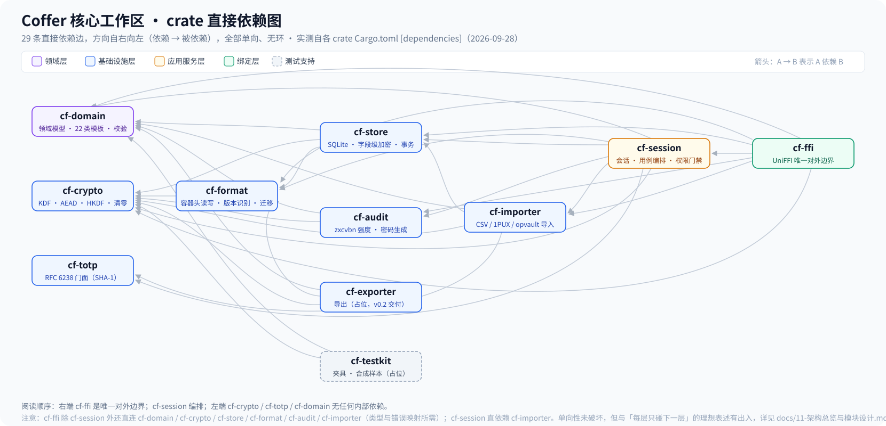
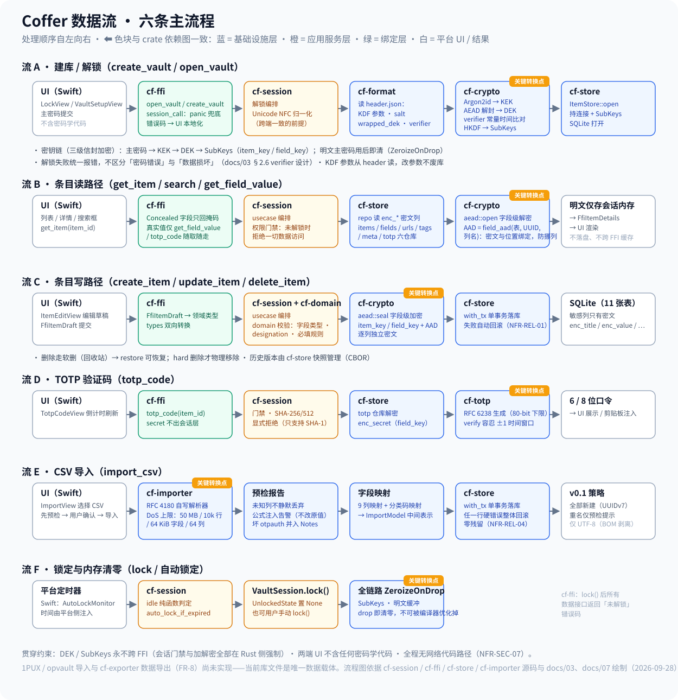

# 11 · 架构总览与模块设计

> 本文基于**当前代码**（2026-09-28，`cargo build` / `cargo test --workspace` 全绿的 M3 后状态）梳理项目整体架构、模块划分与数据流，供团队成员理解系统全貌与后续维护使用。
>
> 与既有设计文档的关系：`02-概要设计` 定分层、`03-详细设计` 定规格、`04-系统设计` 定工程方法——本文不替代它们，而是把**代码实际长成的样子**汇总成一页入口。实现与设计的已知偏差集中在 §3.4，一律如实标注、不粉饰。

---

## 1. 一句话架构

**平台原生 UI（Swift / Kotlin）＋ 单一 Rust 内核，单向依赖，零外部网络。**

加密、存储、业务逻辑全部在 Rust 核心（`core/` 下 11 个 crate）；两端 UI 不含任何密码学代码；全仓库不存在外部网络代码路径（NFR-SEC-07，可技术审计验证；本机内进程间通信 UDS / 本机回环允许且不违背承诺，docs/02-研发计划与决策/03-不可逆决策追认表.md D-4）。两端永不直连，无同步机制（单机架构的排除项，非缺陷）。

---

## 2. 工程结构与目录组织

```
coffer/
├── core/                  # Rust 工作区（cargo workspace，11 个 crate）
│   ├── Cargo.toml         # workspace 清单：成员、依赖版本、release profile（panic=unwind）
│   ├── cf-crypto/         # 基础设施层：加密原语封装
│   ├── cf-format/         # 基础设施层：容器格式读写
│   ├── cf-store/          # 基础设施层：SQLite 存储引擎
│   ├── cf-domain/         # 领域层：领域模型（无 IO、无加密）
│   ├── cf-importer/       # 基础设施层：导入器
│   ├── cf-exporter/       # 基础设施层：导出器（占位）
│   ├── cf-totp/           # 基础设施层：TOTP 门面
│   ├── cf-audit/          # 基础设施层：离线安全检查
│   ├── cf-session/        # 应用服务层：会话与用例编排
│   ├── cf-ffi/            # 绑定层：UniFFI 唯一对外边界
│   └── cf-testkit/        # 测试支持：夹具与合成样本（占位）
├── macos/                 # macOS 端：Swift + SwiftUI（v0.1 已交付）
│   └── Coffer/
│       ├── AppModel.swift           # 应用状态
│       ├── CoreBindings/cf_ffi.swift# UniFFI 生成的绑定
│       ├── Platform/                # AutoLockMonitor · Clipboard · BiometricKeychain
│       ├── Views/                   # Lock / Main / ItemDetail / ItemEdit / Import 等
│       └── Support/                 # 错误呈现 · 诊断日志 · TouchID 状态
├── android/               # Android 端（M5，未开始）
├── docs/                  # 设计文档 01–11 + KNOWN-ISSUES + assets/
├── tools/                 # 构建/测试脚本（build_macos_app.sh 等）
└── tests/                 # 跨端一致性比对样本（1PUX / CSV，仅合成数据）
```

**crate 分层归属**（与 `core/Cargo.toml` 的成员注释一致）：

| 层 | crate | 实现状态 |
| --- | --- | --- |
| 基础设施层 | cf-crypto · cf-format · cf-store · cf-importer · cf-totp · cf-audit | ✅ 全部已实现（cf-importer 的 1PUX/opvault 分支待样本校准） |
| 基础设施层 | cf-exporter | ⬜ 占位（v0.2 交付，FR-8） |
| 领域层 | cf-domain | ✅ |
| 应用服务层 | cf-session | ✅ |
| 绑定层 | cf-ffi | ✅ |
| 测试支持 | cf-testkit | ⬜ 占位（M1 计划内） |

占位 crate 刻意只保留 lib.rs 意图声明、不含假接口——宁可目录是空的，也不要 `todo!()` 占位。

---

## 3. 系统架构总览

### 3.1 分层视图

五层职责与边界见 `docs/assets/layered-architecture.svg`（既有图，仍然有效）：

**表示层 → 绑定层（cf-ffi）→ 应用服务层（cf-session）→ 领域层（cf-domain）→ 基础设施层（cf-crypto / cf-format / cf-store / …）**，禁止反向依赖。

### 3.2 crate 依赖图（代码实测）



上图 **29 条直接依赖边**全部实测自各 crate 的 `[dependencies]` 段（不含 dev-dependencies），方向自右向左、全部单向、无环。直接依赖明细：

| crate | 直接依赖 |
| --- | --- |
| cf-crypto / cf-totp / cf-domain | （无内部依赖） |
| cf-format | cf-crypto |
| cf-store | cf-crypto · cf-format · cf-domain |
| cf-audit | cf-domain · cf-crypto |
| cf-exporter | cf-domain · cf-format · cf-crypto |
| cf-importer | cf-domain · cf-crypto · cf-store · cf-totp |
| cf-session | cf-domain · cf-store · cf-format · cf-crypto · cf-totp · cf-audit · cf-importer |
| cf-ffi | cf-session · cf-domain · cf-crypto · cf-store · cf-format · cf-audit · cf-importer |
| cf-testkit | cf-domain · cf-crypto |

### 3.3 依赖方向的硬约束（审计口径）

- **领域层不依赖基础设施**：cf-domain 的 `[dependencies]` 里没有任何 `cf-*` crate，无 IO、无加密、无平台依赖——可由 Cargo.toml 直接验证。
- **上层可横向引用下层，反向禁止**：任何下层 crate 引用上层即为架构违规，CI（建好后）与代码评审都按此口径把关。
- **DEK / SubKeys 永不跨 FFI**：任何 UniFFI 接口签名不含密钥类型；会话门禁与加解密全部在 Rust 侧强制。
- **两端 UI 不含密码学代码**：macOS 侧只消费 cf-ffi 生成的绑定。

### 3.4 代码与「理想分层」的三处出入（如实记录）

1. **cf-ffi 除 cf-session 外还直连 6 个下层 crate**（cf-domain / cf-crypto / cf-store / cf-format / cf-audit / cf-importer）。用途是类型映射（cf-ffi/src/types.rs）与错误映射（error.rs 对齐 docs/01-需求与架构/03-详细设计.md §12 错误码表）。**单向性未破坏**，但「绑定层只经 cf-session 说话」这句理想表述与实际不符。
2. **cf-session 直接依赖 cf-importer**：CSV 导入的落库编排 `import_csv` 实际落在 cf-importer 内（经 `cf-store::ItemStore::with_tx` 单事务完成），而非 docs/03-功能设计/01-macOS纵切设计.md §7 T03 清单所写的 `cf-session/src/usecase/import_csv.rs`。该偏差已在 cf-importer lib.rs「与设计文档的一处偏差」一节声明。
3. **cf-importer 依赖 cf-store 与 cf-totp**：导入器不是「叶子」基础设施——它承担单事务落库编排，并复用 TOTP URI 解析。把 cf-importer 理解为「导入用例的完整执行者」比「纯解析器」更准确。

> 处置口径：三处均不违反单向依赖硬约束，暂不改代码；若未来做依赖裁剪（如把类型映射收敛回 cf-session），需先改 docs/01-需求与架构/03-详细设计.md §5 再动代码（格式/接口变更纪律：先文档后代码）。

---

## 4. 核心模块设计

以下按依赖顺序自底向上。每个模块给：职责边界（管什么/不管什么）、关键能力、对上暴露的接口形态。

### 4.1 cf-crypto —— 加密原语封装层

| 项 | 内容 |
| --- | --- |
| **职责** | 密码学原语的安全封装：Argon2id KDF、XChaCha20-Poly1305 AEAD、HKDF 子密钥派生、CSPRNG、内存清零（Zeroize + ZeroizeOnDrop） |
| **不管什么** | 不知道任何业务概念——不知道「条目」「保险库」是什么；不自造密码学原语，只用成熟库高层 API |
| **关键能力** | `kdf`（Argon2id，参数可配置，docs/01-需求与架构/03-详细设计.md §2.3）；`aead::seal/open`（字段级加解密）；`build_field_aad(uuid, 列名)` / `build_table_field_aad(表, uuid, 列名)`（AAD 构造——密文与存储位置绑定，防挪列挪表）；`SubKeys::derive`（HKDF 派生 item_key / field_key）；`SessionKey`（内存清零的密钥类型） |
| **硬约束** | 密钥类型必须可清零；禁 `unwrap()/expect()`（编译期 deny）；错误显式不泄漏攻击者可用信息 |

### 4.2 cf-format —— 容器格式层

| 项 | 内容 |
| --- | --- |
| **职责** | 库容器的结构层：header.json 读写、格式版本识别、原子写入（atomic.rs）、完整性清单 |
| **不管什么** | 不管理条目内容（cf-store 的职责）；不做字段级加密——只读写**已是密文**的 BLOB；交换形态 `.lvvault`（ZIP）归 cf-exporter |
| **关键能力** | `open_container`（目录识别无魔数：header.json 存在且可解析且版本受支持）；KDF 参数 / salt / wrapped_dek / verifier 的承载；原子替换写（防半写损坏） |
| **纪律** | 格式变更必须先写进 docs/01-需求与架构/03-详细设计.md §1 再改代码 |

### 4.3 cf-domain —— 领域模型层

| 项 | 内容 |
| --- | --- |
| **职责** | 条目 / 字段 / 保险库的领域模型：22 类条目模板 + Custom 兜底、字段类型与 designation 语义、校验规则、错误类型（`CfError` 全仓统一）、TOTP 数据声明 |
| **不管什么** | 纯逻辑：无 IO、无加密、无平台依赖。TOTP 只声明数据（`TotpData`），算法委托在 cf-session 编排下由 cf-totp 执行 |
| **关键能力** | `category`（22 类 + opvault 分类码映射）；`field`（类型 + designation）；`item` / `vault`（核心结构体）；`validate`（校验规则）；`secret::SecretString`（明文敏感值容器，expose 显式取值）；`snapshot`（历史版本模型） |
| **特殊性** | 全仓错误类型统一在这里定义（cf-store 不自持错误类型）——它是唯一「被所有人依赖、不依赖任何人」的 crate |

### 4.4 cf-store —— 存储引擎

| 项 | 内容 |
| --- | --- |
| **职责** | 「加密后的数据怎么落盘」：SQLite schema（11 张表幂等 DDL + PRAGMA + 版本记录）、字段级加密读写、事务框架、六个仓库、历史版本 |
| **不管什么** | 不做字段级业务校验（cf-domain 的职责）；加密本身委托 cf-crypto |
| **关键能力** | `ItemStore` 门面（持连接 + SubKeys，供解锁态持有）；`with_tx` 单事务框架（失败自动回滚，NFR-REL-01）；`Repos`：items / fields / urls / tags / meta / totp 六仓库；`field_aad` 包装 AAD 构造 |
| **密文落盘纪律** | 敏感列（enc_title / enc_name / enc_value / enc_url / enc_label / totp 的 enc_secret 等）只存密文；逐字段 seal/open，item_key 与 field_key 分管不同敏感级 |

### 4.5 cf-totp —— TOTP 门面

| 项 | 内容 |
| --- | --- |
| **职责** | 只管算：RFC 6238 生成与验证 6/8 位口令（SHA-1）。HMAC-SHA1 委托 totp-rs 5.7.2（锁版保 MSRV 1.85），本 crate 是门面不是实现 |
| **不管什么** | 不持密钥、不存储、不知道业务概念；不提供 SHA-256/512 入口（cf-session 层显式拒绝，避免「错误算法必然不匹配」） |
| **关键能力** | `generate_for_counter`；`verify`（±1 时间窗口容差，RFC 6238 §5.2）；`parse_totp_uri`（otpauth URI 解析，80-bit secret 下限，比 totp-rs 默认 128-bit 宽——符合 RFC 4226 §4） |

### 4.6 cf-audit —— 离线安全检查

| 项 | 内容 |
| --- | --- |
| **职责** | 离线安全检查：弱密码评估、随机密码生成、（规划中）重复 / 弱 URL / 陈旧密码检测，产出体检报告 |
| **硬约束** | 不得联网——zxcvbn / passwords 均纯本地计算；能力缺口必须向用户明示：**无法**检测「密码已在泄露库中出现」（FR-6.5） |
| **状态** | 部分：✅ `password_strength`（zxcvbn）、`generate_password`（参数化，docs/03-功能设计/01-macOS纵切设计.md §2.3）；❌ 重复密码（将用 HMAC 摘要比对，不明文比较）/ 弱 URL / 陈旧密码 |

### 4.7 cf-importer —— 导入器

| 项 | 内容 |
| --- | --- |
| **职责** | 1PUX / CSV / opvault 的解析、字段映射、预检报告，**以及 CSV 的单事务落库编排**（`import_csv`） |
| **关键约束** | RFC 4180 自写解析器 + DoS 上限（50 MB / 10k 行 / 64 KiB 字段 / 64 列，超限拒绝并指明行号）；9 列映射，未知列进预检报告**不静默丢弃**；公式注入不改原值仅告警（防护主战场在导出侧）；坏 otpauth 单元格并入 Notes 不丢整行；v0.1 固定「全部新建（UUIDv7）」；仅 UTF-8（BOM 剥离） |
| **事务语义** | 经 `cf-store::ItemStore::with_tx` 单事务落库，任一行硬错误整体回滚、零残留（NFR-REL-01 / 04） |
| **状态** | ✅ CSV 已交付；🟡 1PUX 待真实样本类别校准；opvault 交叉验证待做 |

### 4.8 cf-exporter —— 导出器（占位）

加密备份包、1PUX 兼容格式、明文 CSV 导出（FR-8）。**未实现**，v0.2 交付。已定约束：明文导出必须调用方先二次确认（FR-8.4）；1PUX 导出注意 CSV 公式注入防护；打包前执行 `PRAGMA wal_checkpoint(TRUNCATE)` 合并 WAL。当前它缺席的后果：**库文件是唯一数据载体**，README 已如实声明。

### 4.9 cf-session —— 应用服务层（会话与用例编排）

| 项 | 内容 |
| --- | --- |
| **职责** | 解锁 / 锁定、用例编排、权限门禁、空闲计时判定、TOTP 会话验证、Touch ID 解封通道 |
| **核心不变量** | **唯一持有 DEK 的模块**——解锁后仅以 `SubKeys` 形态存于 `ItemStore`，跨 FFI 永不出现。定时器在平台侧，本 crate 只提供时间注入的纯逻辑 |
| **模块划分** | `unlock`（`create_vault` / `open_vault` 编排：NFC 归一化 → Argon2id（参数从 header 读）→ 解封 wrapped_dek → verifier 校验 → `SubKeys::derive` → `ItemStore::open`）；`unlock_bio`（Touch ID DEK 封装通道，AAD 钉库）；`vault`（`VaultSession` 持 `Mutex<Option<UnlockedState>>`，`lock()` 置 None 触发全链路清零）；`idle`（空闲判定纯函数）；`usecase`（items CRUD 四类完整 + 只读兜底、标题搜索）；`types`（VaultInfo / ItemDetails / TotpCode） |
| **解锁失败语义** | 统一报错，不区分「密码错误」与「数据损坏」（不泄漏攻击者可用信息） |

### 4.10 cf-ffi —— 绑定层（唯一对外边界）

| 项 | 内容 |
| --- | --- |
| **职责** | UniFFI（0.32.2，proc-macro 模式）暴露接口给 Kotlin / Swift：类型映射、错误映射、接口暴露 |
| **接口形态** | `CofferApp` 工厂（list_vaults / create_vault / open_vault / lock_all / strength_estimate / new_biometric_unwrap_key）＋ `VaultSession` 会话门面（unlock / lock / auto_lock_if_expired / enable/disable_biometric / unlock_with_biometric / list_items / get_item / create_item / update_item / update_item_with_totp / delete_item / restore_item / set_favorite / search / get_field_value / totp_code / totp_config）。全同步接口，Swift 侧用 `Task.detached` 包裹耗时调用 |
| **安全不变量** | ① DEK / SubKeys 永不跨 FFI；② 敏感值单独按需取——详情中 Concealed 字段只回掩码，真实值仅经 `get_field_value` / `totp_code` 随取随走；③ panic 不杀进程——所有会穿透 FFI 的调用经 `session_call`（`catch_unwind` → `FfiError`，兜底码 5999），依赖 workspace `panic = "unwind"`（C-8）；④ 错误码是跨版本契约，UI 按 `code` 本地化 |
| **直连说明** | 除 cf-session 外直连 6 个下层 crate（类型/错误映射所需），见 §3.4 |

### 4.11 cf-testkit —— 测试支持（占位）

测试夹具、合成样本生成、跨端一致性比对辅助。**未实现**。硬约束：不含任何真实数据样本；是唯一允许 `unwrap()/expect()` 的生产侧 crate（仅测试辅助路径）。

---

## 5. 数据流

六条主流程的流转路径、处理顺序与关键转换点见图：



### 5.1 流 A · 建库 / 解锁（open_vault / create_vault）

```
UI(Swift) → cf-ffi(open_vault) → cf-session(NFC 归一化) → cf-format(读 header.json)
  → cf-crypto(Argon2id→KEK → AEAD 解封→DEK → verifier 比对 → HKDF→SubKeys)
  → cf-store(ItemStore::open)
```

关键转换点与不变量：

1. **三级密钥链**：主密码 → KEK（Argon2id，参数从 header 读，换参数不废库）→ DEK（AEAD 解封 wrapped_dek）→ SubKeys（HKDF 派生 item_key / field_key）。主密码只封装数据密钥，**换密码不重加密全库**。
2. **NFC 归一化在 KDF 之前**：保证「Android 设的密码 macOS 打不开」这类跨端坑不发生（有专门测试用例）。
3. **verifier 常量时间比对**（防时序侧信道）；失败统一报错，不区分密码错 / 数据坏。
4. 明文主密码 ZeroizeOnDrop，用后即清。

### 5.2 流 B · 条目读路径（get_item / search）

```
UI → cf-ffi(Concealed 只回掩码) → cf-session usecase(权限门禁)
  → cf-store repo(读 enc_* 密文列) → cf-crypto aead::open(AAD = field_aad(表,UUID,列名))
  → 明文仅存会话内存 → FfiItemDetails → UI
```

关键转换点：**字段级解密 + AAD 位置绑定**——AAD 由（表名，记录 UUID，列名）构造，密文挪列挪表即解密失败，天然防篡改换位。权限门禁在一切数据访问之前：未解锁时 usecase 层直接拒绝。Concealed 字段详情只回掩码，真实值 `get_field_value` / `totp_code` 随取随走，明文不跨 FFI 缓存。

### 5.3 流 C · 条目写路径（create_item / update_item）

```
UI(FfiItemDraft) → cf-ffi(类型转换) → cf-session usecase(cf-domain 校验)
  → cf-crypto aead::seal(逐字段加密，item_key/field_key + AAD)
  → cf-store with_tx(单事务落库，失败回滚 NFR-REL-01) → SQLite 11 张表（敏感列全密文）
```

删除走软删（回收站 → `restore_item` 可恢复），`delete_item(hard=true)` 才物理移除。

### 5.4 流 D · TOTP（totp_code）

```
UI → cf-ffi → cf-session(门禁 + SHA-256/512 显式拒绝)
  → cf-store(解密 enc_secret，field_key) → cf-totp(RFC 6238 生成 / verify ±1 窗口)
  → 6/8 位口令 → UI（倒计时刷新 / 剪贴板注入）
```

secret 全程不出 Rust 侧；UI 只拿口令不拿密钥。

### 5.5 流 E · CSV 导入（import_csv）

```
UI(选文件 → 预检 → 确认) → cf-importer(RFC 4180 解析 + DoS 上限)
  → 预检报告(未知列不静默丢弃 / 公式注入告警 / 坏 otpauth 并入 Notes)
  → 字段映射(9 列 + 分类码) → ImportModel 中间表示
  → cf-store with_tx(单事务，任一行硬错误整体回滚)
```

预检与导入两段式：用户先看报告再确认，导入原子生效——要么全部进来，要么一条不留。

### 5.6 流 F · 锁定与内存清零

```
平台定时器(Swift AutoLockMonitor，时间注入) → cf-session idle 纯函数(auto_lock_if_expired)
  → VaultSession.lock() → UnlockedState 置 None → 全链路 ZeroizeOnDrop
```

定时器在平台侧（Rust 侧只做可测试的纯函数）；锁定后所有数据接口返回「未解锁」错误码；SubKeys 与明文缓冲随 drop 清零，不可被编译器优化掉（zeroize 语义保证）。

### 5.7 贯穿全部流程的约束

| 约束 | 落点 |
| --- | --- |
| DEK / SubKeys 永不跨 FFI | cf-session 持有、cf-ffi 签名保证 |
| 明文敏感值用 `SecretString`，expose 显式取值 | cf-domain |
| 敏感列只落密文，AAD 位置绑定 | cf-store + cf-crypto |
| 事务原子性（导入 / CRUD） | cf-store `with_tx` |
| panic 不杀 App（`catch_unwind` → 错误码） | cf-ffi `session_call` + workspace `panic = "unwind"` |
| 外部网络代码路径 | 全仓 + 依赖树（CI 建好后自动核查；本机内 UDS / 回环允许，docs/02-研发计划与决策/03-不可逆决策追认表.md D-4） |

---

## 6. 术语表

| 术语 | 含义 |
| --- | --- |
| KEK | Key Encryption Key，主密码经 Argon2id 派生，只用于封装 DEK |
| DEK | Data Encryption Key，数据加密主密钥，信封加密的核心，换密码不重加密全库的前提 |
| SubKeys | DEK 经 HKDF 派生的子密钥（item_key / field_key），解锁后唯一在内存中的密钥形态 |
| wrapped_dek | 被 KEK 加密后的 DEK，存于 header.json |
| verifier | 主密码正确性校验值（docs/01-需求与架构/03-详细设计.md §2.6），常量时间比对 |
| AAD | AEAD 附加认证数据，此处由（表名，记录 UUID，列名）构造，绑定密文与存储位置 |
| AAD 钉库 | Touch ID 通道中 AAD 额外绑定库标识，防密钥串跨库复用（docs/03-功能设计/02-TouchID解锁设计.md） |
| 预检报告 | 导入前的逐行核对报告，未知字段不静默丢弃的载体 |
| Concealed 字段 | 详情页默认掩码展示的敏感字段，真实值单独按需取 |
| 假绿 | 测试门禁因命令/管道问题静默未跑而误判通过（见 README「门禁的两条前提」） |

---

## 7. 维护约定

- 本文与代码不一致时，**以代码为准并回改本文**；格式 / 接口变更则反过来：先改 docs/01-需求与架构/03-详细设计.md §1 / §5，再改代码（cf-format lib.rs 的纪律条款）。
- 新增 crate / 依赖边：更新 §3.2 依赖表与 `assets/crate-dependency-graph.svg`，并核对是否符合 §3.3 审计口径。
- 占位 crate（cf-exporter / cf-testkit）实装后，同步更新 §2 分层表与 §4 对应小节的状态行。

## 修订记录

| 日期 | 说明 |
| --- | --- |
| 2026-10-07 | 零网络措辞按 docs/02-研发计划与决策/03-不可逆决策追认表.md D-4 边界重申统一改写（§1 一句话架构 / §5 安全不变量表）：**边界 = 禁止外部网络（不去云端、数据不出本机）为硬承诺；本机内 UDS / 本机回环允许且不违背承诺** |
