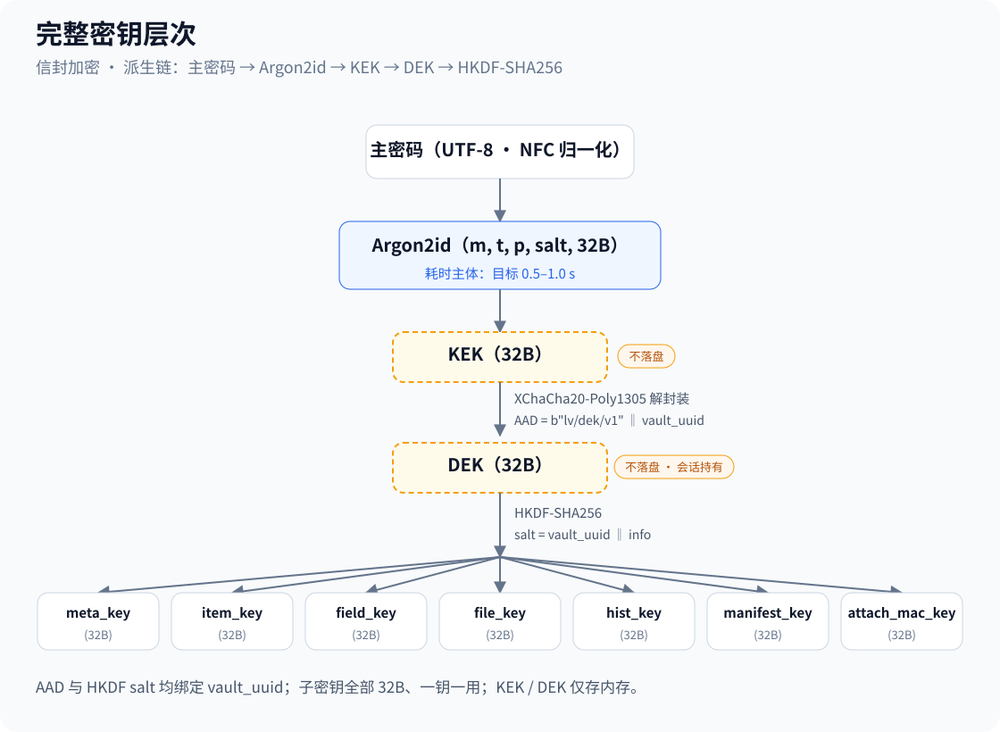

# Coffer 详细设计

| 项 | 内容 |
| --- | --- |
| 文档编号 | LV-DLD-003 |
| 版本 | v1.4 |
| 状态 | 待评审 |
| 创建日期 | 2026-09-23 |
| 上游文档 | `01-需求分析.md`、`02-概要设计.md` |
| 下游文档 | `04-系统设计.md` |

## 修订记录

| 版本 | 日期 | 变更说明 |
| --- | --- | --- |
| v1.0 | 2026-09-23 | 首版 |
| v1.1 | 2026-09-24 | 并入决策会结论（ADR-10 ~ ADR-16）：Passkey 完整能力进 v1.0、整体开源（**许可证 MIT**）、第三方安全审计、**采用许可授予型 CLA 保留再许可权**、macOS 14、附件上限 100 MB、macOS 采用剪贴板填充、系统备份按数据类型分别处理。同步关闭原待确认事项 Q-01 ~ Q-05 / Q-07 / Q-08 / Q-09、H-01 / H-03、D-06 / D-09。新增 `tools/inspect_1pux.py`、`tools/make_test_sample.py` 与 `CLA.md` |
| v1.2 | 2026-09-24 | 交付优先级调整为 macOS 优先（C-04 v1.2），Passkey 条件性交付、D-11 升阻塞级；opvault 保持 Should（CSV 为保底迁移路径）；macOS 全局快捷键升重要级 |
| v1.3 | 2026-09-27 | T01 纵切落地同步：totp 表 DDL 补 `created_at`（C-2 裁定，以 DDL 为准并回补文档）；§4.4 / §12 增补 `WeakPassword`(1010) / `ItemNotFound`(1011) / `Validation`(1012)（docs/07 §2.1–2.2 增补） |
| v1.4 | 2026-09-27 | O-1 / O-2（QA 对抗性验证修复）：§2.5 AAD 构造加入**表名命名空间**——`table ‖ 0x00 ‖ record_uuid(16) ‖ 0x00 ‖ column`，消除跨表密文重放（旧布局下 fields.enc_name 密文可重放到 uuid 文本相同的 tags 行并解密成功）；totp `enc_secret` 的 record_uuid 从条目 uuid 统一为 **totp 行 uuid**（与 enc_issuer/enc_account 语义一致）；§3.1 对应 schema init 语义：schema_version 损坏（非 8 字节 BLOB）报 `Corrupted`，不静默重写。密钥派生（§2.4）不变 |

## 对概要设计的两处修正

**修正 A（存储形态）**：概要设计 §4.2 表述为"`vault.lvvault` 是一个 SQLite 数据库文件"。本设计修正为 **"一个库 = 一个目录"**，导出时才打包成单文件。理由：
1. SQLite 要求文件头部是固定的 `SQLite format 3\0` 魔数，若在其前面插入自定义头会破坏 SQLite 识别；
2. 目录形态下 SQLite 可正常就地读写（WAL 模式、事务、增量写），无需"读全文件 → 改内存 → 写回全文件"；
3. 附件可独立成文件，大附件不必塞进数据库；
4. macOS 与 Android 的沙盒都天然支持目录；macOS 侧还可直接呈现为 `.lvvault` 包目录。

**修正 B（附件完整性）**：概要设计 §4.2 的表中写 `sha256` 存明文摘要。本设计改为 `content_mac`：存 `HMAC-SHA256(attachment_mac_key, content)`。理由是**明文哈希会泄露"两个附件是否相同"**，而 HMAC 用库内密钥，不泄露此信息。

---

## 1. 容器格式规范

### 1.1 两种形态

| 形态 | 用途 | 路径示例 |
| --- | --- | --- |
| **工作形态（目录）** | App 日常读写 | Android: `/data/data/<pkg>/files/vaults/<vault_uuid>/`<br>macOS: `~/Library/Application Support/Coffer/vaults/<vault_uuid>/` |
| **交换形态（单文件）** | 备份、搬运、归档 | `我的密码库.lvvault`（ZIP 归档，内含工作目录的全部内容） |

### 1.2 工作目录结构

```
<vault_uuid>/
├── header.json           # 明文头部：KDF 参数、salt、wrapped_dek、verifier（见 §1.3）
├── db.sqlite             # SQLite 数据库，敏感字段为密文 BLOB（见 §3）
├── db.sqlite-wal         # SQLite WAL（运行时存在）
├── attachments/          # 附件实体（分块加密，见 §3.4）
│   └── <attachment_uuid>.bin
├── thumbnails/           # 可选：附件缩略图（同样加密）
└── MANIFEST.json         # 可选：目录内容清单与整体校验（见 §1.5）
```

> **安全说明**：`db.sqlite` 内所有敏感字段已是密文，因此该文件即使被复制也无法读出明文。这让"目录形态"没有引入额外的明文落盘风险。

### 1.3 header.json 结构

```json
{
  "format_version": 1,
  "vault_uuid": "01932b3c-4d5e-7f80-9abc-def012345678",
  "display_name": "我的密码库",
  "created_at": 1790000000,
  "modified_at": 1790000000,
  "kdf": {
    "algo": "argon2id",
    "argon2_version": 19,
    "m_cost_kib": 262144,
    "t_cost": 3,
    "p_cost": 4,
    "salt_b64": "…32 字节 base64…"
  },
  "aead": { "algo": "xchacha20poly1305" },
  "wrapped_dek": {
    "nonce_b64": "…24 字节…",
    "ct_b64": "…32+16 字节…"
  },
  "verifier": {
    "nonce_b64": "…24 字节…",
    "ct_b64": "…16+16 字节…"
  },
  "biometric_wrap": {
    "available": false,
    "provider": null,
    "key_alias": null,
    "wrapped_dek_b64": null
  },
  "flags": {
    "sort_key_enabled": false,
    "attachments_inline": false
  }
}
```

**字段说明与安全性**：

| 字段 | 是否敏感 | 说明 |
| --- | --- | --- |
| `format_version` | 否 | 用于格式迁移（见 `04-系统设计.md` §7） |
| `vault_uuid` | 否 | 同时作为 KEK/DEK 的 AAD 成分，防跨库替换 |
| `display_name` | **是（明文档列为已知泄露项）** | 锁定时需显示库名供用户选择，故明文。**威胁模型已声明此泄露**，建议用户起不含敏感信息的库名 |
| `kdf.*` | 否 | 公开参数。攻击者需要它们才能爆破，但知道它们不降低安全性 |
| `salt_b64` | 否 | 公开参数，无需保密，只需随机且唯一 |
| `wrapped_dek` | 否 | 密文。攻击者拿到它只能爆破 |
| `verifier` | 否 | 密文常量，见 §2.6 |
| `biometric_wrap` | 否 | 密文；其解密密钥存于平台密钥库 |

### 1.4 交换形态打包格式

`xxx.lvvault` = 标准 ZIP（Deflate），包含工作目录的全部文件，路径相对于库根。要求：

| 项 | 要求 |
| --- | --- |
| 打包内容 | `header.json`、`db.sqlite`、`attachments/**`、`thumbnails/**`、`MANIFEST.json` |
| 排除内容 | `db.sqlite-wal`、`db.sqlite-shm`（打包前先执行 `PRAGMA wal_checkpoint(TRUNCATE)` 合并） |
| ZIP 加密 | **不使用** ZIP 自身的加密（ZipCrypto 弱；AES-ZIP 兼容性差）。内容本身已逐字段加密，ZIP 仅作容器 |
| 文件名编码 | UTF-8，且需设置 Zip 的 UTF-8 标志位（0x0800） |

> **注意**：`.lvvault` 内部内容是密文，但 `header.json` 是明文。这**不构成泄露**——header 中的字段均为公开参数或密文。但也因此**无法从文件外观判断其内容**，用户需自行管理文件（这正是需求 X-11 与 FR-8.4 提示存在的原因）。

### 1.5 MANIFEST.json（可选完整性清单）

```json
{
  "vault_uuid": "01932b3c-…",
  "generated_at": 1790000000,
  "file_count": 42,
  "files": [
    { "path": "db.sqlite", "size": 123456, "content_mac": "…base64…" },
    { "path": "attachments/0193….bin", "size": 98765, "content_mac": "…base64…" }
  ],
  "manifest_mac": "…HMAC-SHA256(manifest_key, 上面全部内容规范化后)…"
}
```

用途：检测文件被替换或删除。`manifest_mac` 用 `HMAC-SHA256` 与从 DEK 派生的 `manifest_key` 计算，因此**攻击者无法伪造清单**（他不知道密钥），但**可以整体回滚到旧版本**（见 `02-概要设计.md` §8.2 的诚实声明）。

---

## 2. 密钥派生与加密

### 2.1 完整密钥层次



### 2.2 主密码归一化（关键，易错）

**必须做 Unicode NFC 归一化**。若不做，同一个密码在不同输入法 / 不同平台上可能产生不同字节序列，表现为"在 Android 上设的密码在 macOS 上打不开"。

```rust
let normalized = password.nfc().collect::<String>();
let bytes = normalized.as_bytes();   // 不做 trim、不做大小写转换！
```

| 要求 | 说明 |
| --- | --- |
| NFC 归一化 | 必须（`unicode-normalization` crate） |
| 不做 trim | 前后空格是密码的一部分，用户有意为之 |
| 不做大小写折叠 | 保持原样 |
| 不做长度截断 | 不设上限（但 UI 侧可提示过长密码的 UX 影响） |
| 编码 | UTF-8 |

### 2.3 Argon2id 参数与标定方法

**不预设参数值**。按以下方法在目标设备上标定：

```
标定流程：
1. 固定 t_cost = 3，p_cost = 4
2. 从 m_cost = 64 MiB 起，按 2 倍递增（64 → 128 → 256 → 512 MiB）
3. 在【最低性能目标设备】上测量单次派生耗时
4. 选取耗时落在 0.5–1.0 s 区间的最大 m_cost
5. 若最低端设备也只能做到 64 MiB/0.4s，则接受该值，并在文档中记录降级
6. 在【旗舰设备】上复核，确认耗时不超过 3 s（避免体验崩塌）
```

**参考区间（来源：OWASP Password Storage Cheat Sheet）**：该文档给出的 Argon2id **最低可接受配置**为 `m=19 MiB, t=2, p=1`。本项目因缺少 1Password 的 Secret Key，**必须显著高于该下限**。

**建议初值（**已被实测数据取代，见下方标定记录**）**：`m = 256 MiB, t = 3, p = 4`。

### 标定记录

**状态：进行中 —— 开发机摸底已完成，最低端设备标定待做。**

| 阶段 | 环境 | 结果 | 性质 |
| --- | --- | --- | --- |
| 第一轮摸底 | M1 MacBook Pro / 16 GiB / macOS 26.6.2 | 384 MiB → 857.9 ms；256 MiB → 574.1 ms | ⚠️ **仅作参考，不可直接采用** |
| 最终标定 | 最低端目标 Android 设备 | 待执行 | 按本节流程确定最终值 |

完整报告（含环境信息、逐档数据、分析与待办）见 **`docs/05-Argon2id参数标定.md`**。

**为什么第一轮不能直接用**：M1 虽已属中低端，但仍明显强于面向新兴市场的入门 Android 设备；且 384 MiB 的内存需求在 2–4 GiB RAM 的设备上**可能导致解锁时被系统杀进程**，而不只是慢。详见报告 §5.2。

> ⚠️ **若最终参数显著低于 384 MiB**（预计会落在 64–128 MiB），则 `NFR-SEC-03` 所依赖的"用内存参数补偿缺失的 Secret Key"这一手段会被削弱。届时应改用**强制密码强度**等其他补偿，并重新评估。此项必须在 M0 结束前给出结论 —— 详见报告 §5.3。

**参数随库文件走**：`header.json` 中记录 `m_cost_kib` / `t_cost` / `p_cost`，解锁时从文件读取。因此调参后**旧库仍可正常打开**，且升级参数时不需重加密（改 header 需要重新封装 DEK，见 §2.7）。

### 2.4 子密钥派生（HKDF）

```rust
// HKDF-SHA256，salt 用 vault_uuid 保证不同库的子密钥不同
fn derive_subkey(dek: &[u8; 32], vault_uuid: &[u8; 16], label: &str) -> [u8; 32] {
    let hk = Hkdf::<Sha256>::new(Some(vault_uuid), dek);
    let mut out = [0u8; 32];
    hk.expand(label.as_bytes(), &mut out).expect("32B 输出不会失败");
    out
}

meta_key        = derive_subkey(dek, uuid, "cf/meta/v1");
item_key        = derive_subkey(dek, uuid, "cf/item/v1");
field_key       = derive_subkey(dek, uuid, "cf/field/v1");
file_key        = derive_subkey(dek, uuid, "cf/file/v1");
hist_key        = derive_subkey(dek, uuid, "cf/history/v1");
manifest_key    = derive_subkey(dek, uuid, "cf/manifest/v1");
attach_mac_key  = derive_subkey(dek, uuid, "cf/attach-mac/v1");
```

**为什么用 HKDF 而非直接把 DEK 用于所有加解密**：一钥一用是密码学工程的基本原则。附件密钥若因某种原因被侧信道获取，不会危及条目字段；同时提供了密钥轮换的粒度。

### 2.5 字段级 AEAD 与 AAD 构造

**加密**：

```rust
fn encrypt_field(key: &[u8;32], aad: &[u8], plaintext: &[u8]) -> Vec<u8> {
    let cipher = XChaCha20Poly1305::new(key.into());
    let mut nonce_bytes = [0u8; 24];
    OsRng.fill_bytes(&mut nonce_bytes);          // CSPRNG，每次全新随机
    let nonce = XChaCha20Poly1305::from_slice(&nonce_bytes);
    let ct = cipher.encrypt(&nonce, Payload { msg: plaintext, aad });
    // 存储格式：nonce(24) ‖ ciphertext ‖ tag(16)
    let mut out = Vec::with_capacity(24 + ct.len());
    out.extend_from_slice(&nonce_bytes);
    out.extend_from_slice(&ct);
    out
}
```

**AAD 构造规则**（防跨行跨列**跨表**密文搬运；O-1 修订，2026-09-23）：

```
aad = table_name_utf8 ‖ 0x00 ‖ record_uuid_bytes(16) ‖ 0x00 ‖ column_name_utf8
例：  aad = b"items" ‖ 0x00 ‖ <items.uuid 的 16 字节> ‖ 0x00 ‖ b"enc_title"
```

**为什么这样构造**：攻击者若把 A 条目的 `enc_title` 密文复制到 B 条目的 `enc_title` 列，AAD 中的 UUID 不匹配 → 解密失败。若复制到 B 条目的其他列（如 `enc_value`），AAD 中的列名不匹配 → 同样失败。表名前缀进一步把不同表的 AAD 空间隔离开：攻击者把 A 表某行密文搬到 B 表 uuid 文本相同的行，表名不匹配 → 仍然失败（O-1：旧版 `uuid ‖ 0x00 ‖ column` 布局无表名命名空间，`fields.enc_name` 密文可重放到 uuid 文本相同的 `tags` 行并解密成功）。`0x00` 分隔符安全：表名 / 列名均为代码内常量（不含 NUL），uuid 为固定 16 字节。**totp 表的 `enc_secret` / `enc_issuer` / `enc_account` 的 record_uuid 统一为 totp 行 uuid**（O-1 同步统一，原 `enc_secret` 钉条目 uuid）。这使单条记录的密文在（表, 行, 列）三维位置上被"钉死"。

**Nonce 策略**：XChaCha20 的 192-bit nonce 空间允许**直接随机生成**而不需计数器管理。以 2^96 次加密为界的碰撞概率可忽略。这是选择 XChaCha20 而非 AES-GCM 的核心理由（AES-GCM 的 96-bit nonce 随机生成在大数据量下有碰撞风险，必须维护计数器，而计数器在多进程/崩溃恢复场景下极易出错）。

### 2.6 verifier 设计

```rust
const VERIFIER_PLAINTEXT: &[u8] = b"coffer-verifier-v1";   // 固定常量

// 创建时
let (nonce, ct) = seal(&kek, aad = b"cf/verifier/v1", VERIFIER_PLAINTEXT);

// 解锁时
match open(&kek, nonce, ct, aad = b"cf/verifier/v1") {
    Ok(pt) if pt == VERIFIER_PLAINTEXT => UnlockOk,
    _ => Err(CfError::UnlockFailed),        // 密码错 与 数据损坏 均返回此码
}
```

**安全性论证**：verifier 中不含任何来自密码的信息（明文是公开常量）。攻击者拿到它，唯一能做的事是"猜 KEK"，而每次猜测需完整执行一次 Argon2id。因此 **verifier 不提供任何降低爆破成本的捷径**。

### 2.7 改主密码（信封加密的收益）

| 模式 | 操作 | 耗时 |
| --- | --- | --- |
| **默认（重封装）** | 旧密码 → KEK_old → 解出 DEK → 新 Argon2id → KEK_new → 重新封装 DEK → 重写 verifier → 重写 header.json | 约 2× Argon2id 耗时，**与库大小无关** |
| **完全重加密**（可选） | 上述步骤 + 生成新 DEK_new → 遍历全库重新加密所有字段与附件 | 与库大小成正比 |

**为什么默认走重封装**：这是信封加密的核心价值。改密码从"全库重写"（大库可能几分钟，中途崩溃风险高）降级为"改一个 header.json"（毫秒级，原子替换）。**完全重加密**提供给"怀疑 DEK 已泄露"的场景。

> 注意：重封装只保护"未来的泄露"，若旧的 DEK 已泄露且攻击者持有旧 header.json，他仍可解出 DEK 从而解开当前库（因为 DEK 未变）。**UI 必须明示这一事实**，并引导有此顾虑的用户选择"完全重加密"。

### 2.8 生物识别密钥封装

```
创建时（用户开启生物识别解锁）：
1. 在平台密钥库生成一个密钥 K_bio
   Android: KeyGenParameterSpec(alias="cf-bio-<vault_uuid>",
              setUserAuthenticationRequired(true),
              setInvalidatedByBiometricEnrollment(true))   ← 关键
   macOS:   SecAccessControlCreateWithFlags(
              kSecAttrAccessibleWhenUnlockedThisDeviceOnly,
              .biometryCurrentSet, ...)                     ← 关键
2. wrapped_dek_bio = XChaCha20-Poly1305(key = K_bio, aad = b"cf/bio/v1" ‖ uuid, pt = DEK)
3. 将 wrapped_dek_bio 存入 header.json 的 biometric_wrap
   （K_bio 本身永远不出平台密钥库）

解锁时：
1. 触发 BiometricPrompt / LAContext.evaluatePolicy
2. 成功后平台释放 K_bio（系统保证只有通过生物识别才能使用该密钥）
3. 解出 DEK
```

**`setInvalidatedByBiometricEnrollment(true)` / `.biometryCurrentSet` 的安全意义**：用户一旦新增或删除生物特征，`K_bio` 立即失效。这防止"别人把手指录入这台设备后直接解锁你的密码库"。

**降级路径**：`K_bio` 失效后，App 必须**优雅回退到主密码解锁**，并提示"生物识别凭据已变更，需使用主密码"，然后询问是否重新启用生物识别。绝不能报错崩溃。

---

## 3. 存储层设计

### 3.1 完整 DDL

```sql
-- 连接初始化
PRAGMA journal_mode = WAL;
PRAGMA synchronous  = FULL;      -- 密码库场景，宁可慢不可丢
PRAGMA foreign_keys = ON;
PRAGMA page_size    = 4096;

-- 库级元数据（值多为明文，便于锁定时读取）
CREATE TABLE meta (
    key    TEXT PRIMARY KEY,
    value  BLOB NOT NULL
);
-- 预置行：
--   ('vault_display_name', '我的密码库')
--   ('item_count',         <i64 LE>)
--   ('record_count',       <i64 LE>)   -- 用于防删除/防回滚检测
--   ('root_mac',           <32B>)      -- HMAC(manifest_key, 全部记录 uuid 排序后拼接)

-- 条目
CREATE TABLE items (
    uuid         TEXT    PRIMARY KEY,              -- 26 字符 base32 或 UUIDv7 文本
    category     TEXT    NOT NULL,                 -- ItemCategory 的 snake_case 名
    state        INTEGER NOT NULL DEFAULT 0,       -- 0=active 1=archived 2=trashed
    is_favorite  INTEGER NOT NULL DEFAULT 0,
    fav_index    INTEGER NOT NULL DEFAULT 0,       -- 收藏排序，来自 1PUX favIndex
    created_at   INTEGER NOT NULL,                 -- Unix 秒 UTC
    updated_at   INTEGER NOT NULL,
    trashed_at   INTEGER,
    enc_title    BLOB    NOT NULL,                 -- AAD: uuid‖'enc_title'
    sort_key     BLOB,                             -- 可选：HMAC 摘要，默认 NULL
    position     INTEGER NOT NULL DEFAULT 0
);
CREATE INDEX idx_items_state_cat ON items(state, category);
CREATE INDEX idx_items_updated   ON items(updated_at DESC);
CREATE INDEX idx_items_fav       ON items(is_favorite, fav_index) WHERE is_favorite = 1;

-- 分区（对应 1PUX/1P 条目的 section）
CREATE TABLE sections (
    uuid       TEXT PRIMARY KEY,
    item_uuid  TEXT NOT NULL REFERENCES items(uuid) ON DELETE CASCADE,
    enc_title  BLOB NOT NULL,
    position   INTEGER NOT NULL DEFAULT 0
);
CREATE INDEX idx_sections_item ON sections(item_uuid, position);

-- 字段
CREATE TABLE fields (
    uuid         TEXT PRIMARY KEY,
    item_uuid    TEXT NOT NULL REFERENCES items(uuid) ON DELETE CASCADE,
    section_uuid TEXT REFERENCES sections(uuid) ON DELETE SET NULL,
    field_type   TEXT NOT NULL,     -- 见 §4.2 FieldType
    designation  TEXT,              -- 见 §4.2 Designation，用于自动填充匹配与导入映射
    enc_name     BLOB NOT NULL,
    enc_value    BLOB,              -- 可空（如仅有名称的布尔标记）
    position     INTEGER NOT NULL DEFAULT 0
);
CREATE INDEX idx_fields_item        ON fields(item_uuid, position);
CREATE INDEX idx_fields_designation ON fields(designation) WHERE designation IS NOT NULL;

-- URL（多 URL 带标签）
CREATE TABLE urls (
    uuid       TEXT PRIMARY KEY,
    item_uuid  TEXT NOT NULL REFERENCES items(uuid) ON DELETE CASCADE,
    enc_label  BLOB,
    enc_url    BLOB NOT NULL,
    is_primary INTEGER NOT NULL DEFAULT 0,
    position   INTEGER NOT NULL DEFAULT 0
);
CREATE INDEX idx_urls_item ON urls(item_uuid, position);

-- 标签
CREATE TABLE tags (
    uuid      TEXT PRIMARY KEY,
    item_uuid TEXT NOT NULL REFERENCES items(uuid) ON DELETE CASCADE,
    enc_name  BLOB NOT NULL
);
CREATE INDEX idx_tags_item ON tags(item_uuid);

-- 附件
CREATE TABLE attachments (
    uuid          TEXT PRIMARY KEY,
    item_uuid     TEXT NOT NULL REFERENCES items(uuid) ON DELETE CASCADE,
    enc_filename  BLOB NOT NULL,
    storage       TEXT NOT NULL,         -- 'inline' | 'file'
    inline_data   BLOB,                  -- storage='inline'：分块密文拼装
    file_path     TEXT,                  -- storage='file'：相对 attachments/ 的路径
    size_bytes    INTEGER NOT NULL,      -- 明文长度（泄露项，见 §3.5）
    chunk_count   INTEGER NOT NULL DEFAULT 1,
    content_mac   TEXT NOT NULL,         -- base64(HMAC-SHA256(attach_mac_key, 明文内容))
    created_at    INTEGER NOT NULL,
    CHECK ((storage = 'inline' AND inline_data IS NOT NULL AND file_path IS NULL)
        OR (storage = 'file'   AND file_path   IS NOT NULL AND inline_data IS NULL))
);

-- 历史版本
CREATE TABLE history (
    uuid         TEXT PRIMARY KEY,
    item_uuid    TEXT NOT NULL REFERENCES items(uuid) ON DELETE CASCADE,
    version      INTEGER NOT NULL,
    created_at   INTEGER NOT NULL,
    enc_snapshot BLOB NOT NULL,          -- 整体条目的 CBOR 快照后加密
    UNIQUE(item_uuid, version)
);
CREATE INDEX idx_history_item ON history(item_uuid, version DESC);

-- 本地安全日志（**严禁写入任何敏感值**）
CREATE TABLE audit_local (
    id     INTEGER PRIMARY KEY AUTOINCREMENT,
    ts     INTEGER NOT NULL,
    event  TEXT    NOT NULL,   -- 'unlock_ok'|'unlock_fail'|'lock'|'export'|'import'|'delete'|'pwd_change'
    detail TEXT                -- 仅允许写计数、路径模式等非敏感信息
);
CREATE INDEX idx_audit_ts ON audit_local(ts DESC);

-- TOTP 密钥（与 fields 分离，便于统一管理）
CREATE TABLE totp (
    uuid        TEXT PRIMARY KEY,
    item_uuid   TEXT NOT NULL REFERENCES items(uuid) ON DELETE CASCADE,
    enc_secret  BLOB NOT NULL,        -- base32 解码后的原始密钥字节
    algo        TEXT NOT NULL DEFAULT 'sha1',   -- 'sha1'|'sha256'|'sha512'
    digits      INTEGER NOT NULL DEFAULT 6,
    period      INTEGER NOT NULL DEFAULT 30,
    enc_issuer  BLOB,
    enc_account BLOB,
    created_at  INTEGER NOT NULL          -- Unix 秒 UTC（C-2 裁定回补：实现需要按创建时间排序）
);
CREATE INDEX idx_totp_item ON totp(item_uuid);

-- Passkey（v1.0 必做，见 §9.4）
CREATE TABLE passkeys (
    uuid              TEXT PRIMARY KEY,
    item_uuid         TEXT NOT NULL REFERENCES items(uuid) ON DELETE CASCADE,
    enc_rp_id         BLOB NOT NULL,      -- Relying Party ID（网站域名）
    enc_rp_name       BLOB,               -- 网站显示名
    enc_user_name     BLOB,               -- 账号标识（用户名/邮箱）
    enc_user_handle   BLOB NOT NULL,      -- RP 提供的 user handle
    enc_credential_id BLOB NOT NULL,      -- 凭据 ID（断言时需原样回传 RP，故一并加密存储）
    enc_private_key   BLOB NOT NULL,      -- 私钥（COSE 编码）。**库内加密，不落平台密钥库**（见 §9.4）
    enc_public_key    BLOB,               -- 公钥（COSE 编码），用于自检
    algorithm         INTEGER NOT NULL,   -- COSE 算法标识，如 -7 = ES256
    sign_count        INTEGER NOT NULL DEFAULT 0,   -- **必须单调递增**，RP 用它检测克隆
    created_at        INTEGER NOT NULL,
    last_used_at      INTEGER,
    -- 断言时需按 rpId 快速查找，但 rpId 是密文无法建索引。
    -- 额外存加盐 HMAC 摘要用于查找（与 sort_key 同策略，默认关闭）
    rp_id_hmac        BLOB
);
CREATE INDEX idx_passkeys_item ON passkeys(item_uuid);
CREATE INDEX idx_passkeys_rp   ON passkeys(rp_id_hmac) WHERE rp_id_hmac IS NOT NULL;
```

### 3.2 关键查询模式

| 用例 | SQL 形态 | 解密工作量 |
| --- | --- | --- |
| 列表首屏 | `SELECT uuid, category, state, is_favorite, updated_at, enc_title FROM items WHERE state=0 ORDER BY updated_at DESC LIMIT 50 OFFSET ?` | 50 次标题解密 |
| 按类型筛选 | 同上 + `AND category = ?` | 同上 |
| 打开条目详情 | `SELECT * FROM items WHERE uuid=?` + fields + urls + tags + sections + totp | 单条目全字段 |
| 自动填充匹配 | `SELECT i.uuid, i.enc_title FROM items i JOIN urls u ON u.item_uuid=i.uuid WHERE i.state=0` → 解密 URL 比对域名 | URL 解密（见下） |
| 搜索 | 见 §3.3 | 全量标题解密 |

**自动填充匹配的性能问题**：域名匹配需要比对 URL，而 URL 是密文。1000 条目 × 平均 1.5 个 URL = 1500 次解密，每次约数微秒，总量约数毫秒——**可接受**。且 AutofillService 有超时限制（Android 建议 500 ms 内响应），因此需要：

```
优化：内存中维护 URL 域名索引缓存
  - 解锁时一次性解密全部 URL，提取规范化域名 → 存内存 HashMap<domain, Vec<item_uuid>>
  - 同时缓存 enc_title 的解密结果
  - 锁定 / 条目变更时失效并重建
  - 1000 条目的重建耗时预估 < 50 ms，可接受
```

此缓存**仅存在于内存**，且必须随锁定清除。

### 3.3 搜索实现

v1.0 采用"全量解密后内存搜索"（概要设计 §9 方案 A）：

```rust
fn search(&self, query: &str) -> Vec<ItemSummary> {
    let q = query.to_lowercase();                    // 统一小写
    let rows = sql("SELECT uuid, category, state, is_favorite, updated_at, enc_title
                    FROM items WHERE state != 2");
    rows.filter_map(|r| {
        let title = decrypt(item_key, &r.enc_title, aad("items", r.uuid, "enc_title"))?;
        if fuzzy_match(&title.to_lowercase(), &q) { Some(summary(r, title)) } else { None }
    }).collect()
}
```

**搜索范围**：标题为主（性能可控）。若用户选择"深度搜索"，则额外解密并匹配用户名、URL、标签、备注——需给出耗时提示。

**`fuzzy_match` 规则**：
1. 子串匹配（优先级最高）
2. 词序无关的多关键词全命中（`"阿里 邮箱"` 命中 `"阿里邮箱"`）
3. 常见音近/形近容错：v1.0 **不做**（引入编辑距离会显著拖慢且误报多）

**性能验证点**：需求 NFR-PERF-03 要求 1000 条目 ≤ 200 ms。此实现需在阶段 3 实测；若不达标，升级到加密倒排索引（概要设计 §9 方案 B）。

### 3.4 附件存储

**分块加密**（避免大文件整块载入内存）：

```
分块参数：
  CHUNK_SIZE = 1 MiB

附件密文布局（storage='file' 时写入 attachments/<uuid>.bin）：
  [chunk_0: nonce(24) ‖ ct(≤1MiB) ‖ tag(16)]
  [chunk_1: nonce(24) ‖ ct(≤1MiB) ‖ tag(16)]
  ...
每块 AAD = attachment_uuid(16) ‖ chunk_index(u32 LE)   ← 防块顺序重排与跨附件搬运
```

**内联 vs 外置的判定**：

| 明文大小 | 策略 |
| --- | --- |
| ≤ 64 KiB | `storage='inline'`，直接存 `inline_data` |
| > 64 KiB | `storage='file'`，写入 `attachments/` |

**64 KiB 阈值的依据**：SQLite 默认页大小 4096 字节；把大 BLOB 放在表里会导致溢出页与查询开销上升。64 KiB 是一个保守的工程经验阈值，最终值需实测调整。

**单文件上限：100 MB**（ADR-15 已定）。超限时**拒绝并明确提示，不做截断**——截断一个密码库的附件等于数据损坏。

### 3.5 已知元数据泄露清单（威胁模型必读）

以下信息在库文件中**可被读取**，即使没有主密码：

| 泄露项 | 泄露程度 | 为何必须泄露 |
| --- | --- | --- |
| 库名称 | 明文 | 锁定时需展示供选择 |
| 条目总数 | 精确值 | 用于完整性校验 |
| 每条记录的字段数量 | 精确值 | SQL 行数 |
| 字段类型分布 | 精确值 | 自动填充与 UI 渲染需要 `designation`/`field_type` 明文的索引 |
| 各记录的创建/修改时间 | 精确值 | 排序与显示 |
| 标签数量、附件大小、附件块数 | 精确值 | 存储管理需要 |
| 条目分类 | 明文 | 列表按类型筛选需在不解密全库的前提下完成（1Password 的 opvault 同样这么做，官方文档明确"category is left unencrypted"） |

**完全隐藏以上信息需要"整库一次性加解密"**，代价是：每次修改都要重写整个文件、解锁必须把全库载入内存、大库（GB 级附件）完全不可用。本项目选择**可接受的元数据泄露 + 内容全加密**，理由与 1Password 在 opvault 中的取舍一致。

---

## 4. 领域模型

### 4.1 条目类型

```rust
#[derive(Debug, Clone, Copy, PartialEq, Eq, Hash, Serialize, Deserialize)]
#[serde(rename_all = "snake_case")]
pub enum ItemCategory {
    // 1Password 官方 Connect API 文档列出的 21 个可创建类别
    Login, Password, ApiCredential, Server, Database,
    CreditCard, Membership, Passport, SoftwareLicense, OutdoorLicense,
    SecureNote, WirelessRouter, BankAccount, DriverLicense, Identity,
    RewardProgram, Document, EmailAccount, SocialSecurityNumber,
    MedicalRecord, SshKey,
    // 以下为官方 SDK 枚举中存在、但 Connect API 未列入可创建项的类别
    CryptoWallet,
    Person,
    // 兜底
    Custom,
}
```

> **关于"22 类"的说明**：1Password 官方支持文档「item categories」列出的常见类别约 22 个；Connect API 的可创建类别枚举为 21 个 + `CUSTOM`；Go SDK 的 `ItemCategory` 枚举还额外含 `CryptoWallet`、`Person`、`Unsupported`。
>
> **这三个来源的类别集合不完全一致。** 本设计以 **Connect API 文档的枚举为基准**（因为它有明确的 API 契约），并额外容纳 SDK 枚举中的 `CryptoWallet` / `Person`，最后以 `Custom` 兜底。**真实导入时若遇到未知分类，一律落入 `Custom` 而非被丢弃**——这保证迁移不丢数据（需求 FR-7.6）。

### 4.2 字段类型与 designation

```rust
#[derive(Debug, Clone, Copy, PartialEq, Eq, Serialize, Deserialize)]
#[serde(rename_all = "snake_case")]
pub enum FieldType {
    Text,        // 单行文本
    Concealed,   // 需掩码显示（密码类）
    Url,
    Date,
    MonthYear,   // 信用卡有效期 YYYY/MM
    Bool,
    Multiline,   // 备注
    Email,
    Phone,
    Number,
    Totp,
    Unsupported, // 导入时遇到未知类型 → 降级为 Text 但不丢值
}

/// 字段语义标识。自动填充与导入映射的核心依据。
#[derive(Debug, Clone, PartialEq, Eq, Serialize, Deserialize)]
pub enum Designation {
    Username,
    Password,
    Totp,
    NotesPlain,
    Email,
    Other(String),   // 保留原始 designation 字符串，便于无损往返
}
```

**`Designation` 设计要点**：`Other(String)` 分支让导入器能**原样保留** 1Password 中出现的任何 designation 字符串，导出时再原样写回。这实现了 **1PUX → Coffer → 1PUX 的无损往返**。

### 4.3 核心结构体

```rust
pub struct Vault {
    pub uuid: VaultId,
    pub display_name: String,
    pub created_at: i64,
    pub modified_at: i64,
    pub format_version: u16,
}

pub struct Item {
    pub uuid: ItemId,
    pub category: ItemCategory,
    pub state: ItemState,          // Active | Archived | Trashed
    pub is_favorite: bool,
    pub fav_index: i64,
    pub created_at: i64,
    pub updated_at: i64,
    pub title: SecretString,       // 解密后才填充
    pub urls: Vec<UrlEntry>,
    pub tags: Vec<SecretString>,
    pub sections: Vec<Section>,
    pub fields: Vec<Field>,
    pub totp: Option<TotpConfig>,
    pub attachments: Vec<AttachmentMeta>,
}

pub struct Field {
    pub uuid: FieldId,
    pub section_uuid: Option<SectionId>,
    pub field_type: FieldType,
    pub designation: Option<Designation>,
    pub name: SecretString,
    pub value: Option<SecretString>,
    pub position: i32,
}

#[derive(Zeroize, ZeroizeOnDrop)]
pub struct SecretString(String);
// 不实现 Display / Debug 的明文输出；Debug 打印为 "SecretString(***)"
```

**`SecretString` 的强制约束**：
- **不实现** `Display`
- `Debug` 输出固定为 `SecretString(***)`
- 实现 `ZeroizeOnDrop`，析构时清零底层 `String` 的内存
- 只提供 `expose(&self) -> &str` 显式取用方法，让代码中"何处使用了明文"可被 grep 出来审计

### 4.4 错误类型

```rust
#[derive(Debug, thiserror::Error)]
pub enum CfError {
    #[error("vault is locked")]                 VaultLocked,
    #[error("unlock failed")]                   UnlockFailed,      // 密码错 或 数据损坏，不区分
    #[error("vault not found")]                 VaultNotFound,
    #[error("vault already exists")]            VaultExists,
    #[error("corrupted container: {0}")]        Corrupted(String),
    #[error("unsupported format version: {0}")] UnsupportedFormat(u16),
    #[error("kdf error")]                       KdfError,
    #[error("crypto error")]                    CryptoError,
    #[error("storage error")]                   StorageError(String),
    #[error("password too weak")]               WeakPassword,         // 1010（docs/07 §2.2 增补）
    #[error("item not found")]                  ItemNotFound,         // 1011（docs/07 §2.1 增补）
    #[error("validation failed: {0}")]          Validation(String),   // 1012（docs/07 §2.1 增补）
    #[error("import failed: {0}")]              ImportFailed(String),
    #[error("import source unrecognized")]      ImportUnknownFormat,
    #[error("export failed: {0}")]              ExportFailed(String),
    #[error("totp error: {0}")]                 TotpError(String),
    #[error("biometric unavailable")]           BiometricUnavailable,
    #[error("biometric invalidated")]           BiometricInvalidated,
    #[error("io error: {0}")]                   Io(String),
    #[error("invalid argument: {0}")]           InvalidArgument(String),
}
```

**`UnlockFailed` 的合并是刻意的**（需求 FR-1.4）：攻击者无法通过错误码区分"密码错"与"文件损坏"，从而无法判断自己是否拿到了正确的库文件。

---

## 5. FFI 接口清单

通过 UniFFI 暴露。命名遵循 `动词_名词`，全部返回 `Result<T, CfError>`。

### 5.1 保险库生命周期

| 接口 | 签名（Rust 视角） | 说明 |
| --- | --- | --- |
| `list_vaults` | `fn list_vaults() -> Vec<VaultBrief>` | 列出本地全部库（只读 header.json，不需解锁） |
| `create_vault` | `fn create_vault(name: String, password: String) -> VaultBrief` | 创建新库 |
| `open_vault` | `fn open_vault(uuid: String) -> VaultBrief` | 打开库（未解锁状态） |
| `unlock_with_password` | `fn unlock_with_password(uuid: String, password: String) -> VaultInfo` | 主密码解锁 |
| `unlock_with_biometric` | `fn unlock_with_biometric(uuid: String) -> VaultInfo` | 生物识别解锁（需平台侧已取得 K_bio） |
| `enable_biometric` | `fn enable_biometric(uuid: String, platform_key: Vec<u8>) -> ()` | 写入生物识别封装 |
| `disable_biometric` | `fn disable_biometric(uuid: String) -> ()` | 移除生物识别封装 |
| `lock` | `fn lock(uuid: String) -> ()` | 锁定并清除内存密钥 |
| `lock_all` | `fn lock_all() -> ()` | 锁定全部（Android 退后台用） |
| `is_unlocked` | `fn is_unlocked(uuid: String) -> bool` | 查询状态 |
| `change_password` | `fn change_password(uuid: String, old: String, new: String, reencrypt: bool) -> ()` | 改密；`reencrypt=true` 走完全重加密 |
| `delete_vault` | `fn delete_vault(uuid: String, password: String) -> ()` | 删库（需密码二次确认） |
| `rename_vault` | `fn rename_vault(uuid: String, name: String) -> ()` | 改库名 |
| `export_vault_package` | `fn export_vault_package(uuid: String, out_path: String) -> ()` | 打包为 `.lvvault` 单文件 |
| `import_vault_package` | `fn import_vault_package(path: String) -> VaultBrief` | 从 `.lvvault` 导入为库 |

### 5.2 条目与字段

| 接口 | 说明 |
| --- | --- |
| `list_items(uuid, filter: Option<ItemFilter>, sort: SortKey, offset: u32, limit: u32) -> Vec<ItemSummary>` | 分页列表 |
| `get_item(uuid, item_id) -> Item` | 取完整条目（解密） |
| `create_item(uuid, draft: ItemDraft) -> ItemId` | 新建 |
| `update_item(uuid, item: Item) -> ()` | 更新（自动写历史版本） |
| `delete_item(uuid, item_id, hard: bool) -> ()` | 删除（软删进回收站 / 硬删） |
| `restore_item(uuid, item_id) -> ()` | 从回收站恢复 |
| `archive_item` / `unarchive_item` | 归档 / 取消归档 |
| `set_favorite(uuid, item_id, fav: bool) -> ()` | 收藏 |
| `move_item(uuid, item_id, target_vault_uuid) -> ()` | 跨库移动 |
| `duplicate_item(uuid, item_id, target_vault_uuid) -> ItemId` | 跨库复制 |
| `list_history(uuid, item_id) -> Vec<HistoryEntry>` | 历史版本列表 |
| `restore_history(uuid, item_id, version: i32) -> ()` | 回滚到某版本 |

### 5.3 搜索、生成、TOTP、审计、Passkey

| 接口 | 说明 |
| --- | --- |
| `search(uuid, query: String, scope: SearchScope) -> Vec<ItemSummary>` | 搜索 |
| `list_tags(uuid) -> Vec<String>` | 全部标签 |
| `generate_password(opts: PasswordGenOptions) -> String` | 生成密码 |
| `generate_passphrase(opts: PassphraseGenOptions) -> String` | 生成短语 |
| `estimate_strength(candidate: String) -> StrengthEstimate` | 强度评估 |
| `totp_code(uuid, item_id) -> TotpCode` | 取当前验证码（含剩余秒数） |
| `parse_otpauth_uri(uri: String) -> TotpConfig` | 解析 URI |
| `run_audit(uuid) -> AuditReport` | 运行安全检查 |
| `list_audit_log(uuid, limit: u32) -> Vec<AuditEntry>` | 本地审计日志 |
| `get_autofill_candidates(uuid, context: AutofillContext) -> Vec<AutofillCandidate>` | 自动填充候选（**Rust 侧完成域名匹配**） |
| `list_passkeys(uuid, filter: Option<PasskeyFilter>) -> Vec<PasskeySummary>` | Passkey 列表（**仅元数据，不含私钥**） |
| `get_passkey_assertion(uuid, passkey_uuid, request: AssertionRequest) -> PasskeyAssertion` | **执行断言签名**。返回 authenticatorData + signature，**私钥不出 Rust** |
| `create_passkey(uuid, request: PasskeyCreateRequest) -> PasskeySummary` | 创建并保存新 Passkey（Rust 侧生成密钥对） |
| `delete_passkey(uuid, passkey_uuid) -> ()` | 删除 |

### 5.4 导入导出

| 接口 | 说明 |
| --- | --- |
| `detect_import_format(path: String) -> ImportFormat` | 识别格式 |
| `precheck_import(path: String) -> PrecheckReport` | **只读**预检 |
| `execute_import(path: String, target_vault: String, policy: ConflictPolicy) -> ImportResult` | 执行导入 |
| `export_backup(uuid, out_path: String) -> ()` | 导出加密备份（等同 `export_vault_package`） |
| `export_one_pux(uuid, out_path: String) -> ()` | 导出 1PUX 兼容格式 |
| `export_csv(uuid, out_path: String) -> ()` | 导出明文 CSV |

### 5.5 平台回调（Rust → 平台）

UniFFI 支持回调接口。核心库需要在以下场景回调平台：

```rust
#[uniffi::export(callback_interface)]
pub trait PlatformHost: Send + Sync {
    /// 请求平台执行生物识别。返回 Ok(()) 表示成功，平台密钥已可用。
    fn request_biometric(&self, reason: String) -> Result<(), CfError>;
    /// 请求写入剪贴板（含自动清除定时）
    fn copy_to_clipboard(&self, text: String, clear_after_secs: u32) -> Result<(), CfError>;
    /// 报告操作进度（导入/导出/重加密）
    fn report_progress(&self, task: String, current: u32, total: u32);
    /// 获取当前时区偏移（**仅用于显示，不参与存储**）
    fn tz_offset_secs(&self) -> i32;
}
```

---

## 6. 导入器设计

### 6.1 格式识别

```rust
fn detect_format(path: &Path) -> ImportFormat {
    // 1) 魔数优先
    let head = read_head(path, 4);
    if head == b"PK\x03\x04" {
        // ZIP：进一步判断是 1PUX 还是 .lvvault
        let names = zip_entry_names(path);
        if names.contains("export.data") && names.contains("export.attributes") {
            return ImportFormat::OnePux;
        }
        if names.contains("header.json") { return ImportFormat::Coffer; }
    }
    // 2) opvault：目录，且含 <profile>/*.js
    if path.is_dir() && exists(path.join("default/profile.js")) {
        return ImportFormat::OpVault;
    }
    // 3) CSV：尝试按 UTF-8 / GBK 解码首行，看是否含 1Password 表头特征字段
    //    1P CSV 表头特征：Title / Website / Username / Password
    if looks_like_1p_csv(path) { return ImportFormat::OnePasswordCsv; }

    // 4) 未知 → 报 ImportUnknownFormat，**不做猜测性尝试**
    ImportFormat::Unknown
}
```

**设计要点**：识别失败时**明确报错**，不做"尽力尝试"。用户拿到"无法识别"的提示，比拿到"导入成功但数据错乱"要好得多。

### 6.2 1PUX 解析

```
① 解 ZIP → 读取 export.attributes、export.data、files/**
② 校验 export.attributes.version（当前已知为 3）
   若 version > 已知最大值 → 告警但继续（尽力解析），并在报告中标注
③ 解析 export.data：
     accounts[] → 取第一个 account（或多 account 时逐库导入）
       vaults[] → 每个 vault 变为一个 Coffer 库（或合并，见 §6.5）
         items[] → 逐条转换
④ 逐条转换：
     uuid          ← item.uuid（若与已有冲突 → 按 ConflictPolicy 处理）
     category      ← categoryUuid 映射（见 §6.4）
     created_at    ← item.createdAt
     updated_at    ← item.updatedAt
     is_favorite   ← item.favIndex > 0
     fav_index     ← item.favIndex
     state         ← item.state ("active" → Active；"archived" → Archived)
     title         ← item.overview.title
     urls          ← item.overview.urls[]  (label + url)，url 作为 primary
     tags          ← item.overview.tags[]
     notes         ← item.details.notesPlain → 字段 (designation=NotesPlain)
     login fields  ← item.details.loginFields[] → fields
     other fields  ← item.details.sections[].fields[] → fields（含 section 信息）
     totp          ← 从 details 中 designation='totp' 或 type='otp' 的字段解析 otpauth URI
     attachment    ← item.file → 读取 files/<path>，加密后写入 attachments/
⑤ 附件：
     路径来自 item.file.path，相对 1PUX 包内的 files/ 目录
     流式读取 → 分块加密 → 写入目标库的 attachments/
     同时计算 content_mac
```

**必须处理的异常情况**：

| 情况 | 处理 |
| --- | --- |
| `export.data` 缺少某字段 | 用默认值，记入预检报告的"字段缺失"清单 |
| 未知 `categoryUuid` | 落入 `ItemCategory::Custom`，**保留原始 categoryUuid 到自定义字段 `_1p_category_uuid`**，不丢数据 |
| 未知字段 `type` | `FieldType::Unsupported` → 按 `Text` 存储，值不丢 |
| 附件文件缺失 | 记录到报告的"附件缺失"清单，条目本身正常导入 |
| 超大 `export.data`（> 500 MB） | 用流式 JSON 解析（`serde_json::StreamDeserializer`），不整体载入内存 |
| JSON 解析到一半失败 | 整体失败并回滚，报告失败位置（行号/字节偏移） |

### 6.3 opvault 解析（依据官方设计文档）

**目录结构**：

```
xxx.opvault/
└── default/                    # profile 名（可用 1password-opvault profiles 命令列出）
    ├── profile.js              # KDF 参数与密钥材料
    ├── contents.js             # 条目索引（明文或轻加密）
    └── <item_uuid>.js          # 每个条目一个文件
```

**`profile.js` 字段**（来源：1Password 官方 OPVault design 文档）：

| 字段 | 说明 |
| --- | --- |
| `masterKey` | base64 编码的 opdata，含加密后的 master key 材料 |
| `overviewKey` | base64 编码的 opdata，含加密后的 overview key 材料 |
| `iterations` | PBKDF2 迭代次数 |
| `salt` | base64 编码的 16 字节随机盐 |
| `createdAt` | Unix 时间戳 |
| `lastUpdatedBy` | 同步优化用 |
| `password hint` | **未混淆存储**（官方明确说明：因混淆收益有限，故明文存储） |

**密钥派生链**（官方文档原文的工程化转述）：

```
① PBKDF2
   password: 主密码 → UTF-8 → 以 NUL 结尾的字符串
   salt:     profile.salt (base64 解码后 16 字节)
   PRF:      HMAC-SHA512
   rounds:   profile.iterations
   输出:     前 256 bit = 派生加密密钥
             后 256 bit = 派生 MAC 密钥
   (官方说明：用 SHA-512 有两个目的——提供足够材料同时做加密与 MAC 密钥；
    宽哈希增加 GPU 爆破的内存访问难度)

② 解出 masterKey 与 overviewKey
   两者都是 base64 编码的 opdata 对象，用 ① 的派生密钥解密与校验

③ masterKey 明文 = 256 字节随机数据
   SHA-512(masterKey_plaintext) →
       前 32 字节 = master 加密密钥
       后 32 字节 = master HMAC 密钥

④ overviewKey 明文 = 64 字节随机数据
   SHA-512(overviewKey_plaintext) →
       前 32 字节 = overview 加密密钥
       后 32 字节 = overview HMAC 密钥

⑤ master 密钥用于解密每个条目的 item keys
   overview 密钥用于解密每个条目的 overview 数据
   解密后的 item keys = { crypto_key(32B), mac_key(32B) }
```

**条目文件字段**（来源：同官方文档）：

| 字段 | 含义 | 是否加密 |
| --- | --- | --- |
| `category` | 三位十进制分类码（见 §6.4） | **否**（官方明确"left unencrypted"，理由：不解密全部 overview 即可按类别列出条目） |
| `created` | Unix 时间，ASCII 十进制 | 否 |
| `fave` | 收藏排序索引，ASCII 无符号长整数 | 否 |
| `folder` | 所属文件夹 UUID | 否 |
| `hmac` | HMAC-SHA256，覆盖除 `hmac` 外全部元素，用 overview MAC key，base64 | — |
| `k` | 加密的 item keys。用 master 加密密钥加密、master MAC key 认证。**最后 32 字节是 HMAC-SHA256(IV ‖ 密文)**；之前是 AES-CBC 加密的 item keys，16 字节随机 IV | 是 |
| `o` | 加密的 overview，base64 opdata，用 overview 密钥 | 是 |
| `d` | 加密的 details，base64 opdata，用 item 密钥 | 是 |
| `trashed` | `true` 表示已移入归档 | 否 |

**加密构造**：官方明确 **Encrypt-then-MAC**，HMAC-SHA256，AES（256-bit）。

> ⚠️ **重要勘误提示**：在检索过程中发现有一篇中文技术文章（CSDN 转载的某个 Haskell 实现介绍）声称 opvault 使用 **AES-256-GCM** 与 **ZIP 归档**。这与 1Password 官方设计文档**明确矛盾**——官方文档说明 OPVault 的加密原语"**only cryptographic primitives used within OPVault are AES and SHA-2**"，构造方式为 **Encrypt-then-MAC**，并非 GCM。**本实现以官方文档为准**。若未来实现时两种说法导致解密失败，应优先复核官方文档并寻找第三方独立实现交叉验证。

### 6.4 分类码与字段映射表

#### 6.4.1 opvault 分类码（**官方文档给出的权威表**）

| 码 | 类别 | Coffer |
| --- | --- | --- |
| 001 | Login | `Login` |
| 002 | Credit Card | `CreditCard` |
| 003 | Secure Note | `SecureNote` |
| 004 | Identity | `Identity` |
| 005 | Password | `Password` |
| 099 | Tombstone | 跳过（已删除标记） |
| 100 | Software License | `SoftwareLicense` |
| 101 | Bank Account | `BankAccount` |
| 102 | Database | `Database` |
| 103 | Driver License | `DriverLicense` |
| 104 | Outdoor License | `OutdoorLicense` |
| 105 | Membership | `Membership` |
| 106 | Passport | `Passport` |
| 107 | Rewards | `RewardProgram` |
| 108 | SSN | `SocialSecurityNumber` |
| 109 | Router | `WirelessRouter` |
| 110 | Server | `Server` |
| 111 | Email | `EmailAccount` |

> 来源：1Password 官方支持文档「OPVault design」，原文表述"These are three digit decimal numbers"，表中分类名与码值为官方给出。**表中 Coffer 一列为本项目映射**。

#### 6.4.2 1PUX 的 `categoryUuid`（**待真实样本校准**）

1Password 官方 1PUX 格式文档**只说明 `categoryUuid` 表示条目类型，未给出具体数值**。社区实践普遍认为其与 opvault 的三位分类码一致，但**本项目不采用"普遍认为"作为实现依据**。

**处理方案**：

| 步骤 | 动作 |
| --- | --- |
| 1 | 收集真实 1PUX 样本（至少覆盖全部 22 类各一条，见 `01-需求分析.md` D-05） |
| 2 | 编写提取脚本：解析样本，输出 `categoryUuid → overview.title 前缀 / 字段结构` 的对照表 |
| 3 | 人工比对 1Password UI 中的类别，生成映射表 |
| 4 | 映射表以**数据文件**（非硬编码）形式置于 `cf-importer/mapping/category_1pux.json`，可独立更新 |
| 5 | 未命中映射的 `categoryUuid` → `ItemCategory::Custom`，并把原始值写入自定义字段 `_1p_category_uuid` |

**映射表文件结构**：

```json
{
  "source": "1pux",
  "format_version": 3,
  "calibrated_with": "样本文件 SHA-256 指纹 + 校准日期",
  "categories": {
    "001": "login",
    "002": "credit_card",
    "003": "secure_note"
  },
  "unmapped_fallback": "custom"
}
```

> **这是本文档中唯一一处明确标注"数字待校准"的地方。** 其余所有数值（Argon2 参数、分块大小、超时阈值）均已给出依据或明确标为"待实测"。有意不在此处编造看起来确定、实则无从验证的映射值。

#### 6.4.3 字段 designation 映射

| 1Password designation | Coffer | 说明 |
| --- | --- | --- |
| `username` | `Designation::Username` | 自动填充匹配关键字段 |
| `password` | `Designation::Password` | 同上 |
| `totp` / `otp` | `Designation::Totp` | 触发 TOTP 解析 |
| `notesPlain` | `Designation::NotesPlain` | 备注 |
| `email` | `Designation::Email` | — |
| 其他任意字符串 | `Designation::Other(原字符串)` | **原样保留**，保证无损往返 |

#### 6.4.4 CSV 导入映射（**能力受限，须明示**）

1Password 的 CSV 导出**仅含 9 列**（来源：官方导出文档）：`Title`、`Website`、`Username`、`Password`、`One-time password`、`Favorite status`、`Archived status`、`Tags`、`Notes`。

| CSV 列 | Coffer |
| --- | --- |
| Title | `items.enc_title` |
| Website | `urls`（primary） |
| Username | field(designation=Username) |
| Password | field(designation=Password, type=Concealed) |
| One-time password | 解析 `otpauth://` → `totp` 表 |
| Favorite status | `items.is_favorite` |
| Archived status | `items.state` |
| Tags | `tags` |
| Notes | field(designation=NotesPlain, type=Multiline) |

**导入 UI 必须提示**：CSV 不含安全问题、关联项、自定义字段、附件。要完整迁移请用 1PUX。

**CSV 解析的工程要点**：

| 要点 | 处理 |
| --- | --- |
| 编码 | 先查 BOM；无 BOM 则尝试 UTF-8，失败回退 GBK（1Password 中文环境导出可能为 GBK） |
| 引号与转义 | 必须实现 RFC 4180 的 `""` 转义与引号内换行 |
| 前导零 | 一律按字符串处理，**禁止数值化**（卡号、账号会被破坏） |
| 公式注入 | 导出时对以 `=`/`+`/`-`/`@`/Tab 开头的字段加前缀 `'`（**导出侧**防护） |
| 换行符 | 兼容 `\n` 与 `\r\n` |

### 6.5 预检报告结构

```rust
pub struct PrecheckReport {
    pub source_format: ImportFormat,
    pub source_version: Option<u32>,
    pub accounts: Vec<String>,
    pub vaults: Vec<PendingVault>,
    pub total_items: u32,
    pub items_by_category: HashMap<String, u32>,
    pub attachment_count: u32,
    pub attachment_total_bytes: u64,
    pub unmapped_fields: Vec<UnmappedField>,      // 字段名 + 出现次数 + 所属类别
    pub unknown_categories: Vec<String>,          // 原始 categoryUuid
    pub conflicts: Vec<ConflictEntry>,            // 与目标库的 uuid 冲突
    pub missing_attachments: Vec<String>,
    pub warnings: Vec<String>,
    pub estimated_duration_ms: u64,
    pub estimated_size_bytes: u64,
}
```

**`unmapped_fields` 是预检报告的核心价值**：用户能在导入前看到"有 3 个字段我识别不了"，从而判断是否需要换用另一种导入格式，而不是导入后才发现数据丢了。

### 6.6 冲突策略

```rust
pub enum ConflictPolicy {
    SkipExisting,      // 跳过 uuid 已存在的（默认）
    OverwriteExisting, // 覆盖已有条目
    CreateAll,         // 全部作为新条目（重新生成 uuid）
    Ask,               // 逐条询问（UI 侧实现，核心库提供回调）
}
```

**默认 `SkipExisting` 的理由**：重跑一次导入不会造成数据重复或覆盖用户的新修改——这是最不容易造成损失的行为。

---

## 7. TOTP 实现

### 7.1 算法（RFC 6238）

```
T = floor((current_unix_time - T0) / period)      T0 = 0，period 默认 30
      T 编码为 8 字节大端整数
H = HMAC-SHA1/SHA256/SHA512(K, T)
offset = H[last_byte] & 0x0F
binary = ((H[offset] & 0x7F) << 24) | (H[offset+1] << 16) | (H[offset+2] << 8) | H[offset+3]
code   = binary mod 10^digits                     digits 默认 6
输出   = 左侧补零至 digits 位
```

### 7.2 标准测试向量（必须通过）

来源：RFC 6238 Appendix B。种子（ASCII）：
- SHA-1：`12345678901234567890`（20 字节）
- SHA-256：`12345678901234567890123456789012`（32 字节）
- SHA-512：`1234567890123456789012345678901234567890123456789012345678901234`（64 字节）

| 时间（Unix） | 模式 | 期望输出 |
| --- | --- | --- |
| 59 | SHA-1 | `94287082` |
| 59 | SHA-256 | `46119246` |
| 59 | SHA-512 | `90693936` |
| 1111111109 | SHA-1 | `07081804` |
| 1111111109 | SHA-256 | `68084774` |
| 1111111109 | SHA-512 | `25091201` |
| 1111111111 | SHA-1 | `14050471` |
| 1111111111 | SHA-256 | `67062674` |
| 1111111111 | SHA-512 | `99943326` |
| 1234567890 | SHA-1 | `89005924` |
| 1234567890 | SHA-256 | `91819424` |
| 1234567890 | SHA-512 | `93441116` |
| 2000000000 | SHA-1 | `69279037` |
| 2000000000 | SHA-256 | `90698825` |
| 2000000000 | SHA-512 | `38618901` |
| 20000000000 | SHA-1 | `65353130` |
| 20000000000 | SHA-256 | `77737706` |
| 20000000000 | SHA-512 | `47863826` |

> 上表数值引自 RFC 6238 Appendix B。**实现完成后必须逐条跑通**，这是 `cf-totp` 的验收门槛（需求 AC-05）。若某条不通过，说明实现有 bug，不允许通过调整测试向量来"修好"。

### 7.3 otpauth URI 解析

```
格式：otpauth://totp/{issuer}:{account}?secret={base32}&issuer={issuer}&algorithm={SHA1|SHA256|SHA512}&digits={6|8}&period={30}

解析要点：
- label 部分需 URL 解码，并可能含冒号分隔的 issuer
- secret 是 Base32（RFC 4648，无 padding），需容错处理含空格与大小写混用
- 参数缺失时用默认值：SHA1 / 6 位 / 30 秒
- 若 scheme 为 hotp:// → 不支持，明确报错（不静默当 totp 处理）
```

### 7.4 时间来源

**必须使用系统 UTC 时间**，不依赖时区。`tz_offset_secs` 只用于 UI 显示，不参与任何计算。若设备时间不准，验证码会错——UI 需提供"验证码不正确？请检查设备时间"的提示。

---

## 8. 安全检查（离线 Watchtower）规则集

| 规则 ID | 名称 | 判定逻辑 | 严重度 |
| --- | --- | --- | --- |
| `AUD-01` | 弱密码 | 长度 < 12，或通过 zxcvbn 类熵评估的熵 < 40 bit，或在本地常见密码字典中命中 | 高 |
| `AUD-02` | 重复密码 | 相同密码出现在 ≥2 个条目（用**密码的 HMAC 摘要**比对，不比分贝明文） | 高 |
| `AUD-03` | 弱 URL | URL scheme 为 `http://` 且非 localhost / 内网地址 | 中 |
| `AUD-04` | 陈旧密码 | `updated_at` 距今天数 > 阈值（默认 365 天，可配置） | 低 |
| `AUD-05` | 常见密码命中 | 命中内置的 top-N 常见密码字典（**离线**，字典随安装包分发） | 高 |
| `AUD-06` | 未配置 TOTP | 条目 URL 的域名在**本地 2FA 支持域名白名单**中，但条目无 TOTP 字段 | 低 |
| `AUD-07` | 密码为空 | Login 类条目无密码字段或密码为空 | 中 |
| `AUD-08` | 疑似占位值 | 密码为 `password`/`123456`/`changeme` 等 | 高 |

**`AUD-02` 的实现细节**：不能用明文比较（会长时间持有明文）。做法：

```rust
// 用固定密钥的 HMAC 做等值比较
let digest = HMAC-SHA256(hmac_key = item_key, msg = password_plaintext);
// 收集全部 digest，找出重复
// hmac_key 来自 DEK 派生，安全
```

**`AUD-05` 的字典**：随安装包分发的静态词表（如 top-10000 常见密码）。**字典文件本身不是秘密**，不加密。

**必须向用户明确声明的能力缺口**（需求 FR-6.5）：

> Coffer **无法**检测"你的密码已在某次数据泄露中出现"。该能力需要查询在线的泄露库（如 Have I Been Pwned），而本产品不含任何网络能力。Coffer 只做基于本地字典与规则的启发式判断。**如果你需要泄露检测，需要另行使用在线服务，或接受这一能力缺失。**

这句话需同时出现在：产品文档、首次运行引导、安全检查报告页脚。

### 8.1 报告结构

```rust
pub struct AuditReport {
    pub generated_at: i64,
    pub total_items: u32,
    pub findings: Vec<AuditFinding>,
    pub ignored: Vec<AuditFinding>,        // 用户已"忽略"的项
    pub score: u8,                         // 0-100 综合评分
    pub capability_notice: String,         // 固定填入上面的能力缺口声明
}

pub struct AuditFinding {
    pub rule_id: String,
    pub severity: Severity,                // High | Medium | Low
    pub item_uuid: String,
    pub item_title: String,
    pub message: String,
    pub affected_field_uuid: Option<String>,
}
```

---

## 9. Android 实现要点

### 9.1 模块与权限

```xml
<!-- AndroidManifest.xml —— 关键：不含 INTERNET 权限 -->
<uses-permission android:name="android.permission.USE_BIOMETRIC" />
<uses-permission android:name="android.permission.CAMERA" />   <!-- 仅 QR 扫描，可设为可选 -->
<uses-permission android:name="android.permission.POST_NOTIFICATIONS" /> <!-- 备份提醒，API 33+ -->

<!-- 明确不声明：INTERNET、ACCESS_NETWORK_STATE、ACCESS_WIFI_STATE -->

<!-- 备份：允许（见下），但排除日志与导出目录 -->
<application android:allowBackup="true"
             android:fullBackupContent="@xml/backup_rules"
             android:dataExtractionRules="@xml/data_extraction_rules">
```

> **`INTERNET` 权限的缺失是"零网络"的技术保证**。Android 的权限模型在此处是硬约束：没有该权限，任何 socket 创建都会抛 `SecurityException`，无绕过方式。这是需求 NFR-SEC-07 在 Android 侧的落地。

**备份策略（ADR-13 的落地）**

早期设想是 `allowBackup="false"` 一刀切，**该方案已放弃**——它同时否掉了用户的换机恢复能力，而本产品没有跨端同步，系统备份是用户唯一的自动恢复路径。正确做法是按数据类型分别处理：

| 数据类型 | 位置 | 是否允许系统备份 | 理由 |
| --- | --- | --- | --- |
| **库文件** | `files/vaults/` | ✅ 允许 | 内容是密文。允许备份意味着换机、恢复出厂后数据能回来——对本产品尤其重要 |
| **日志** | `files/logs/` | ❌ 排除 | 虽已脱敏，但含操作时间线等元数据，无备份价值 |
| **导出文件** | `files/exports/` | ❌ 排除 | 用户自管产物，且可能含明文 CSV |
| **密钥材料** | Android Keystore | 天然不参与 | Keystore 密钥不可导出，系统备份不包含 |

```xml
<!-- res/xml/backup_rules.xml（API 30 及以下） -->
<full-backup-content>
    <include domain="file" path="vaults/"/>
    <exclude domain="file" path="logs/"/>
    <exclude domain="file" path="exports/"/>
</full-backup-content>

<!-- res/xml/data_extraction_rules.xml（API 31+） -->
<data-extraction-rules>
    <cloud-backup>
        <include domain="file" path="vaults/"/>
        <exclude domain="file" path="logs/"/>
        <exclude domain="file" path="exports/"/>
    </cloud-backup>
    <device-transfer>
        <include domain="file" path="vaults/"/>
    </device-transfer>
</data-extraction-rules>
```

> ⚠️ **一处必须纠正的认知**：`android:allowBackup` 是**开发者在 manifest 中声明的属性，用户无法在系统设置里针对单个 App 关闭它**。用户在系统设置里能关的，是**整机备份**（Settings → System → Backup），关掉后影响设备上所有 App。
>
> 因此 App 内必须如实告知用户：
> - 系统备份会包含你的库文件，**内容是加密的**，没有主密码无法读取；
> - 若要连密文都不上传，需在**系统设置中关闭整机备份**——App 自身无法做到"只排除自己"；
> - 换机后若开启了系统备份，库文件会自动恢复，但**仍需原主密码才能解锁**；
> - **卸载 App 会删除应用私有目录**，若系统备份未开启或尚未上传，库文件将一并丢失。卸载前务必先导出备份。

### 9.2 AutofillService 实现

```kotlin
class CfAutofillService : AutofillService() {
    override fun onFillRequest(
        request: FillRequest,
        cancellationSignal: CancellationSignal,
        callback: FillCallback
    ) {
        // 1) 解析 AssistStructure，提取可填充的 AutofillId
        val structure = request.fillContexts.last().structure
        val ctx = parseAssistStructure(structure)   // 抽出：包名、网页域名、含 hints 的输入框
        if (!ctx.isFillable) { callback.onSuccess(null); return }

        // 2) 调 Rust 核心做域名匹配（核心库完成规范化与反钓鱼校验）
        val candidates = core.getAutofillCandidates(vaultUuid, ctx.toFfi())

        // 3) 组装 Dataset（每个候选一个）
        val datasets = candidates.map { c ->
            Dataset.Builder()
                .setValue(usernameId, AutofillValue.forText(c.username), pendingIntentFor(c))
                .setValue(passwordId, AutofillValue.forText(c.password), pendingIntentFor(c))
                .setAuthentication(pendingIntentForAuth(c))    // ← 强制身份校验
                .build()
        }
        callback.onSuccess(FillResponse.Builder().setDatasets(datasets).build())
    }
}
```

**关键点**：

| 点 | 说明 |
| --- | --- |
| `setAuthentication` | 必须设置。它使系统在用户点击填充时先弹出 BiometricPrompt。这是"填充前必须验证身份"的实现方式（需求 FR-4.2） |
| 超时 | `onFillRequest` 必须在数秒内回调。域名匹配走内存缓存（§3.2），不做全库解密 |
| `FLAG_SECURE` | 在密码展示页设置，阻止截屏与最近任务预览（需求 FR-12.2） |
| 保存提示 | `onSaveRequest` 中判断是否为新登录，弹通知或应用内提示 |
| 低版本降级 | API < 26 无 Autofill，App 内提供"复制密码"路径 |

### 9.3 生物识别与密钥库

```kotlin
// 生成受生物识别保护的平台密钥
val keyGenerator = KeyGenerator.getInstance(KeyProperties.KEY_ALGORITHM_AES, "AndroidKeyStore")
keyGenerator.init(
    KeyGenParameterSpec.Builder(alias, KeyProperties.PURPOSE_ENCRYPT or KeyProperties.PURPOSE_DECRYPT)
        .setBlockModes(KeyProperties.BLOCK_MODE_GCM)
        .setEncryptionPaddings(KeyProperties.ENCRYPTION_PADDING_NONE)
        .setUserAuthenticationRequired(true)
        .setInvalidatedByBiometricEnrollment(true)     // ← 生物特征变更即失效
        .setKeySize(256)
        .build()
)
```

**注意**：Android Keystore 的密钥**不可导出**。因此 `wrapped_dek_bio` 的封装与解封装必须**在平台侧完成**——即：

- 启用生物识别时：平台侧用 Keystore 密钥 `encrypt(DEK)` → 得到密文 → 交给 Rust 存入 `header.json`
- 解锁时：平台侧用 Keystore 密钥 `decrypt(密文)` → 得到 DEK → 传给 Rust

这也意味着 `PlatformHost` 回调需要增加两个方法：`keystore_encrypt(alias, data)` 与 `keystore_decrypt(alias, data)`。**这是 §5.5 接口清单需要补充的**（见本文档 §13 待确认项 D-01）。

### 9.4 Passkey（Android 端：API 34+；macOS 端：AuthenticationServices）

> **交付定位（C-04 v1.2，macOS 优先）**：Android 端 Passkey 实现归入 v1.1（Android 为第二交付目标）；macOS 端为 v1.0 首版门禁（凭据提供者扩展，视 D-11 M0 验证结果，联动 §13 D-11）。

**最低版本与降级**

| 项 | 要求 |
| --- | --- |
| 最低版本 | **API 34（Android 14）**。`CredentialProviderService` 在官方文档中标注 Added in API level 34 |
| 依赖 | `androidx.credentials:credentials` |
| 降级 | API < 34 时 Passkey UI 全部隐藏，设置页说明"当前系统版本（API x）不支持 Passkey，需 Android 14 及以上"。**密码与 Autofill 功能不受影响** |

**Manifest 声明**

```xml
<service
    android:name=".passkey.CfCredentialProviderService"
    android:exported="true"
    android:permission="android.permission.BIND_CREDENTIAL_PROVIDER_SERVICE">
    <intent-filter>
        <action android:name="android.service.credentials.CredentialProviderService" />
    </intent-filter>
    <meta-data
        android:name="android.credentials.provider"
        android:resource="@xml/provider" />
</service>
```

```xml
<!-- res/xml/provider.xml -->
<credential-provider xmlns:android="http://schemas.android.com/apk/res/android">
    <capabilities>
        <capability name="android.credentials.TYPE_PUBLIC_KEY_CREDENTIAL" />
    </capabilities>
</credential-provider>
```

> 官方文档说明：凭据服务会与同包内的 Autofill 服务合并，系统在设置页复用同一个图标。因此 Passkey 与 Autofill 应放在同一 App 内（本项目本就如此），无需额外配置。

**两阶段交互（官方机制）**

| 阶段 | 回调 | 本项目实现 |
| --- | --- | --- |
| 查询 | `onBeginGetCredentialRequest` | 按 `rpId` 匹配库内 Passkey，返回凭据条目列表（**不含私钥**，仅 rpId、用户名等元数据），每个条目带 `PendingIntent` |
| 查询 | `onBeginCreateCredentialRequest` | 返回可保存到的目标库列表 |
| 选择 | `PendingIntent` 拉起的 Activity | 在 Activity 内完成**身份校验**（BiometricPrompt / 主密码），再由 Rust 核心签名，经 `EXTRA_GET_CREDENTIAL_RESPONSE` 回传 |
| 清理 | `onClearCredentialStateRequest` | 清空内存中的凭据会话状态 |

**私钥存储位置（关键决策）**

| 方案 | 做法 | 结论 |
| --- | --- | --- |
| **A. 私钥存库内（加密）** | 私钥作为库内数据，用 `passkey_key` 加密；使用前经平台生物识别门禁 | ✅ **采用** |
| B. 私钥存 Android Keystore | 用 `setUserAuthenticationRequired(true)` 做硬件保护 | ❌ 不采用。Keystore 私钥**不可导出**，一旦采用，库文件搬到 macOS 后 Passkey 即失效，与"库文件可跨端搬运"的架构冲突 |

> **必须记录的取舍**：方案 B 的安全等级更高（私钥永不离开 TEE/StrongBox），但它把 Passkey 钉死在本设备上。用户已明确要求 Passkey 覆盖全部管理凭据，且本项目架构是"库文件是唯一搬运单位"——两者共同决定了必须选方案 A。
>
> **硬件保护带来的安全增益，改由"库文件整体加密 + 使用前生物识别门禁"补偿。此残余风险需在威胁模型（`04` §4）中列明。**

**签名计数器（易错点）**

```kotlin
// 断言成功后必须持久化递增
core.update_passkey_after_use(vaultUuid, passkeyUuid)
```

> `signCount` 是**依赖方用于检测克隆凭据**的机制。若实现时忘记递增、或每次断言都从 0 开始，部分严格校验的网站会直接拒绝登录。**这必须在集成测试中覆盖。**

**保留密码（FR-10.6）**

创建 Passkey 时，条目**必须同时保留**账号密码字段。网站的密码与 Passkey 是两套并存的凭据，网站改版、Passkey 失效、跨设备登录等场景都可能回退到密码。**不得因创建了 Passkey 而删除密码。**

---

## 10. macOS 实现要点

### 10.1 工程与二进制

| 项 | 要求 |
| --- | --- |
| 目标架构 | `arm64` 原生。**不做 universal binary**（不支持 Intel，见需求 NFR-COMPAT-04） |
| 最低系统 | **macOS 14（Sonoma）**。该版本同时是 Apple 开放第三方 Passkey 存储的起点（ADR-14） |
| 语言 | Swift（UI）+ Rust 静态库（核心） |
| 链接方式 | Rust 编译为 `staticlib`，通过 UniFFI 生成的 Swift 绑定调用 |
| 沙盒 | 启用 App Sandbox；文件访问通过用户选择的路径（security-scoped bookmark） |
| 网络能力 | **不申请 `com.apple.security.network.client` 与 `.server` 权限** |
| 签名 | Developer ID 签名 + Hardened Runtime + 公证 |

**"零网络"的 macOS 侧验证**：Hardened Runtime 下**不授予网络客户端 entitlement**，App 无法发起网络连接（系统层面拒绝）。用户可通过 `codesign -d --entitlements - Coffer.app` 自行检查。

### 10.2 SwiftUI 与菜单栏

```
App 结构：
  CofferApp
   ├── WindowGroup（主窗口：库列表 / 条目列表 / 条目详情）
   ├── MenuBarExtra（菜单栏常驻图标）
   │     ├── 快速搜索（输入即搜）
   │     └── 锁定的库列表
   └── Settings（偏好设置窗口）

全局快捷键：
  使用 NSEvent.addGlobalMonitorForEvents 或注册 Carbon 热键
  ⚠️ 需在设置的"辅助功能"中授权（仅监听键盘事件即可，不申请控制权限）
  默认组合键：待定（避免与 Spotlight ⌘Space、输入法切换等冲突）
```

### 10.3 自动填充（方案 A：剪贴板）

```swift
func copyPassword(_ password: String, clearAfter secs: UInt32) {
    let pb = NSPasteboard.general
    pb.clearContents()
    pb.setString(password, forType: .string)
    // 记录本次写入的 changeCount，防止误清用户后来复制的内容
    let stamp = pb.changeCount
    DispatchQueue.main.asyncAfter(deadline: .now() + .seconds(Int(secs))) {
        if NSPasteboard.general.changeCount == stamp {
            NSPasteboard.general.clearContents()
        }
    }
}
```

**`changeCount` 检查的用意**：若用户在自动清除前自己复制了别的内容，不该把用户的新剪贴板内容清掉。这是细节，但缺失会让人恼火。

### 10.4 Touch ID 与 Keychain

```swift
// 创建受生物识别保护的 Keychain 项
var error: Unmanaged<CFError>?
let access = SecAccessControlCreateWithFlags(
    nil,
    kSecAttrAccessibleWhenUnlockedThisDeviceOnly,
    .biometryCurrentSet,          // ← 生物特征变更即失效
    &error
)!

let query: [String: Any] = [
    kSecClass as String: kSecClassGenericPassword,
    kSecAttrService as String: "cn.coffer.biometric",
    kSecAttrAccount as String: vaultUuid,
    kSecAttrAccessControl as String: access,
    kSecValueData as String: wrappedDekBio
]
SecItemAdd(query as CFDictionary, nil)
```

**`kSecAttrAccessibleWhenUnlockedThisDeviceOnly` 的用意**：`ThisDeviceOnly` 保证该密钥**不会随 iCloud 钥匙串同步到其他设备**。对"本地版密码管理器"这是必须的——否则"零网络"的承诺会被系统级的钥匙串同步悄悄绕过。

> **这里必须区分"密钥材料"与"数据"两类东西——它们的备份策略完全相反**：
>
> | 类别 | 例子 | 是否允许随系统同步/备份 | 理由 |
> | --- | --- | --- | --- |
> | **密钥材料** | 生物识别封装密钥 `K_bio` | ❌ **绝对禁止** | 密钥一旦跨设备，等于"零网络"承诺被系统级通道绕过。Android 侧靠 Keystore 天然不可导出；macOS 侧必须显式用 `ThisDeviceOnly` |
> | **数据** | 库文件、附件 | ✅ 允许 | 内容已是密文。允许备份能让用户换机恢复，对"无跨端同步"的产品尤其重要（见 `04` §3.1） |
>
> 把这两类混为一谈会犯两种相反的错：要么把密钥同步出去（安全性崩塌），要么禁止一切备份导致用户换机即丢库（可用性崩塌）。
>
> **macOS 侧的对应配置**：
> - Keychain 中的 `K_bio`：`kSecAttrAccessibleWhenUnlockedThisDeviceOnly`（已在本节示例中体现）
> - 库目录：`~/Library/Application Support/` 本身**不在 iCloud Drive 同步范围**，但**会被 Time Machine 备份**——这是期望行为，不需要排除
> - 若用户把库放到 iCloud Drive 目录：必须**强烈告警**（见 §10.5）

### 10.5 库目录与沙盒

```
~/Library/Application Support/Coffer/vaults/<vault_uuid>/
```

在沙盒环境下这是容器内的路径。**该路径不随 iCloud Drive 同步**（`Application Support` 不在 iCloud 同步范围）。若用户把库放在 `~/Documents` 或 `~/Desktop`，则可能被 iCloud Drive 同步——**App 需在用户选择此类位置时给出明确告警**。

---

## 11. 内存安全与自动锁定实现

### 11.1 密钥生命周期

```rust
pub struct Session {
    vault_uuid: VaultId,
    dek: Zeroizing<[u8; 32]>,
    subkeys: SubKeys,             // 全部 Zeroizing<[u8;32]>
    last_activity: AtomicI64,
    autofill_cache: Option<AutofillCache>,   // 域名索引缓存
}

impl Drop for Session {
    fn drop(&mut self) {
        // dek 与 subkeys 通过 Zeroizing 自动清零
        // autofill_cache 内含解密后的标题与域名，必须显式清理
        self.autofill_cache.take().map(|mut c| c.zeroize());
    }
}
```

### 11.2 自动锁定

| 平台 | 实现 |
| --- | --- |
| Android | `ProcessLifecycleOwner` 监听前后台切换；`BroadcastReceiver` 监听 `ACTION_SCREEN_OFF` 与 `ACTION_USER_PRESENT`；前台 Service 或协程做空闲计时 |
| macOS | `NSWorkspace` 通知：`screenIsLocked`、`screensDidSleep`、`sessionDidResignActive`；`NSDistributedNotificationCenter` 监听屏保启动；空闲检测用 `CGEventSource.secondsSinceLastEventType` |

**空闲计时器必须放在 Rust 侧还是平台侧？**

放在**平台侧**。理由：Rust 核心是无状态的库，不应该持有定时器。Rust 侧只提供 `set_last_activity(ts)` 与 `is_expired(now, threshold)` 两个纯函数，由平台侧的定时器驱动。这样核心库保持可测试性（时间可以注入）。

### 11.3 明文暴露面控制

| 位置 | 控制 |
| --- | --- |
| Rust 内 | 用 `SecretString`，只有 `expose()` 能拿到 `&str` |
| 跨 FFI | UniFFI 会把 `String` 复制到 Kotlin/Swift 侧，**这一步无法避免明文跨越语言边界**。因此限制：一次只传必要字段，不传整个条目 |
| Kotlin | 用 `CharArray` 而非 `String` 存密码（`String` 不可清零）；填完立即置零 |
| Swift | 用 `withUnsafeMutableBytes` 管理临时缓冲；填完立即清零 |
| UI | 密码默认掩码；`FLAG_SECURE`（Android）；大字号显示只在用户显式操作时出现 |

**"跨 FFI 无法避免明文"这一点必须诚实对待**：任何声称"密码从不以明文出现在内存中"的设计在跨语言栈中都是不成立的。正确做法是**缩短明文的存在时间与范围**，而不是宣称它不存在。

---

## 12. 错误码表

供 UI 层做本地化映射（**不解析错误消息文本**）。

| 错误码 | 常量 | 用户可见提示（建议） | 可恢复 |
| --- | --- | --- | --- |
| 1001 | `VaultLocked` | 保险库已锁定，请先解锁 | 是 |
| 1002 | `UnlockFailed` | 密码不正确，或数据文件已损坏 | 是 |
| 1003 | `VaultNotFound` | 找不到该保险库 | 否 |
| 1004 | `VaultExists` | 该保险库已存在 | 是 |
| 1005 | `Corrupted` | 数据文件损坏：{细节} | 否（引导从备份恢复） |
| 1006 | `UnsupportedFormat` | 文件格式版本（v{0}）高于当前 App 支持范围，请升级 App | 否 |
| 1007 | `KdfError` | 密钥派生失败 | 否 |
| 1008 | `CryptoError` | 解密失败 | 否 |
| 1009 | `StorageError` | 数据读写失败 | 视情况 |
| 1010 | `WeakPassword` | 主密码强度不足，请更换更强的密码 | 是 |
| 1011 | `ItemNotFound` | 条目不存在或已被删除 | 否 |
| 1012 | `Validation` | 数据校验失败：{细节} | 是 |
| 2001 | `ImportUnknownFormat` | 无法识别该文件格式，请确认是 1PUX / CSV / opvault | 是 |
| 2002 | `ImportFailed` | 导入失败：{细节} | 是 |
| 2003 | `ExportFailed` | 导出失败：{细节} | 是 |
| 3001 | `TotpError` | 验证码生成失败：{细节} | 是 |
| 4001 | `BiometricUnavailable` | 当前设备不支持生物识别 | 是（回退主密码） |
| 4002 | `BiometricInvalidated` | 生物识别凭据已变更，请使用主密码解锁 | 是（回退主密码） |
| 5001 | `Io` | 文件读写错误：{细节} | 视情况 |
| 5002 | `InvalidArgument` | 参数无效：{细节} | 是 |

**`1002` 的合并**是刻意的（见 §4.4）：不向用户（以及潜在攻击者）区分"密码错"与"文件损坏"。

---

## 13. 事项状态（含已关闭项）

| 编号 | 事项 | 影响 | 建议 |
| --- | --- | --- | --- |
| D-01 | `PlatformHost` 需补充 `keystore_encrypt` / `keystore_decrypt` 两个回调（§9.3 发现） | 阻塞生物识别解锁实现 | 确认后更新 §5.5 接口清单 |
| D-02 | 1PUX `categoryUuid` 实际数值 | 阻塞导入映射表 | **必须拿真实样本校准**，不可猜测 |
| D-03 | 1PUX `details.sections[].fields[]` 的确切结构 | 阻塞字段完整导入 | 同上 |
| D-04 | opvault 的 opdata 对象精确二进制布局 | 阻塞 opvault 导入器 | 找第三方开源实现交叉验证（已知存在 Go / Haskell 实现） |
| D-05 | Argon2id 最终参数 | 影响解锁体验 | 阶段 3 基准测试后锁定 |
| D-06 | ~~附件大小上限初值~~ | — | ✅ **已定：100 MB**（ADR-15） |
| D-07 | macOS 全局快捷键具体组合 | 影响 UX | 需在真机上测冲突 |
| D-08 | 搜索结果中"深度搜索"是否进 v1.0 | 影响性能与开发量 | 建议 v1.0 仅标题搜索 |
| D-09 | ~~Android 备份策略~~ | — | ✅ **已定：`allowBackup="true"` + 排除 `logs/`、`exports/`**（ADR-13，见 §9.1） |
| **D-10** | **Passkey 私钥是否落 Secure Enclave / TEE** | **决定跨端搬运是否成立** | **建议不落**（见 §9.4 决策表）。**必须列入 M0 验证** |
| **D-11** | macOS 凭据提供者扩展与主 App 的凭据传递机制 | **阻塞 macOS 首版 Passkey**（C-04 v1.2，联动 `02-概要设计.md` §11 H-07、`04-系统设计.md` §14.1） | 扩展只做代理，DEK 永不进扩展进程 |
| **D-12** | 开源许可证选型 | 影响依赖兼容性 | 见 `04` §12.3 |

---

*文档结束。下一步：`04-系统设计.md`*
