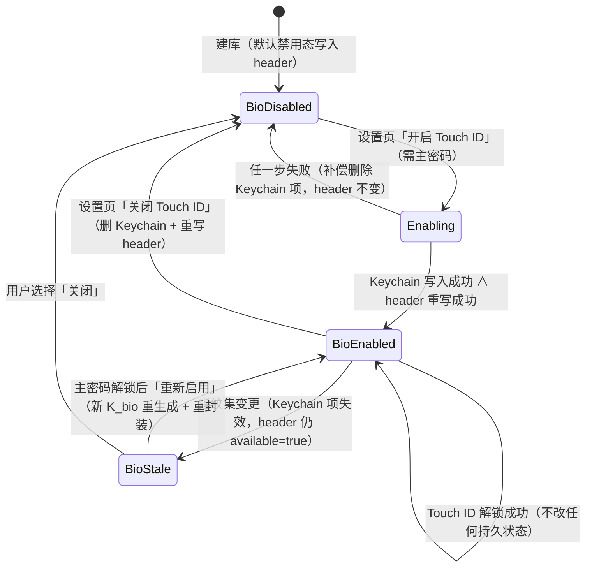
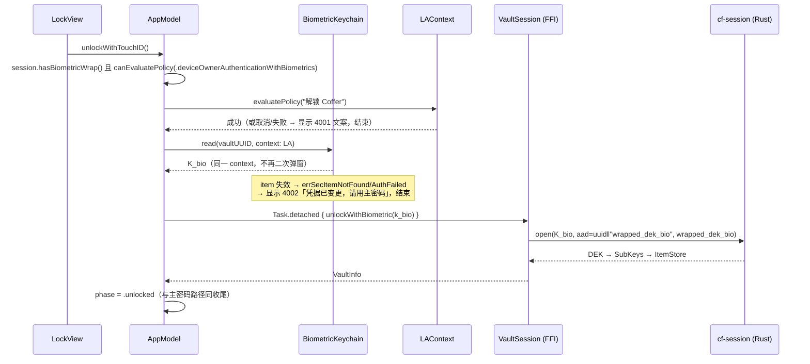

# Coffer Touch ID 解锁设计（v0.2 主件）

| 项 | 内容 |
| --- | --- |
| 文档编号 | LV-SLICE-008 |
| 版本 | v0.1 |
| 状态 | 评审中 |
| 创建日期 | 2026-10-04 |
| 上游文档 | `01-需求分析.md`（FR-1.5 / FR-13.4 / FR-13.5）、`03-详细设计.md`（§1.3 / §2.8 / §10.4）、`07-macOS纵切设计.md`（FFI 纪律） |
| 定位 | **增量设计**：在 v0.1 已交付的主密码解锁链路上叠加第二条 DEK 封装通道，不推翻既有决策 |
| 基线 | 提交 `be23ef4`（404 测试全绿，macOS v0.1 纵切已交付） |

---

## 0. 本质问题与方案概述

Touch ID 解锁 = **「不经主密码拿到 DEK」**。当前 DEK 只被主密码派生的 KEK 封装
（`wrapped_dek` in header）；本设计新增一条**平行的封装通道**：

```
启用时（需要主密码证明）：
  Rust 生成随机 32B unwrap-key（K_bio，cf-crypto CSPRNG）
  → Swift 将 K_bio 存入 Keychain（ThisDeviceOnly + biometryCurrentSet）
  → Rust 用 K_bio 以 XChaCha20-Poly1305 封装 DEK → wrapped_dek_bio
  → 写入 header.json 既有的 biometric_wrap 字段

解锁时：
  LAContext 弹 Touch ID → 通过后 Keychain 读出 K_bio
  → K_bio 传给 Rust（unlock_with_biometric）
  → Rust AEAD open wrapped_dek_bio → DEK → SubKeys → 解锁
```

**核心纪律：DEK 明文永不跨 FFI 桥。** 跨桥的只有 K_bio（随机封装密钥，非 DEK、
非主密码派生物），这与 v0.1「主密码作为参数跨 FFI、DEK 不出现在任何签名」的
暴露面纪律完全同构（docs/07 §2.3 密钥暴露面决策）。

---

## 1. 需求映射

| 需求 | 内容 | 本设计落点 |
| --- | --- | --- |
| FR-1.5 | 生物识别解锁作为**解锁快捷方式**（主密钥仍由主密码派生，生物识别仅解锁密钥封装） | §3 封装结构：Touch ID 只是「解锁 wrapped_dek_bio 的钥匙」的准入条件，DEK 语义不变 |
| FR-13.4 | 使用 LocalAuthentication 框架 | §7.2 LAContext 流程 |
| FR-13.5 | 密钥封装存入 Keychain | §3.2 Keychain 项设计（存的是 K_bio unwrap-key，封装密文存 header） |

---

## 2. 关键裁定（D-决策表）

| # | 裁定点 | 裁定 | 理由 |
| --- | --- | --- | --- |
| **D-1** | header 格式兼容 | **不触发 format_version 2**。`biometric_wrap` 字段已在 docs/03 §1.3 的 header v1 中冻结定义，cf-format/cf-session 已实现（`unlock.rs` 建库时写入禁用态）；启用 = 填充既有可选字段，无新字段、无结构变更 | header 加字段才需要 bump；这里零结构变化。禁用态字段值已落盘于全部存量库，向后/向前兼容均已验证（404 测试全绿的基线覆盖了禁用态读写） |
| **D-2** | wrapped_dek_bio 的 AAD | `vault_uuid_bytes(16) ‖ b"wrapped_dek_bio"`——沿用 docs/07 §2.2 的 `uuid ‖ purpose` 规则，新增 purpose 标签 | 防跨库重放（与 verifier/wrapped_dek 同一裁定逻辑）；docs/03 §2.8 旧文 `b"cf/bio/v1" ‖ uuid` 作废，回改（见冲突 C-1） |
| **D-3** | K_bio 的本质与存放 | K_bio = 32 字节随机数（**非 KEK、非派生物**），由 Rust CSPRNG 生成，存 macOS Keychain generic password | macOS Keychain item 是可读出字节的（不像 Android Keystore 不可导出），因此「平台持密钥、平台加解密」的 Android 模式（docs/03 §9.3）在 macOS 不适用也不必要；macOS 模式 = Keychain 只当「受门禁保护的随机字节保险柜」，加解密统一在 Rust（cf-crypto AEAD） |
| **D-4** | biometryCurrentSet vs 仅 ThisDeviceOnly | **采用 `kSecAttrAccessibleWhenUnlockedThisDeviceOnly` + `.biometryCurrentSet`** | 换指纹/删指纹后 K_bio 读取失败 → 降级主密码。语义代价（用户加一枚指纹后需重新启用）可接受：① 防「他人把手指录入这台设备后直接解锁你的密码库」（docs/03 §2.8 已裁定这是关键语义）；② 重新启用流程轻量（输入主密码即可）；③ 不采用 CurrentSet 则「指纹集已变」无法检测，等于把库的解锁权交给当前录入的任意手指。`ThisDeviceOnly` 无条件强制：密钥材料绝不随 iCloud 钥匙串同步（docs/03 §10.4 密钥材料/数据两分法） |
| **D-5** | 授权语义：一次 Touch ID 解封多久 | **每次解锁都要 Touch ID**。Touch ID 通过 = 换取一次 DEK 解封；之后走与主密码解锁完全相同的会话生命周期（自动锁定/锁屏/手动锁定清零密钥）。不做「一次授权永久解封」、不做解锁后静默重封装缓存 | 与 FR-1.6 自动锁定、FR-13.6 系统锁屏联动的安全语义一致；会话内（解锁态）不再要求生物识别（与主密码路径一致） |
| **D-6** | enable 时 DEK 从哪来 | **不把 DEK 常驻解锁态**。`enable_biometric(password, k_bio)` 要求传入主密码，Rust 内部复用 `recover_dek`（从 unlock.rs 拆出的 `KEK→DEK` 内核，约 1s Argon2id）解出 DEK → 封装 → 写 header | ① v0.1 的 `UnlockedState` 只持 SubKeys、DEK 已 drop——为 enable 而改清零边界得不偿失；② 「开启 Touch ID 需输入主密码」符合安全直觉（证明身份 + 重验证 1002 纪律）；③ 改主密码（未来 change_password）走重封装模式时 **DEK 不变 → wrapped_dek_bio 无需变动**，这是信封加密的又一收益（只有「完全重加密」才需重封 bio，届时用已解锁态的 DEK） |
| **D-7** | 加解密归属 | **Rust 持封装、Rust 解封**；Swift 只做：K_bio 的 Keychain 存取（认证门禁）+ 把 K_bio 作为参数调 FFI | 满足「绝不能把 DEK 送出桥」；不需要 PlatformHost 回调（docs/03 §5.5 的 `request_biometric` 回调对 macOS 不必要——Swift 主动驱动比回调简单，进一步佐证 docs/07 §2.3「v0.1 无 callback interface」决策）；D-01（docs/03 §13，keystore_encrypt/decrypt 回调）**仅影响 Android**，macOS 路径不解阻塞 |
| **D-8** | 解封失败的错误码 | `unlock_with_biometric` 中 AEAD open 失败 → **统一 1002**（UnlockFailed），与主密码路径同纪律；`header.biometric_wrap.available == false` 却调用 → 4001（BiometricUnavailable） | 「指纹已变更」在 Swift 侧发生（Keychain 读取失败），根本不会到达 Rust，Rust 无需区分失败原因；1002 合并纪律不因新路径破例 |

---

## 3. 封装结构与存储布局

### 3.1 header 中的 `biometric_wrap`（v1 既有字段，启用时填充）

```json
"biometric_wrap": {
  "available": true,
  "provider": "touch_id",
  "key_alias": null,
  "wrapped_dek_b64": "<base64( nonce(24) ‖ ct(32) ‖ tag(16) )>"
}
```

- `wrapped_dek_bio` = `seal(K_bio, aad = vault_uuid_bytes ‖ b"wrapped_dek_bio", DEK)`，
  存储格式与 `wrapped_dek` 完全一致（cf-crypto `aead::seal`，nonce 前置）。
- `provider` 取值 `"touch_id"`（macOS）；`key_alias` **macOS 不使用**（Keychain
  定位用 `service + account=vault_uuid`，无别名语义），恒为 `null`——字段保留
  给 Android 的 Keystore alias（跨平台字段，不删）。
- `available` 的语义 = **「用户意图开启」**（header 侧持久意愿）；Keychain 项的
  存在性 + 可读性 = **「实际可用」**。两者可能不一致（指纹变更后 Keychain 失效
  而 header 仍 available=true），Swift 侧组合两者决定 UI（见 §8 降级矩阵）。

### 3.2 Keychain 项（Swift 侧持有）

```swift
// 通用密码项
kSecClass:              kSecClassGenericPassword
kSecAttrService:        "cn.coffer.biometric"
kSecAttrAccount:        <vault_uuid 文本>          // 多库并存天然隔离
kSecAttrAccessible:     kSecAttrAccessibleWhenUnlockedThisDeviceOnly
kSecAttrAccessControl:  SecAccessControlCreateWithFlags(
                          nil,
                          kSecAttrAccessibleWhenUnlockedThisDeviceOnly,
                          .biometryCurrentSet, &error)
kSecValueData:          <K_bio 32 字节>
```

读取（解锁时）：

```swift
// 认证与读取绑定在同一个 LAContext 上：
query[kSecUseAuthenticationContext as String] = laContext
// laContext 须先 evaluatePolicy(.deviceOwnerAuthenticationWithBiometrics)
// （提前弹窗可控制时机与取消语义；读取时复用同一 context 不再二次弹窗）
```

属性选型说明：

| 属性 | 为什么 |
| --- | --- |
| `WhenUnlockedThisDeviceOnly` | 设备锁定态（登录窗口）下不可读 → 系统锁屏期间即使攻击者能执行代码也读不到 K_bio；`ThisDeviceOnly` 阻断 iCloud 钥匙串同步（docs/03 §10.4「密钥材料绝对禁止跨设备」） |
| `.biometryCurrentSet` | 指纹集变更（增/删任一指纹）→ 该 item 立即失效（读取返回 `errSecAuthFailed` / item 失效），强制走主密码降级（D-4） |
| generic password（非 private key） | K_bio 是对称字节；Secure Enclave 非对称方案（ECIES）评估过：需在 cf-crypto 引入 ECDH/ECIES，换来的增益只是「Keychain 字节不可 dump」——而 K_bio 解封后仍要进 Rust 内存，攻击者能 dump Keychain 字节的场景（同用户会话代码执行）同样能 dump 内存。**不引入**，记录为 v2 可选强化 |

### 3.3 多库并发

每库一个 Keychain 项（account = vault_uuid），封装互不干扰；`lock_all()` /
系统锁屏只影响会话内存密钥，不触碰 Keychain。删除库（未来 delete_vault）时
必须同步删除对应 Keychain 项（列入 change_password/delete_vault 实现约束，
见 §10）。

---

## 4. 生命周期状态机



### 4.1 各场景流程

**启用（enable）**——需解锁态 UI（设置页在解锁后才可达）+ 主密码：

```
Swift: K_bio = factory.newBiometricUnwrapKey()          // Rust CSPRNG，32B
Swift: BiometricKeychain.save(key: K_bio, vaultUUID:)   // 先落 Keychain
Swift: Task.detached { session.enableBiometric(password, K_bio) }
Rust:  recover_dek(vault_dir, header, password)          // 主密码校验，错 → 1002
Rust:  wrapped_dek_bio = seal(K_bio, aad=uuid‖b"wrapped_dek_bio", DEK)
Rust:  原子重写 header.json（biometric_wrap = {available:true, provider:"touch_id",
       key_alias:null, wrapped_dek_b64}；modified_at 更新；其余段不变）
失败补偿：Rust 返回 Err → Swift 立即 delete Keychain 项（半启用态不留痕）
```

顺序裁定：**先 Keychain 后 header**。Keychain 写失败 → 直接报错，header 未动；
header 写失败 → Keychain 有孤儿项，危害 ≈ 0（无对应 header 封装，无法解出任何
东西），且后续 enable 用 `SecItemAdd → errSecDuplicateItem → SecItemUpdate`
幂等覆盖、disable 幂等删除。反向顺序（先 header）失败会留下「available=true
但无 Keychain 项」的假启用态，UI 需处理降级，更糟。

**Touch ID 解锁**——见 §7.2 时序图。

**关闭（disable）**——设置页，要求解锁态：

```
Swift: BiometricKeychain.delete(vaultUUID:)              // 先删 Keychain
Swift: Task.detached { session.disableBiometric() }      // 重写 header → 禁用态
失败处理：header 写失败 → 报非致命错误并提示重试（幂等可重试；
         Keychain 已删 = 功能实际已失效，header 残留密文无泄露面）
```

**指纹变更（biometryCurrentSet 失效）**：

Keychain 读取失败（`errSecItemNotFound` / `errSecAuthFailed`）→ Swift 显示
4002 文案「生物识别凭据已变更，请使用主密码解锁」→ 用户用主密码解锁 →
设置页出现「重新启用」入口（同 enable 流程，生成**新** K_bio + 重封装；
旧 Keychain 项若残留则被 SecItemUpdate 覆盖 / 先删后加）。
**Rust 侧零参与、header 零改动**——降级纯由 Swift 判定，这是 D-2/D-8 的直接推论。

**建库时可选启用**：建库成功页追加可选步骤「启用 Touch ID 解锁」（复用
enable 流程，用户重输刚建的主密码；密码不落属性不能预填， UX 上一次性
输入可接受）。跳过则直接进入主界面，之后随时可在设置页开启。

---

## 5. 威胁模型增量（相对 v0.1 诚实声明）

| # | 攻击面 | 分析 | 结论 |
| --- | --- | --- | --- |
| T-1 | 同机其他进程读 Keychain 项 | Keychain item 的 ACL 绑定创建时的 code signing designated requirement；沙盒 App 的 item 其他 App 读取被拒。**真机验证项**：沙盒下跨进程读取行为与提示框策略需实测（§9 T05） | 接受，标注验证 |
| T-2 | 调试器 / LLDB attach | 发布版 Hardened Runtime 无 `get-task-allow` → 无法 attach；开发构建可 attach 但开发构建本就不设防（与 v0.1 主密码路径同假设） | 无新增风险 |
| T-3 | 磁盘文件被窃（无主密码攻击者） | 拿到 header.json + db.sqlite + （若备份了 Keychain）——`ThisDeviceOnly` 项不随任何备份/iCloud 同步离开设备，物理取得磁盘 ≠ 取得 Keychain；即使拿到 K_bio 字节也需同设备生物认证 | **Touch ID 通道不降低库文件本身的抗爆破强度**（wrapped_dek 主通道原样保留） |
| T-4 | 已入侵同用户会话的攻击者 | 能等用户解锁后 dump 进程内存拿 SubKeys——这与主密码路径的暴露面**完全相同**（docs/07 §4.2 诚实声明）；Keychain 项本身在认证通过后也可被同进程读出 K_bio | 诚实结论：Touch ID 的强度 ≤ 主密码路径，它是 FR-1.5 定义的**解锁快捷方式**而非更强保护。文档与 UI 不宣称「Touch ID 更安全」 |
| T-5 | Keychain 项被替换（篡改攻击） | K_bio 被换 → `unlock_with_biometric` AEAD open 失败 → 1002；wrapped_dek_bio 被跨库搬运 → AAD（D-2）认证失败 → 1002 | 与 verifier/wrapped_dek 同等的防篡改/防重放语义 |
| T-6 | 暴力触发 Touch ID | macOS 生物识别自带速率限制与回退策略（系统层），App 不重复实现 | 依赖系统行为 |

---

## 6. FFI 接口清单（签名草案）

**新增 4 个接口，全部同步**（docs/07 §2.3 决策不变）；DEK/SubKeys 依旧不出现
在任何签名。错误映射沿用 `CfError → FfiError`，新增码 4001/4002（docs/03 §12
错误码表已预留这两个语义）。

```rust
// object CofferApp（工厂级，无会话依赖）
/// 生成 32B 随机 bio unwrap-key（cf-crypto::SessionKey::random，CSPRNG）。
/// 仅生成、不落任何状态；调用方（Swift）负责存 Keychain。
pub fn new_biometric_unwrap_key(&self) -> Result<Vec<u8>, FfiError>;

// object VaultSession
/// header 中 biometric_wrap.available（锁定态可用，供 LockView 决定是否
/// 显示 Touch ID 按钮）。纯读 header，无密钥操作。
pub fn has_biometric_wrap(&self) -> bool;

/// 启用：recover_dek(password) 校验主密码并解出 DEK（错 → 1002）
/// → seal(K_bio, aad=uuid‖b"wrapped_dek_bio", DEK) → 原子重写 header。
/// k_bio 必须 32 字节（否则 5002 InvalidArgument）。
/// 调用前 Swift 已把 k_bio 写入 Keychain；Rust 失败 → Swift 补偿删除。
pub fn enable_biometric(&self, password: String, k_bio: Vec<u8>) -> Result<(), FfiError>;

/// 关闭：原子重写 header → 禁用态。幂等。Keychain 删除在 Swift 侧先行。
pub fn disable_biometric(&self) -> Result<(), FfiError>;

/// Touch ID 解锁后半段：open(K_bio, aad=uuid‖b"wrapped_dek_bio", wrapped_dek_bio)
/// → DEK → SubKeys → ItemStore::open —— 与主密码 unlock 共享步骤 3–5
/// （见 §7.1）。失败统一 1002；available=false 时调用 → 4001。
pub fn unlock_with_biometric(&self, k_bio: Vec<u8>) -> Result<FfiVaultInfo, FfiError>;
```

**cf-session 内部重构**（cf-ffi 依赖的前提）：

```
unlock.rs 拆分：
  recover_dek(vault_dir, header, password) -> SessionKey      // 现 unlock_store 步骤 1–2 前半
  unlock_store(...) = recover_dek → verifier 校验 → SubKeys → ItemStore（步骤 2–5，行为不变）
新增 unlock_bio.rs（或并入 unlock.rs）：
  enable_biometric_impl / disable_biometric_impl / unlock_store_with_bio
VaultSession 增加对应门面方法（门禁与幂等语义与 unlock/lock 一致）
```

**cf-format**：`Header.biometric_wrap` 结构已存在且已序列化/反序列化，无需改
结构；仅确认「启用态 header 的读写往返 + `write_header` 原子替换」有测试覆盖
（现有 write_header 已原子，需补启用态用例）。

---

## 7. Swift 侧组件

### 7.1 组件与文件

```
macos/Coffer/
├── Platform/
│   └── BiometricKeychain.swift      # Keychain 封装器（新增）
├── Views/
│   ├── LockView.swift               # 修改：条件显示 Touch ID 按钮
│   ├── SecuritySettingsView.swift   # 新增：设置页（开关/重新启用/状态说明）
│   └── VaultSetupView.swift         # 修改：建库成功后可选启用步骤
└── AppModel.swift                   # 修改：unlockWithTouchID() + bio 状态查询
```

### 7.2 解锁时序（Touch ID 路径）



enable / disable 时序见 §4.1，不再画。

### 7.3 BiometricKeychain.swift 职责边界

```swift
enum BiometricKeychainError: Error {
    case itemNotFound      // → 4002（指纹集变更 / 项被删）
    case authFailed        // → 4001（Touch ID 取消/失败/不可用）
    case unexpected(OSStatus)
}
struct BiometricKeychain {
    static let service = "cn.coffer.biometric"
    static func isBiometricsAvailable() -> Bool          // LAContext.canEvaluatePolicy（只检测，不弹窗）
    func itemExists(vaultUUID: String) -> Bool           // 只查属性不取数据（kSecReturnData=false），
                                                         // 注意：不应触发认证弹窗——实现后真机确认
    func save(key: Data, vaultUUID: String) throws       // Add → DuplicateItem 则 Update
    func read(vaultUUID: String, context: LAContext) throws -> Data
    func delete(vaultUUID: String) throws                // 幂等：item 不存在视为成功
}
```

### 7.4 AppModel 增量

- `unlockWithTouchID() async`（§7.2）；`isBusy` 互斥与主密码解锁共用。
- Keychain read 在主线程触发 LAContext（LAContext 的 UI 要求主线程回调上下文），
  K_bio 作为局部变量捕获进 Task 闭包后即弃——不落任何 `@Published`（与主密码
  同纪律，docs/07 §2.4）。
- 锁定（`lock()`）与 `lock_all()` 路径**不变**——Touch ID 解锁获得的密钥与主密码
  路径同生共死，无需新增清理逻辑。

### 7.5 设置界面（SecuritySettingsView）

| 元素 | 行为 |
| --- | --- |
| 状态行 | 「Touch ID 解锁：已启用 / 已停用 / 凭据已失效（需重新启用）」——组合 `has_biometric_wrap()` 与 `itemExists()` 判定 |
| 开关（关→开） | 弹主密码输入框 → enable 流程（§4.1）；失败按错误码提示（1002 = 密码不对，4001 = Keychain/系统问题） |
| 开关（开→关） | 二次确认 → disable 流程（§4.1） |
| 「重新启用」 | 仅在 BioStale 态显示，同 enable |
| 降级说明 | 无 Touch ID 硬件/未录入指纹：整节隐藏，并注明「当前设备不支持生物识别解锁」 |

---

## 8. 降级矩阵

| 场景 | 检测点（归属层） | 行为 |
| --- | --- | --- |
| 无 Touch ID 硬件 / 模拟器 / 未录入指纹 | `LAContext.canEvaluatePolicy` false（Swift） | 全部 UI 入口隐藏；主密码路径不受任何影响；**CI 与无 Touch ID 机器可测「隐藏」分支** |
| 指纹集变更（biometryCurrentSet 失效） | Keychain 读失败（Swift） | 4002 文案 + 引导主密码解锁 + 设置页「重新启用」；header 不改 |
| Keychain 写失败（enable 前半） | `SecItemAdd` 非 0（Swift） | 报错，header 不变，无半启用态 |
| header 写失败（enable 后半） | Rust Err | Swift 补偿删 Keychain 项；孤儿项可容忍（§4.1） |
| header 写失败（disable 后半） | Rust Err | 非致命报错 + 可重试；功能实际已失效 |
| wrapped_dek_bio 与 K_bio 不匹配（header 被回滚/篡改） | Rust AEAD open 失败 | 1002，与主密码错同码（D-8） |
| 多库之一启用、其他未启用 | 按库独立 | 各库 Keychain 项 / header 独立，无联动 |

---

## 9. 任务列表（按依赖序）

| ID | 任务 | 主要文件 | 依赖 | 优先级 | 验收标准（可测试） | 真机 |
| --- | --- | --- | --- | --- | --- | --- |
| **T01** | **cf-session bio 封装内核** | `core/cf-session/src/unlock.rs`（拆 `recover_dek`）、`core/cf-session/src/unlock_bio.rs`（enable/disable/unlock_with_bio 实现）、`core/cf-session/src/vault.rs`（门面方法）、`core/cf-session/src/types.rs`（如需）、`core/cf-session/src/lib.rs`（导出）；测试：`core/cf-session/tests/`（或模块内 `#[cfg(test)]`） | 无 | P0 | ① `recover_dek` 抽取后既有 404 测试零回归（unlock_store 行为不变）；② enable→lock→unlock_with_bio 往返：正确 K_bio 解锁成功、错误 K_bio/篡改 wrapped_dek_b64/跨库搬运 wrapped_dek_bio 均 1002；③ enable 传错误主密码 → 1002 且 header 未变；④ enable/disable 幂等：重复 enable（新 K_bio）后旧 K_bio 解封失败 1002；⑤ AAD 钉库断言：库 A 的 wrapped_dek_bio 拷入库 B header → 解封失败；⑥ header 启用态读写往返：`has_biometric_wrap()` 锁定态可查、write_header 后字段无损；⑦ k_bio 非 32 字节 → 5002；⑧ 全部密钥材料（DEK、K_bio 中间值）走 Zeroizing，clippy 零警告 | 否 |
| **T02** | **cf-ffi 接口扩展 + 绑定重生成** | `core/cf-ffi/src/api.rs`（4 个新接口 + panic 守卫）、`core/cf-ffi/src/error.rs`（4001/4002 映射核对）、`tools/build_swift_bindings.sh`（重生成）、`macos/Coffer/CoreBindings/`（更新生成物）；测试：api.rs 模块内 | T01 | P0 | ① 4 接口跨 FFI 冒烟：`new_biometric_unwrap_key` 返回 32B 且两次调用不同；`enableBiometric`（错密码 1002）→ 正确密码 → `hasBiometricWrap=true` → `unlockWithBiometric` 成功；② `available=false` 时调 `unlockWithBiometric` → 4001；③ FFI 层 panic 注入 → 5999 不杀进程（新接口同守卫）；④ 生成 Swift 绑定编译通过（xcodebuild 命令行 target） | 否 |
| **T03** | **Swift Keychain 封装器 + Touch ID 解锁流程** | `macos/Coffer/Platform/BiometricKeychain.swift`、`macos/Coffer/AppModel.swift`（`unlockWithTouchID` + bio 状态）、`macos/Coffer/Views/ErrorPresenter.swift`（或等价错误文案处，补 4001/4002）、`macos/Coffer/Coffer.entitlements`（核对 Keychain-sharing 不引入） | T02 | P0 | ① 单元测试（宿主 App target）：save/read/delete 往返、DuplicateItem 覆盖、delete 幂等（无 Touch ID 机器上用无 accessControl 的测试路径或 mock OSStatus 分支）；② `unlockWithTouchID` 端到端：无 Touch ID 机器验证 canEvaluatePolicy=false → 入口隐藏、4001/4002 文案分支；③ K_bio 不落任何 @Published（代码评审 + grep）；④ entitlements 不含 keychain-access-groups 泄露面（`codesign -d` 核查） | 部分（②的弹窗分支） |
| **T04** | **设置页 + LockView 按钮 + 建库可选启用** | `macos/Coffer/Views/SecuritySettingsView.swift`（新增）、`macos/Coffer/Views/LockView.swift`（Touch ID 按钮条件渲染）、`macos/Coffer/Views/VaultSetupView.swift`（建库成功可选启用步骤）、设置入口挂接（`CofferApp.swift` 或 Settings scene） | T03 | P1 | ① 无 Touch ID 机器：设置节隐藏/置灰、LockView 无按钮、建库跳过步骤可跳过——全流程回归 404 测试对应的 v0.1 手工脚本不破；② 状态行三态（启用/停用/凭据失效）判定逻辑有单元测试（注入 bio 状态）；③ enable 对话框取消 / 密码错 / Keychain 失败三分支 UI 反馈正确 | 否 |
| **T05** | **真机端到端验收 + 文档回填** | 验收脚本（`docs/` 或 `macos/` 内手工清单）、`docs/03-详细设计.md`（§2.8/§5.1/§13 D-01 回改，见冲突清单）、`docs/08` 本文档状态刷新、`docs/06-开发计划.md`（进度） | T04 | P1 | ① 真机全流程：启用（输主密码）→ 锁定 → Touch ID 解锁 → 自动锁定 → 再 Touch ID 解锁；② 指纹变更降级：系统设置删/加指纹 → Touch ID 解锁出现 4002 → 主密码可解锁 → 重新启用成功；③ 关闭后：Keychain 项消失（钥匙串访问 App 核查）+ header 回禁用态 + 主密码解锁正常；④ Keychain 跨进程读取：另一进程/另一 App 读该 item 被拒（T-1 实测结论回填 §5）；⑤ `biometryCurrentSet` 失效后旧 Keychain 项不可用（预期 errSecAuthFailed/NotFound）；⑥ 文档三处回改完成 | **全部需真机**（Touch ID 与指纹管理无法模拟） |

依赖链：T01 → T02 → T03 → T04 → T05（纵切链，线性合理：每层是下层的直接前提）。

---

## 10. 对既有未实现功能的约束（防止未来破坏 bio 通道）

| 功能 | 约束 | 出处 |
| --- | --- | --- |
| change_password（v0.2+） | 重封装模式：DEK 不变 → `wrapped_dek_bio` **无需变动**（bio 封装封的是 DEK，与 KEK 无关）；完全重加密模式（新 DEK）：必须同步用 K_bio 重封 bio → 重写 `biometric_wrap.wrapped_dek_b64`；且改密流程必须校验：若 bio 已启用而 Keychain 项已失效（BioStale），重加密后应清 header bio（避免封装一个「永不可达」的 DEK 副本——无安全危害但留脏数据） | D-6 推论 |
| delete_vault（v0.2+） | 必须同步删除对应 Keychain 项（account=vault_uuid） | §3.3 |
| 导出/打包 `.lvvault` | header 内 `biometric_wrap`（密文）允许随包迁移，但 **K_bio 不迁移**（ThisDeviceOnly）→ 换机后 bio 通道自然失效，回退主密码，行为正确无需特判；可在导入时提示「生物识别解锁需在本机重新启用」 | D-3/D-4 推论 |

---

## 11. 风险与待明确事项

| # | 事项 | 影响 | 建议 |
| --- | --- | --- | --- |
| Q-1 | 沙盒 App 的 Keychain ACL 对「其他进程读取」的精确行为（拒绝 vs 弹允许框 vs errSecInteractionNotAllowed） | T-1 结论与 §5 回填 | T05-④ 真机实测；若存在允许框路径，评估在 ACL 中固化（`SecAccess` 旧 API 已弃用，可能需接受拒绝语义即可） |
| Q-2 | `itemExists()` 仅查属性是否会触发认证弹窗 | LockView 按钮显隐的静默判定 | T03 实现时用 `kSecReturnAttributes` 验证；若仍触发，改为信任 `has_biometric_wrap()` + 首次 read 失败降级 |
| Q-3 | `.biometryCurrentSet` 在「用户从未录入指纹但创建 item」时 macOS 的具体行为（创建成功/失败） | 无指纹设备的启用路径 | T05 验证；无论如何 UI 侧已被 canEvaluatePolicy 门禁挡住，属双保险 |
| Q-4 | enable 时 1s Argon2id 重派生（D-6）是否影响体验 | 设置页开关延迟 | 可接受（一次性操作）；若反馈差，v0.3 可改「解锁态下用内存中……」——不可行，DEK 已 drop，维持现状 |
| Q-5 | `LAContext.evaluatePolicy` 与 `kSecUseAuthenticationContext` 的弹窗时序在 macOS 14 的细节（两次弹窗 vs 合一） | UX | T05 实测；文档示例已按「提前 evaluate + 复用 context」写，若系统自动合并弹窗则更简 |
| R-1 | cf-format `write_header` 原子替换对「启用态字段」的既有覆盖是否完备 | T01-⑥ | 现有原子写已覆盖，补启用态用例即可，风险低 |
| R-2 | UniFFI `Vec<u8>` ↔ Swift `Data` 转换的拷贝语义（K_bio 在桥上被复制，Swift 侧副本不可清零） | 与 v0.1 明文跨桥同性质的已知局限（docs/07 §4.2），K_bio 是随机密钥非用户凭据，暴露窗口毫秒级 | 接受并记录；不做缓冲区体操 |

---

## 12. 与现有文档的冲突清单

| # | 冲突 | 现状证据 | 处理建议（T05 回填） |
| --- | --- | --- | --- |
| C-1 | docs/03 §2.8 的 bio 封装 AAD 为 `b"cf/bio/v1" ‖ uuid`，违反 docs/07 §2.2 裁定的 `vault_uuid ‖ purpose` 规则 | docs/03 §2.8 L302 | 修订 §2.8：AAD = `vault_uuid_bytes ‖ b"wrapped_dek_bio"`（与本文 D-2 一致） |
| C-2 | docs/03 §2.8 描述的「平台密钥库生成 K_bio 且加解密在平台侧」是 Android Keystore 语义；macOS Keychain item 是可读字节，模式完全不同（本设计 D-3/D-7：Keychain 只当门禁保险柜，加解密在 Rust） | docs/03 §2.8 与 §9.3 | §2.8 拆分 Android/macOS 两小节（或标注「Android 特定」，macOS 指向本文档）；§9.3/D-01 标注仅阻塞 Android |
| C-3 | docs/03 §5.1 的 `enable_biometric(uuid, platform_key)` / `unlock_with_biometric(uuid)` 签名按「平台侧加解密」设计，与本设计签名不符 | docs/03 §5.1 | 修订为本文 §6 签名（`enable_biometric(password, k_bio)`、`unlock_with_biometric(k_bio)`、新增 `new_biometric_unwrap_key` / `has_biometric_wrap` / `disable_biometric`） |
| C-4 | docs/03 §1.3 示例中 `biometric_wrap.key_alias` 在 macOS 无语义（恒 null） | docs/03 §1.3 | 补一行字段说明「key_alias 仅 Android Keystore 使用；macOS 恒 null，定位由 service+account 承担」；`provider` 取值补充 `"touch_id"` |
| C-5 | docs/03 §2.7 改主密码流程未提及 wrapped_dek_bio | docs/03 §2.7 | 补注（本文 §10 的约束）：重封装模式无需动 bio；完全重加密必须重封 bio；顺带 delete_vault 约束 |
| C-6 | docs/03 §12 错误码表已有 4001/4002 语义行，但无 macOS 触发点说明 | docs/03 §12 | 补注：4001 由 Swift 侧 LAContext/Keychain 失败或 Rust available=false 触发；4002 仅由 Swift 侧 Keychain 失效触发（Rust 不产生 4002） |
| C-7 | docs/07 §2.3「平台回调 v0.1 无 callback interface；PlatformHost 整体推后到 v0.2 生物识别时再定」——本设计证明 macOS 生物识别**不需要**回调 | docs/07 §2.3 | 在 docs/07 或本文状态：PlatformHost 回调仅在 Android 侧按需重启论证（D-01 同步收窄），macOS 维持零回调 |

**docs/03 是否需要加 §2.x**：不加新节。§2.8 修订为双平台分述（C-1/C-2）即可，
本文档（08）作为 macOS 实体设计被 §2.8 与 §10.4 引用。

---

*文档结束。*
